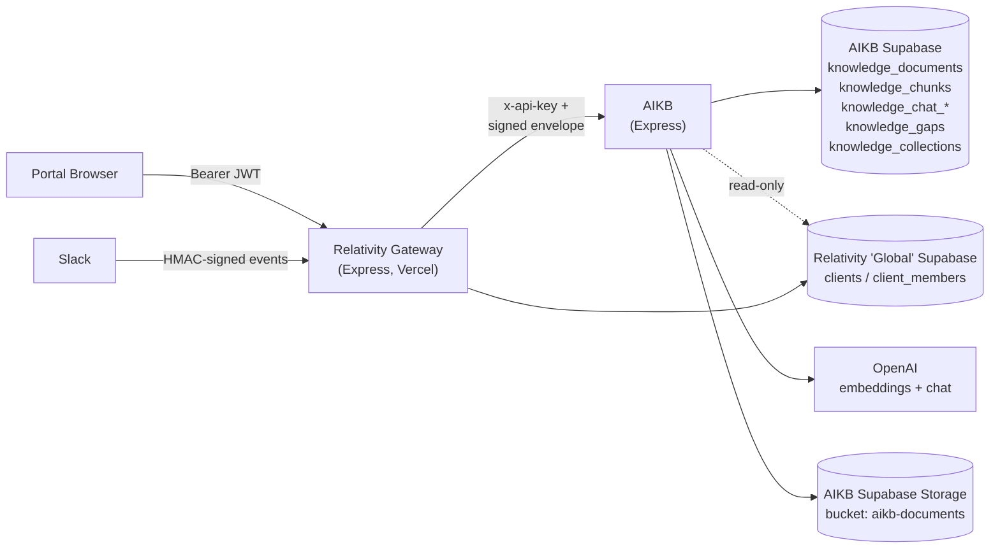
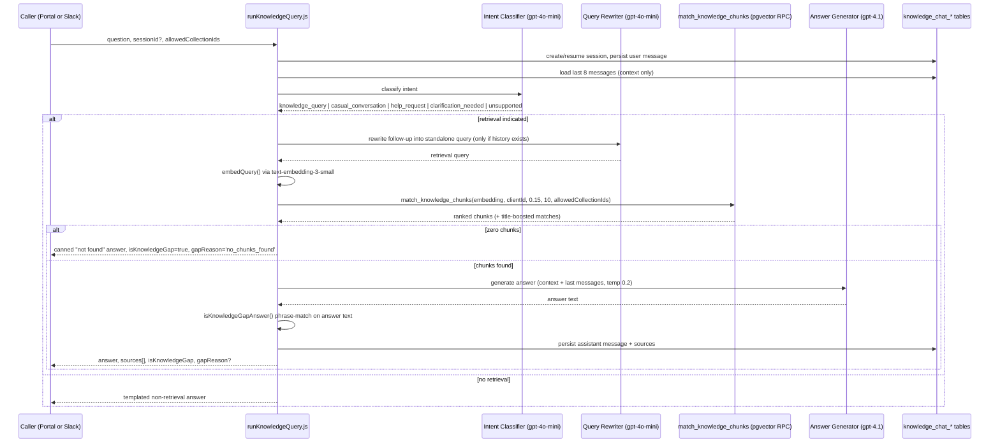

# AIKB Architecture

Source repository: `relativitysystems/AIKB` (local checkout referenced in this review: `aikb/`).

## Overview

AIKB is a standalone Node/Express service that owns document ingestion, chunking, embedding generation, vector retrieval, RAG (retrieval-augmented generation) answer generation, conversation persistence, and knowledge-gap logging for every Relativity Systems client. It is a multi-tenant backend called exclusively over HTTP by the Relativity gateway (`relativitysystems/Relativity`) — no browser, Slack, or third party calls AIKB directly except through the signature-verified Slack Events endpoint owned by Relativity (see [CONNECTOR_FRAMEWORK.md](CONNECTOR_FRAMEWORK.md)).

AIKB has no identity system of its own. It validates the caller's Supabase JWT against Relativity's separate "Global" Supabase project and reads (never writes) `clients`/`client_members` there. This split — Relativity owns identity, AIKB owns knowledge — is consistent across every route and table in this repository.



## Multi-Tenant Design

Every tenant-scoped table carries a `client_id UUID NOT NULL` column (`aikb/migrations/001_knowledge_base_schema.sql`, `003_chat_history.sql`, `006_knowledge_collections.sql`). Tenant isolation is enforced **entirely at the application layer** — every Supabase query in `services/supabaseService.js` explicitly filters `.eq('client_id', clientId)`, and the vector-search RPC (`match_knowledge_chunks`) takes `match_client_id` as a required parameter inside its own `WHERE` clause. There is no Supabase Row-Level Security anywhere in this schema — a repository-wide search for `CREATE POLICY` / `ENABLE ROW LEVEL SECURITY` returns zero matches. See [SECURITY.md](SECURITY.md) for the full implication of this.

AIKB talks to two distinct Supabase projects, configured in `config/index.js`:

| Client | Project | Access | Purpose |
|---|---|---|---|
| `aikb` Supabase client | AIKB's own project | Read/write | `knowledge_*` tables, Storage bucket |
| `global` Supabase client | Relativity's "Global" project | Read-only | `clients`, `client_members` — for auth/entitlement checks only |

Cross-project foreign keys are not supported by Supabase, so references into the Global project (`member_id`, `connection_id`) are stored as plain `UUID` columns with no `FK` constraint (documented explicitly in `aikb/migrations/004_member_id.sql`).

Within a client, requests are further scoped by `member_id` for non-admin members — `isAdminRole` (`role === 'owner' || role === 'admin'`) determines whether a member sees only their own chat sessions/gaps or the whole client's (`services/runKnowledgeQuery.js`).

## Database Schema

pgvector is enabled via `CREATE EXTENSION IF NOT EXISTS vector;` (migration 001).

| Table | Added in | Purpose | Key columns |
|---|---|---|---|
| `knowledge_documents` | 001 (+002, +006) | One row per ingested source file | `client_id`, `source_provider`, `source_file_id`, `file_name`, `mime_type`, `content_hash`, `status` (pending\|indexing\|indexed\|deleted\|error), `storage_path` (002), `collection_id` FK → `knowledge_collections` `ON DELETE RESTRICT` (006). `UNIQUE(client_id, source_provider, source_file_id)`. |
| `knowledge_chunks` | 001 | Retrievable text segments with embeddings | `document_id` FK `ON DELETE CASCADE`, `client_id`, `chunk_index`, `content`, `embedding VECTOR(1536)`, `metadata JSONB` |
| `knowledge_ingestion_jobs` | 001 | Audit trail for ingest/reindex/delete runs | `client_id`, `document_id`, `source_file_id`, `status` (queued\|running\|completed\|failed) |
| `knowledge_chat_sessions` | 003 (+004, +005) | One conversation per client (+ member) | `client_id`, `title`, `deleted_at`, `member_id` (004), `origin`/`origin_metadata`/`idempotency_key` (005, unique partial index) |
| `knowledge_chat_messages` | 003 (+004) | Individual turns in a session | `session_id` FK `ON DELETE CASCADE`, `role` CHECK IN (user\|assistant\|system), `content`, `sources JSONB`, `metadata JSONB`, `member_id` |
| `knowledge_gaps` | 003 (+004, +005) | Questions the knowledge base couldn't answer | `session_id`/`message_id` FK `ON DELETE SET NULL`, `question`, `reason`, `status` CHECK IN (open\|reviewed\|resolved\|ignored), `member_id`, `origin`/`origin_metadata`/`idempotency_key` (005, added but currently unused — see [KNOWLEDGE_GAP_DETECTION.md](../product/KNOWLEDGE_GAP_DETECTION.md)) |
| `knowledge_collections` | 006 | Named groupings of documents, per client | `client_id`, `name`, `is_default BOOLEAN`. `UNIQUE(client_id, name)`; partial unique index guarantees at most one default per client |

**Vector index**: `ivfflat (embedding vector_cosine_ops) WITH (lists = 100)` (migration 001). Distance operator is `<=>` (cosine distance); similarity is computed as `1 - distance`.

## Knowledge Collections

Collections are a real, implemented concept inside AIKB's own schema (Milestone 5, migration `006_knowledge_collections.sql`), not a proposal:

- Every client is seeded with two collections: **"General"** (`is_default = true`, the fallback target for every newly-ingested document) and **"Slack"** (an ordinary collection with no special code behavior beyond its name — existing purely as a starter for admins to scope Slack retrieval). Seeding happens either via the migration's backfill (for clients with existing documents) or lazily via `ensureDefaultCollections()` for clients created afterward.
- **Assignment**: a document's `collection_id` is set once, at first ingest, to the client's default collection (`inngest/functions.js`). A reindex never resets an already-moved document's collection. Documents can be moved via `PATCH /api/knowledge/document/:id/collection`.
- **CRUD**: `GET/POST/PATCH/DELETE /api/knowledge/collections[...]` (`routes/knowledge.js`), with server-side and DB-level (`ON DELETE RESTRICT`) protection against deleting the default collection or a non-empty collection.
- **Enforcement**: filtering happens inside the retrieval SQL itself (see below), not in application code after the fact — a restricted chunk is never fetched into the Node process at all.

## Embedding Pipeline

- Model: `text-embedding-3-small` (default; overridable via `OPENAI_EMBEDDING_MODEL`), producing 1536-dimension vectors matching the `knowledge_chunks.embedding` column type.
- Triggered inside the `index-document-core` step of the `knowledge-document-ingest` Inngest function, after chunking.
- Batched at 100 texts per OpenAI call (`EMBEDDING_BATCH_SIZE = 100`), with results re-sorted by response index to preserve chunk order.
- Timeouts: 60s per batch (`AbortController`) nested inside a 90s outer step timeout; a mismatch between returned-embedding count and chunk count throws and fails the job.
- Retry: the Inngest function itself retries the whole step up to 3 times (`retries: 3`) on failure, with `concurrency: { limit: 2, key: clientId }`.

Full flow detail (including query-time embedding) is documented in [INGESTION_PIPELINE.md](INGESTION_PIPELINE.md).

## Chunking

Implemented in `services/chunkService.js`, unit = **characters**, not tokens:

- `DEFAULT_CHUNK_SIZE = 4000` characters, `DEFAULT_OVERLAP = 400` characters.
- Text is split on paragraph boundaries (`\n\n+`); paragraphs accumulate into a running buffer until the next one would exceed `chunkSize`, at which point the chunk is flushed and the next chunk is seeded with the last `overlap` characters of the previous one for context continuity.
- A single paragraph longer than `chunkSize` is hard-sliced at a `chunkSize - overlap` stride.
- PDFs with a detected page structure are chunked **per page** (preserving `pageNumber` in chunk metadata, with a chunk index running globally across pages); non-paginated documents (TXT/MD/CSV/DOCX, or a PDF that yielded no page array) are chunked as one whole-document call.

## Vector Search / Retrieval Pipeline

The core SQL function is `match_knowledge_chunks`, defined in migration 001 and extended in migration 006:

```sql
match_knowledge_chunks(
  query_embedding      VECTOR(1536),
  match_client_id      UUID,
  match_threshold      FLOAT  DEFAULT 0.7,
  match_count          INT    DEFAULT 5,
  match_collection_ids UUID[] DEFAULT NULL
) RETURNS TABLE (id, document_id, content, metadata, similarity)
```

It ranks by ascending cosine distance (`ORDER BY embedding <=> query_embedding`), filters to rows above `match_threshold` similarity, and — when `match_collection_ids` is not `NULL` — additionally requires `kd.collection_id = ANY(match_collection_ids)` inside the same `WHERE` clause. An **empty array matches zero rows**, which is the mechanism used to mean "search nothing" (used when a channel has been granted zero collections) as distinct from "search everything" (`NULL`, the portal default).

The application layer (`services/supabaseService.js`) calls this RPC with its own defaults — `threshold: 0.15, count: 10` — which differ from the SQL function's own defaults (`0.7`/`5`); every caller passes explicit values, so the SQL defaults are effectively unused in practice.

A **title-boost hybrid layer** (`searchChunksWithTitleBoost`) runs alongside the vector search: if the question text references a known document's filename (normalized word-overlap ≥ 60% or substring match), that document's chunks are fetched directly (ordered by `chunk_index`), marked `similarity: 1, titleMatched: true`, and placed first in the result list ahead of pure vector matches, deduplicated by chunk id, then truncated to the requested count. Title-boost candidates are pre-filtered by the same `allowedCollectionIds`, so a restricted document's filename can never force its chunks into a response it isn't entitled to see.

### End-to-end query flow



## Collection Filtering

Two distinct default behaviors coexist by design:

| Caller | `allowedCollectionIds` default | Meaning |
|---|---|---|
| Portal chat (`POST /api/knowledge/query`) | `null` | No restriction — searches every collection in the client's workspace, since the portal user is already scoped to their own client |
| Slack (`POST /api/knowledge/ask`) | `[]` if not an explicit array | Fail-closed — zero collections searched unless the client has explicitly allow-listed some via `slack_collection_access` |

See [CONNECTOR_FRAMEWORK.md](CONNECTOR_FRAMEWORK.md) for how the Slack allow-list is managed, and [SECURITY.md](SECURITY.md) for the authorization envelope that carries it.

## Security Model

Summarized here; full detail in [SECURITY.md](SECURITY.md).

| Route group | Middleware | Notes |
|---|---|---|
| Every route under `/api/knowledge` | `requireApiKey` (static `x-api-key`, router-level) | Shared secret between Relativity and AIKB; not per-caller |
| `/query`, `/chat/*`, `/gaps` | + `requireMemberContext` | Validates the caller's Supabase JWT against the Global project, resolves `clientId`/`memberId`/`memberRole` |
| `POST /ask` (Slack path) | + `requireServiceRequest` | HMAC-SHA256 signed envelope (60s TTL, `crypto.timingSafeEqual`) — `clientId` is read only from the verified envelope, never the raw request body |
| `DELETE /client/:clientId` | `requireApiKey` only, deliberately skips `requireActiveClient` | Intended to work even after the Global client record is already gone |

## Citation Generation

Citations are produced two ways simultaneously:

1. **Inline in the LLM's answer text** — the system prompt instructs the model to append `Source: filename` or `Source: filename, p. X` (or `Source: N/A` when unsupported), based on numbered `[i] Source: filename[, p. X]` headers built into the retrieved-context block passed to it.
2. **As a structured `sources[]` array** — built programmatically (not LLM-derived) by grouping retrieved chunks by `document_id`, collecting filename and a set of page numbers per document, and attaching the result to both the API response and the persisted assistant chat message.

When an answer is classified as a knowledge gap, any model-hallucinated `Source:` line is stripped and rewritten to `Source: N/A`, and the structured `sources[]` array is forced empty — a gap answer can never appear to cite a document it didn't actually use.

## Current Limitations

- **No database-level tenant isolation.** All isolation is application-layer `client_id` filtering; a missed filter in future code is a full cross-tenant data leak with no RLS backstop.
- **Shared `x-api-key` grants broad trust.** Every route under `/api/knowledge` except `/ask` trusts the shared key plus whatever `clientId` the caller supplies, relying on Relativity (the only intended caller) to have already verified entitlement — AIKB itself does not independently re-verify caller-to-client entitlement on these routes.
- **Non-constant-time API key comparison** (`provided !== config.apiKey` in `routes/knowledge.js`) is a timing side-channel, in contrast to the constant-time (`crypto.timingSafeEqual`) comparisons used elsewhere (service-request signatures, Slack signatures).
- **No deduplication on `knowledge_gaps` inserts** — `createKnowledgeGap` is a plain `INSERT`; the `idempotency_key` column added for this purpose (migration 005) is not yet used by any write path.
- **No OCR / scanned-PDF support.** PDF parsing extracts the embedded text layer only (`pdf-parse`); image-only or scanned documents produce no usable text.
- **Single in-process Inngest instance** — background jobs run inside the same Express process as the REST API; there is no independently-scaled worker deployment.
- ~~Two overlapping analytics endpoints (`GET /summary/:clientId`, `GET /analytics/:clientId`) compute similar aggregates independently on every request, with no shared computation or caching layer~~ **Resolved (backlog L5).** Added `GET /stats/:clientId` (`getClientKnowledgeStats`), which computes each underlying table exactly once instead of the up-to-4x `knowledge_ingestion_jobs` reads and 2x `knowledge_chat_messages`/`knowledge_gaps` reads the three routes (`/summary`, `/analytics`, and `/jobs`) previously produced when called together for the same client — which Relativity's admin dashboard did, for every client, on every page load. `/summary`/`/analytics`/`/jobs` are unchanged and still used independently elsewhere. See [KNOWLEDGE_ANALYTICS.md](../product/KNOWLEDGE_ANALYTICS.md).

## Future Extension Points

- `knowledge_documents.source_provider` and `document_import_log.source_type` are already generic string fields (schema comment: `-- e.g. 'google_drive'`), and the `document_import_log.source_type` allow-list has already been widened once (3 → 4 values) — the schema anticipates more providers even though only `portal_upload` is accepted end-to-end today.
- `knowledge_gaps.origin` / `origin_metadata` / `idempotency_key` (migration 005) are already present but unwritten — a ready-made seam for automatic, deduplicated gap creation from non-portal channels.
- `knowledge_collections` is a flat, client-scoped model today (no inheritance, no per-group/per-user entitlement) — the `slack_collection_access` join-table pattern (client_id, collection_id) is explicitly structured as "the natural extension point for a future `principal_type`/`principal_id` pair" per its own migration comment, without needing to migrate off the current shape.
