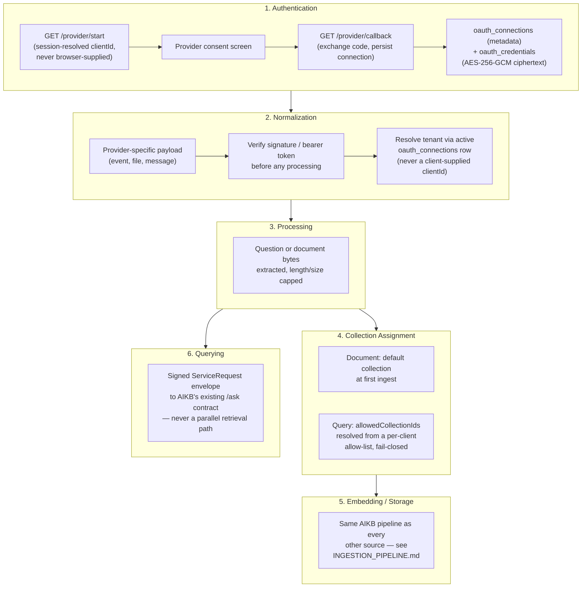

# Connector Framework

Source repository: `relativitysystems/Relativity`. All connector/integration code lives here — AIKB is provider-agnostic and only ever receives normalized ingestion calls or signed knowledge queries (see [AIKB.md](AIKB.md), [INGESTION_PIPELINE.md](INGESTION_PIPELINE.md)).

## Overview

Three external connectors exist today, at three different levels of maturity:

| Connector | Auth model | Maturity |
|---|---|---|
| **Slack** | Encrypted OAuth (`oauth_connections`/`oauth_credentials`), hashed server-side state, HMAC-verified events, idempotent event log | Fully modernized reference implementation |
| **Google Drive** | Legacy plaintext OAuth (`oauth_tokens`) for a persistent-connection flow that is no longer exposed in the portal UI, plus a separate browser-obtained-token Picker import flow | Working, but split across two inconsistent auth paths |
| **Dropbox** | Legacy plaintext OAuth (`oauth_tokens`) | Connect/status only — no working import path exists in this repository today |

Slack is the connector to model any future integration (Gmail, Outlook, Teams, CRM) on. This document describes what actually exists for each connector, then extracts the pattern Slack established so a future connector can reuse it.

## Current Implementation

### Google Drive

- **Auth**: `GET /auth/google/start` (behind `clientAuth`) requests `drive.readonly` scope with `access_type=offline`/`prompt=consent`; state is an **unsigned** base64-encoded `{clientId}` (not hashed or server-stored, unlike Slack's later flow). `GET /auth/google/callback` exchanges the code and stores tokens **in plaintext** via `supabaseService.upsertToken(clientId, 'google_drive', ...)` in the legacy `oauth_tokens` table.
- **A second, separate token path exists for the current UI flow**: the Google Picker. `GET /api/google-drive/picker-config` hands the browser a client ID/API key so the frontend runs Google's own JS picker and obtains its own short-lived access token client-side, sent as an `x-google-access-token` header to `POST /api/google-drive/import`. This route never touches the server-stored refresh token from the OAuth flow above.
- **Normalization**: MIME allow-list (PDF, DOCX, `text/plain`, `text/markdown`) enforced before download; no content transformation happens in Relativity — raw bytes are handed to AIKB unchanged.
- **Trigger**: one-shot, user-initiated only (Picker selection or the apiKey-protected `GET /api/google-drive/files/:clientId` used by external automation). No polling, webhook, or ongoing sync exists.
- **Handoff / collection assignment / embedding / storage**: identical to every other source — `aikbService.uploadAndIngest` uploads to AIKB's Storage bucket, calls `POST /api/knowledge/ingest` tagged `sourceProvider: 'portal_upload'`, and the document is assigned to the client's default collection at first insert, exactly as described in [INGESTION_PIPELINE.md](INGESTION_PIPELINE.md).
- **UI status**: `googleDriveConnected` is still computed and returned by `GET /auth/me`, but nothing in the portal frontend (`portal.js`/`portal.html`) reads or displays it — the persistent-OAuth flow has no current UI entry point; only the one-shot Picker import is exposed.

### Dropbox

- **Auth**: `GET /auth/dropbox/start`/`callback` (`token_access_type=offline`) exchange and store a token via the same legacy plaintext `oauth_tokens` path as Google Drive.
- **Import**: `services/dropboxService.js#listFiles()` is explicitly commented as legacy, intended for a `/api/dropbox/files/:clientId` route used by an external n8n workflow — no such route exists in `routes/api.js` today. **Dropbox therefore has working OAuth connect/disconnect and status only; there is no in-repo document import path.**
- **UI status**: `dropboxConnected` is computed by `GET /auth/me` but, like Google Drive's persistent connection, has no corresponding UI in the portal.

### Slack — Reference Implementation

Mounted at `/api/integrations/slack` (`routes/integrations/slack.js`):

```
GET  /api/integrations/slack/start        clientAuth, requireOwnerAdmin
GET  /api/integrations/slack/callback     (public — resolves identity only from server-side state)
GET  /api/integrations/slack/status       clientAuth
POST /api/integrations/slack/disconnect   clientAuth, requireOwnerAdmin
GET  /api/integrations/slack/collections  clientAuth
PUT  /api/integrations/slack/collections  clientAuth, requireOwnerAdmin
POST /api/integrations/slack/events       verifySlackSignatureMiddleware
POST /api/integrations/slack/deliver      requireServiceRequest (AIKB → Relativity, reversed envelope)
GET  /api/integrations/slack/sweep        requireConfiguredCronSecret (deprecated — see below)
```

**The old flow is retired, not deleted quietly.** `GET/POST /auth/slack/start` and `/callback` now return HTTP `410 Gone` with an explanatory error — the old flow trusted an unsigned, client-supplied `clientId` in its OAuth `state` and stored tokens in plaintext; both were replaced outright rather than patched. AIKB's own former Slack Events handler (`aikb/routes/slack.js`) is likewise retired: it still verifies signatures and answers Slack's `url_verification` challenge (so Slack's app configuration doesn't 404), but every `event_callback` is logged (without message content or tokens) and answered `410 Gone` — no retrieval, no answer generation, no posting back to Slack happens in AIKB anymore. The safe replacement lives entirely in Relativity, described below.

**OAuth install**:
1. `GET /start` generates a cryptographically random 32-byte state, stores only its **SHA-256 hash** server-side (`oauth_states`, 10-minute TTL) together with the session-resolved `client_id`/`member_id` — the raw state value is sent to Slack but never persisted or logged.
2. `GET /callback` is public (no bearer token) but resolves organization/member identity **only** from the `oauth_states` row matched by the returned state's hash — never from anything the browser or Slack supplies directly. Single-use consumption is enforced by one atomic conditional `UPDATE ... WHERE state_hash = $1 AND consumed_at IS NULL AND expires_at > now()`, so two concurrent callbacks for the same state can never both succeed.
3. Requested scopes are minimal: `app_mentions:read`, `chat:write`.
4. The exchanged bot token is encrypted (AES-256-GCM, see [SECURITY.md](SECURITY.md)) and written atomically — connection metadata and encrypted credential together — via the `replace_active_oauth_connection` Postgres function, which revokes any prior active connection for the same `(client_id, provider)` in the same transaction as inserting the new one.

**Event ingestion & tenant mapping**:
- `POST /events` is verified via HMAC-SHA256 over the raw request body (`v0:{timestamp}:{rawBody}`, 300-second replay window, constant-time comparison) before any other processing.
- Tenant mapping is a **single lookup**: the active `oauth_connections` row for `(provider='slack', external_account_id=team_id)`. There is no separate channel-to-client mapping table — the whole Slack workspace maps to one client.
- Only `app_mention` events with no `subtype` and no `bot_id` are processed; self-mentions (the bot mentioning itself) are dropped by comparing against the connection's stored `bot_user_id`.
- The question text is extracted by stripping the leading `<@BOT_ID>` mention, capped at 2000 characters.
- **Idempotency**: every event is recorded in `slack_event_log`, keyed by `UNIQUE(provider, external_event_id)` — the first delivery of a Slack event inserts and proceeds; every redelivery hits the unique constraint and is acknowledged `200` with no further processing. Status is a small state machine: `received → enqueued → answered → delivered` (terminal) or `failed` (terminal, after a bounded retry count).

**Collection-scoped retrieval**: the question is sent to AIKB's `POST /api/knowledge/ask` inside a signed service-request envelope carrying `allowedCollectionIds`, resolved fresh at request time from `slack_collection_access` (a per-client join table of allowed `collection_id`s managed via `GET/PUT /api/integrations/slack/collections`). An empty allow-list means "search nothing," never "search everything" — this is enforced inside AIKB's retrieval SQL itself (see [AIKB.md](AIKB.md)).

**Delivery back to Slack**: AIKB calls back `POST /api/integrations/slack/deliver` once an answer is ready, authenticated by a **reversed** signed envelope (AIKB signs, Relativity verifies via `requireServiceRequest`). The handler looks up the event row by idempotency key, atomically claims it (`enqueued → answered`, so only one delivery attempt ever proceeds even under a race), formats the message, and calls `chat.postMessage` with the client's decrypted bot token.

**Retry sweep (deprecated, not restored)**: `GET /api/integrations/slack/sweep` retries event-log rows stuck in `received`/`enqueued` past a timeout, gated by a cron secret (fails closed with `503` if unset). It is currently **not wired to any scheduler** — the intended Vercel Cron entry was removed because the hosting plan rejected the desired 5-minute interval, so sweeping today is manual/external-trigger only. The earlier plan to restore this scheduler (a Vercel Pro upgrade, an external scheduler, or a Railway-side scheduled job in AIKB) has been **superseded**: the product decision is to not run any scheduled Slack retry sweep, ever — see [ADR-007](../decisions/ADR-007-SLACK-BOUNDED-DELIVERY-RETRY.md). The endpoint and its code still exist in Relativity as of this writing (not yet removed); it is a target for removal or permanent disabling as part of implementing the design below, not something already torn out.

**Target design — bounded delivery retries and terminal `delivery_failed` (approved, not yet implemented)**: Slack delivery failure and AIKB generation failure are handled differently:

- **AIKB generation failure** (AIKB cannot produce an answer, but Slack communication is still functioning): a brief error response is sent to the Slack user, the processing attempt is marked failed, and the event terminates. This depends on the same Slack Web API call path as a normal answer, so it is generally deliverable.
- **Slack delivery failure** (AIKB generated an answer, but the callback to `POST /api/integrations/slack/deliver` or the subsequent `chat.postMessage` call cannot reach or be accepted by Slack): the handler performs a small, bounded number of immediate retry attempts with short backoff, in-flow, during the same processing pass — never via a background scheduler. If delivery still fails after those attempts, the `slack_event_log` row is marked with a terminal status, `delivery_failed`, and processing of that event stops permanently. Because sending an error notification to the Slack user depends on the same unavailable Slack API, a delivery failure **cannot always** notify the user — unlike an AIKB generation failure, where Slack itself is reachable.

On reaching `delivery_failed`, the row's customer content — the Slack user's question, the generated answer, retrieved document chunks/context, and full prompts — is redacted, nulled, or removed. Only the technical metadata needed for Slack event deduplication, basic debugging, delivery-attempt auditing, and client identification is retained: conceptually, `external_event_id` (Slack event dedup), `client_id`, `status = 'delivery_failed'`, `attempt_count`, an error code, a sanitized error message, and `failed_at`/other audit timestamps. The existing `slack_event_log` schema already has `external_event_id`, `client_id`, `status`, `attempt_count`, `error_code`, and `failed_at` (see [TABLES.md](../docs/supabase/global/TABLES.md)); `status` is an unconstrained `text` column, so adding `delivery_failed` as a new value is an application-logic change, not a migration. Whether a sanitized error message needs a new column or fits inside the existing `response_metadata` jsonb column is an implementation decision, not yet finalized. The user can ask the question again manually if they still need an answer; no scheduled process ever revisits a `delivery_failed` row. See [ADR-007](../decisions/ADR-007-SLACK-BOUNDED-DELIVERY-RETRY.md) for the full rationale and tradeoffs, and [../roadmap/FEATURE_BACKLOG.md](../roadmap/FEATURE_BACKLOG.md) item H5 for the implementation task.

## Architecture — The Reusable Connector Pattern

The following pattern is observed directly in the Slack implementation and is the shape a future connector (Gmail, Outlook, Teams, CRM) should follow. It is *not* a formal framework/interface enforced by the codebase today — Google Drive and Dropbox predate it and were not retrofitted onto it — but it is the consistent shape of every Milestone-4/5-era service.



Concretely, a future connector should:

1. **Authentication** — implement `GET /api/integrations/{provider}/start` (session-resolved `clientId`, never trust one from the browser) and `/callback` (exchange code, persist via the shared `oauth_connections`/`oauth_credentials` tables). The `oauth_connections.provider` CHECK constraint already lists `slack`, `microsoft`, `gmail`, `google_drive`, `dropbox` — the schema is provider-generic even though only Slack is migrated onto it today. Use `oauthStateService`'s hashed, single-use, server-side state pattern rather than the older unsigned-base64 pattern still used by Drive/Dropbox.
2. **Normalization** — verify the inbound request's authenticity (signature, bearer token, or provider-specific mechanism) before any other processing, and resolve the tenant **only** from a trusted server-side lookup (an active `oauth_connections` row keyed by the provider's own account/workspace identifier) — never from a client-supplied `clientId` in the payload. This is precisely the failure mode the original AIKB Slack prototype had, and precisely what the current Slack implementation replaced.
3. **Processing** — extract the normalized unit of work (a question string, or file bytes) with the same discipline as Slack's `slackQuestionService` (strip provider-specific wrapper syntax, cap length) or the ingestion routes (extension/MIME allow-lists, size caps).
4. **Collection assignment** — for document sources, assign the client's default collection at first ingest, same as every existing source. For query sources, resolve an `allowedCollectionIds` list from a per-client, per-provider allow-list table (following the `slack_collection_access` join-table shape) and pass it inside the signed envelope, fail-closed on an empty/missing list.
5. **Embedding / Storage** — never implement provider-specific parsing, chunking, or embedding. Every existing source funnels through the identical `uploadAndIngest` → AIKB `/ingest` → Inngest pipeline; a new connector should do the same rather than inventing its own indexing path.
6. **Querying** — never implement provider-specific retrieval logic. Call AIKB's existing `/ask` (or `/query`) contract with a signed service-request envelope, exactly as Slack does. This is the architectural lesson embedded directly in the codebase's own history: AIKB's original Slack prototype ran its own retrieval, bypassing the platform's session/gap/authorization logic, and was retired specifically because of that — see the retirement comment in `aikb/routes/slack.js` and migration `20260714_oauth_connections.sql`.

**Shared conventions already established** that a new connector should reuse rather than reinvent:
- Service factory pattern: `create{X}Service(client)` for test injection, alongside a ready-made default singleton (used by `oauthConnectionsService`, `oauthStateService`, `slackIntegrationService`, `slackEventLogService`, `slackCollectionAccessService`).
- Encrypted credential storage: `oauth_connections` (metadata) + `oauth_credentials` (AES-256-GCM ciphertext, see [SECURITY.md](SECURITY.md)), written atomically via a single Postgres RPC rather than separate client-side inserts.
- Idempotency/event-log pattern: a per-provider event log table keyed by `UNIQUE(provider, external_event_id)`, with a small `received → enqueued → answered → delivered/failed` state machine, for any provider whose events can be redelivered (webhooks, at-least-once queues).

## Current Limitations

- **Google Drive and Dropbox are not on the encrypted `oauth_connections` model.** Both still use the legacy plaintext `oauth_tokens` table via `supabaseService.upsertToken`/`getToken`, explicitly marked `@deprecated for new providers` in code — but not yet migrated for these two existing providers.
- **Google Drive has two inconsistent auth paths** — a persistent OAuth connection (plaintext token, no UI entry point) and a one-shot Picker-obtained browser token (no server-side refresh token at all) — with no single source of truth for "is Drive connected."
- **Dropbox has no working import path** in this repository; `listFiles()` is orphaned code with no calling route.
- **Slack's retry sweep is not scheduled, and restoring its scheduler is no longer the plan.** The sweep endpoint's code still exists (manual/external-trigger only) but is deprecated; the approved target design is bounded, immediate delivery retries followed by a terminal `delivery_failed` status, with no scheduled sweep at all. See [ADR-007](../decisions/ADR-007-SLACK-BOUNDED-DELIVERY-RETRY.md).
- **The connector pattern above is observed, not enforced.** Nothing in the codebase prevents a future connector from bypassing it (e.g., implementing its own retrieval) the way the original AIKB Slack prototype did — there is no shared base class or interface that new connector code must implement.

## Future Extension Points

- The `oauth_connections`/`oauth_credentials` schema already anticipates `microsoft`, `gmail`, `google_drive`, `dropbox` as provider values — a Gmail or Outlook/Teams connector's credential storage requires no new table, only a new adapter following the pattern above.
- `slack_collection_access`'s join-table shape (rather than an array column) is explicitly designed, per its own migration comment, "as the natural extension point for a future `principal_type`/`principal_id` pair (per-group or per-user scoping)" — i.e., moving from organization-wide allow-lists to finer-grained entitlement would not require a schema migration off the current table shape.
- Migrating Google Drive and Dropbox onto the encrypted `oauth_connections` model (rather than adding a fourth ad hoc credential store) is the straightforward next step suggested directly by the schema's existing provider list.
