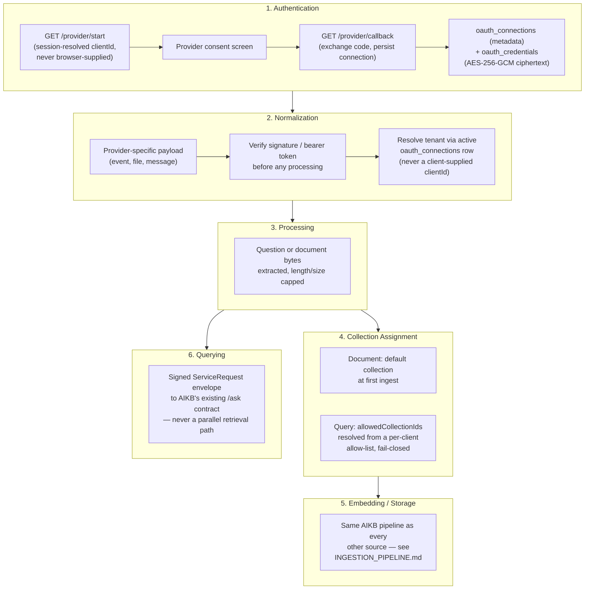

# Connector Framework

Source repository: `relativitysystems/Relativity`. All connector/integration code lives here — AIKB is provider-agnostic and only ever receives normalized ingestion calls or signed knowledge queries (see [AIKB.md](AIKB.md), [INGESTION_PIPELINE.md](INGESTION_PIPELINE.md)).

## Overview

Two external connectors exist today:

| Connector | Auth model | Maturity |
|---|---|---|
| **Slack** | Encrypted OAuth (`oauth_connections`/`oauth_credentials`), hashed server-side state, HMAC-verified events, idempotent event log | Fully modernized reference implementation |
| **Google Drive** | None — a browser-obtained-token Picker import only; no persistent connection | One-shot document import only, by design (see below) |

**Dropbox has been removed entirely (backlog M15).** It previously had an encrypted OAuth connect/status flow (`oauth_connections`/`oauth_credentials`, backlog H2) but no working import path was ever built — `services/dropboxService.js#listFiles()` was orphaned code with no calling route, so Connect stored a credential nothing ever read back. Google Drive's equivalent persistent-connection flow (`GET /auth/google/start`/`callback`, `googleDriveService.js`) was removed for the same reason: it existed only as scaffolding for a future recurring "Knowledge Sync" feature that was never built and isn't scheduled (see [CONNECTOR_ROADMAP.md](../roadmap/CONNECTOR_ROADMAP.md)), and it duplicated — inconsistently — the one-shot Picker import that already served the client's actual use case. See [CLIENT_PORTAL.md](../product/CLIENT_PORTAL.md) for the portal-facing UI change.

Slack is the connector to model any future integration (Gmail, Outlook, Teams, CRM) on. This document describes what actually exists for each connector, then extracts the pattern Slack established so a future connector can reuse it.

## Current Implementation

### Google Drive

Google Drive has exactly one integration surface: a one-shot, browser-token Picker import on the Documents tab. There is no OAuth connect flow and no persistent connection (backlog M15 removed it — see above).

- **Auth**: `GET /api/google-drive/picker-config` hands the browser a client ID/API key so the frontend runs Google's own JS picker and obtains its own short-lived access token client-side, sent as an `x-google-access-token` header to `POST /api/google-drive/import`. No server-side token exchange, storage, or refresh happens anywhere in this flow.
- **Normalization**: MIME allow-list (PDF, DOCX, `text/plain`, `text/markdown`) enforced before download; no content transformation happens in Relativity — raw bytes are handed to AIKB unchanged.
- **Trigger**: one-shot, user-initiated only (Picker selection). No polling, webhook, or ongoing sync exists. (The apiKey-protected `GET /api/google-drive/files/:clientId`/`file/:clientId/:fileId` routes once documented here as a theoretical external-automation entry point were confirmed to have zero live callers and an unconfigured `API_KEY` — dead code, removed per backlog L9.)
- **Handoff / collection assignment / embedding / storage**: identical to every other source — `aikbService.uploadAndIngest` uploads to AIKB's Storage bucket, calls `POST /api/knowledge/ingest` tagged `sourceProvider: 'portal_upload'`, and the document is assigned to the client's default collection at first insert, exactly as described in [INGESTION_PIPELINE.md](INGESTION_PIPELINE.md).

### Slack — Reference Implementation

Mounted at `/api/integrations/slack` (`routes/integrations/slack.js`):

```
GET  /api/integrations/slack/start        clientAuth, requireOwnerAdmin
GET  /api/integrations/slack/callback     (public — resolves identity only from server-side state)
GET  /api/integrations/slack/status       clientAuth
POST /api/integrations/slack/disconnect   clientAuth, requireOwnerAdmin
GET  /api/integrations/slack/collections  clientAuth
PUT  /api/integrations/slack/collections  clientAuth, requireOwnerAdmin
POST /api/integrations/slack/events       verifySlackSignatureMiddleware
POST /api/integrations/slack/deliver      requireServiceRequest (AIKB → Relativity, reversed envelope)
```

`GET /api/integrations/slack/sweep` no longer exists — removed per [ADR-007](../decisions/ADR-007-SLACK-BOUNDED-DELIVERY-RETRY.md); see below.

**The old flow is retired, not deleted quietly.** `GET/POST /auth/slack/start` and `/callback` now return HTTP `410 Gone` with an explanatory error — the old flow trusted an unsigned, client-supplied `clientId` in its OAuth `state` and stored tokens in plaintext; both were replaced outright rather than patched. AIKB's own former Slack Events handler (`aikb/routes/slack.js`) is likewise retired: it still verifies signatures and answers Slack's `url_verification` challenge (so Slack's app configuration doesn't 404), but every `event_callback` is logged (without message content or tokens) and answered `410 Gone` — no retrieval, no answer generation, no posting back to Slack happens in AIKB anymore. The safe replacement lives entirely in Relativity, described below.

**OAuth install**:
1. `GET /start` generates a cryptographically random 32-byte state, stores only its **SHA-256 hash** server-side (`oauth_states`, 10-minute TTL) together with the session-resolved `client_id`/`member_id` — the raw state value is sent to Slack but never persisted or logged.
2. `GET /callback` is public (no bearer token) but resolves organization/member identity **only** from the `oauth_states` row matched by the returned state's hash — never from anything the browser or Slack supplies directly. Single-use consumption is enforced by one atomic conditional `UPDATE ... WHERE state_hash = $1 AND consumed_at IS NULL AND expires_at > now()`, so two concurrent callbacks for the same state can never both succeed.
3. Requested scopes are minimal: `app_mentions:read`, `chat:write`.
4. The exchanged bot token is encrypted (AES-256-GCM, see [SECURITY.md](SECURITY.md)) and written atomically — connection metadata and encrypted credential together — via the `replace_active_oauth_connection` Postgres function, which revokes any prior active connection for the same `(client_id, provider)` in the same transaction as inserting the new one.

**Event ingestion & tenant mapping**:
- `POST /events` is verified via HMAC-SHA256 over the raw request body (`v0:{timestamp}:{rawBody}`, 300-second replay window, constant-time comparison) before any other processing.
- Tenant mapping is a **single lookup**: the active `oauth_connections` row for `(provider='slack', external_account_id=team_id)`. There is no separate channel-to-client mapping table — the whole Slack workspace maps to one client.
- Only `app_mention` events with no `subtype` and no `bot_id` are processed; self-mentions (the bot mentioning itself) are dropped by comparing against the connection's stored `bot_user_id`.
- The question text is extracted by stripping the leading `<@BOT_ID>` mention, capped at 2000 characters.
- **Idempotency**: every event is recorded in `slack_event_log`, keyed by `UNIQUE(provider, external_event_id)` — the first delivery of a Slack event inserts and proceeds; every redelivery hits the unique constraint and is acknowledged `200` with no further processing, including a redelivery arriving after the original event already reached a terminal state. Status is a small state machine: `received -> enqueued -> answered -> delivered` (terminal), or one of two distinct terminal failure states — `failed` (an AIKB-generation-failure notification that itself couldn't be sent) or `delivery_failed` (bounded Slack-delivery retries exhausted; see below and [ADR-007](../decisions/ADR-007-SLACK-BOUNDED-DELIVERY-RETRY.md)).

**Collection-scoped retrieval**: the question is sent to AIKB's `POST /api/knowledge/ask` inside a signed service-request envelope carrying `allowedCollectionIds`, resolved fresh at request time from `slack_collection_access` (a per-client join table of allowed `collection_id`s managed via `GET/PUT /api/integrations/slack/collections`). An empty allow-list means "search nothing," never "search everything" — this is enforced inside AIKB's retrieval SQL itself (see [AIKB.md](AIKB.md)).

**Delivery back to Slack**: AIKB calls back `POST /api/integrations/slack/deliver` once an answer is ready, authenticated by a **reversed** signed envelope (AIKB signs, Relativity verifies via `requireServiceRequest`). The handler looks up the event row by idempotency key, atomically claims it (`enqueued -> answered`, so only one delivery attempt ever proceeds even under a race), formats the message, and calls `chat.postMessage` with the client's decrypted bot token. If that call fails, the answer-delivery leg gets bounded, immediate, in-flow retries (see below) before landing on a terminal state — it does not simply mark the row failed on the first failure the way it did before [ADR-007](../decisions/ADR-007-SLACK-BOUNDED-DELIVERY-RETRY.md).

**Retry sweep — removed, not merely deprecated**: `GET /api/integrations/slack/sweep` and its `cronSweepAuthService.js`/`CRON_SECRET` bearer-secret auth have been deleted from `relativitysystems/Relativity`, along with the `slackEventsService.js`/`slackEventLogService.js` sweep-only helper functions that backed it (`runDeliverySweep`, `retryStuckRow`, `bestEffortFailureReply`, `listStuckForRetry`, `incrementAttempt`). No Vercel Cron entry, external scheduler, or Railway-side scheduled job exists or is planned for Slack delivery, per the product decision in [ADR-007](../decisions/ADR-007-SLACK-BOUNDED-DELIVERY-RETRY.md). This is not a "not yet restored" state — the endpoint and its supporting code are gone.

**Implemented design — bounded delivery retries and terminal `delivery_failed`**: Slack delivery failure and AIKB generation failure are handled differently, exactly as ADR-007 specifies:

- **AIKB generation failure** (AIKB cannot produce an answer, but Slack communication is still functioning): a brief error response is sent to the Slack user (`slackDeliverService.js`, the `payload.error === true` branch), the processing attempt is marked with the pre-existing generic `failed` status, and the event terminates. Single attempt, no retry — this path is unchanged by ADR-007 by design, since Slack itself is reachable here.
- **Slack delivery failure** (AIKB generated an answer, but the callback to `POST /api/integrations/slack/deliver` or the subsequent `chat.postMessage` call cannot reach or be accepted by Slack): `slackDeliverService.js` retries the `chat.postMessage` call via `services/retryWithBackoff.js` — **3 total attempts by default** (initial + 2 retries), **2s then 5s backoff**, both configurable via `SLACK_DELIVERY_MAX_ATTEMPTS`/`SLACK_DELIVERY_BACKOFF_MS` — still within the same request/processing pass, never via a background scheduler. If delivery still fails after those attempts, the `slack_event_log` row is marked with a terminal status, `delivery_failed`, via `slackEventLogService.js#markDeliveryFailed`, and processing of that event stops permanently. Because sending an error notification to the Slack user depends on the same unavailable Slack API, a delivery failure **cannot always** notify the user — unlike an AIKB generation failure, where Slack itself is reachable. The same bounded-retry-then-`delivery_failed` treatment was also extended to the initial synchronous accept-and-enqueue call to AIKB's `POST /api/knowledge/ask` and to the empty-question direct Slack reply (`slackEventsService.js`) — an implementation decision made beyond ADR-007's literal text, to avoid a row getting permanently stuck at `received` now that the sweep no longer exists as a backstop. See [ADR-007](../decisions/ADR-007-SLACK-BOUNDED-DELIVERY-RETRY.md)'s Implementation Status section for the full detail.

On reaching `delivery_failed`, the row's customer content is redacted in both repositories:

- **Relativity**: `slackEventLogService.js#markDeliveryFailed` sets `status`, `failed_at`, `error_code`, `attempt_count`, and `question = null` in a single UPDATE — the row is never observably `delivery_failed` with its question still attached.
- **AIKB**: Relativity's `services/aikbRedactClient.js` makes a **best-effort, single-attempt** signed callback to AIKB's `POST /api/knowledge/chat/redact` (`aikb/routes/knowledge.js`, `requireServiceRequest`-gated identically to `/ask`), which nulls the matching chat session's `title` and every message's `content` (replaced with a fixed marker — the column is `NOT NULL`), `sources`, and `metadata` by `clientId`/`idempotencyKey`. **This AIKB-side callback is not itself retried** — a failure is logged and swallowed, never surfaced to Slack or retried later, since ADR-007 rules out any scheduled process. Relativity's own redaction is unconditional and happens first; AIKB's is best-effort only. See [ADR-007](../decisions/ADR-007-SLACK-BOUNDED-DELIVERY-RETRY.md) for the full tradeoff, stated explicitly rather than hidden.

Only technical metadata needed for Slack event deduplication, basic debugging, delivery-attempt auditing, and client identification is retained: `external_event_id`, `client_id`, `status = 'delivery_failed'`, `attempt_count`, `error_code`, and `failed_at` on the Relativity side; session/message ids, timestamps, `origin`/`origin_metadata`, and `idempotency_key` on the AIKB side. The `slack_event_log.status` column remains unconstrained `text` — `delivery_failed` was an application-logic change, not a migration (see [TABLES.md](../docs/supabase/global/TABLES.md)). The user can ask the question again manually if they still need an answer; no scheduled process ever revisits a `delivery_failed` row. A resend of the same Slack `event_id` after the original reached `delivery_failed` is still deduped at `insertReceived` and never reprocessed, verified by test. Technical-metadata retention duration (ADR-007 suggested 7–30 days) remains an open TODO — see [../roadmap/FEATURE_BACKLOG.md](../roadmap/FEATURE_BACKLOG.md).

**Verification checklist** (manual or automated, before relying on this behavior in a new environment):

1. Run the full `relativitysystems/Relativity` test suite (`npm test`) and the full `relativitysystems/aikb` test suite — both must be green.
2. Ask a real question via Slack; confirm a normal reply, `slack_event_log.status = 'delivered'`, `attempt_count = 1`.
3. Confirm retry-then-success and all-attempts-exhausted behavior via the automated tests in `Relativity/test/slackDeliverService.test.js` and `Relativity/test/slackEventsService.test.js` (these inject failures deterministically — do not invalidate a production Slack bot token to force a real failure).
4. On a terminal `delivery_failed` row, confirm `question` is `null` in Relativity and the corresponding AIKB `knowledge_chat_sessions`/`knowledge_chat_messages` content is redacted, while `idempotency_key`, `external_event_id`, `client_id`, `attempt_count`, and timestamps remain.
5. Resend the same Slack event (or replay the same `event_id` in a test) after a `delivery_failed` row exists; confirm it is deduped, not reprocessed, and no delayed answer is ever posted.
6. Confirm `GET /api/integrations/slack/sweep` returns `404` (route removed) and no cron/scheduled job exists anywhere in either deployment (Vercel, Railway/Inngest) that calls it.
7. After any test run, reconnect/verify the Slack workspace connection still works for a fresh question — bounded-retry testing should never leave the connection in a broken state.

## Architecture — The Reusable Connector Pattern

The following pattern is observed directly in the Slack implementation and is the shape a future connector (Gmail, Outlook, Teams, CRM) should follow. It is *not* a formal framework/interface enforced by the codebase today — Google Drive's one-shot Picker import predates it and was never retrofitted onto it (nor does it need to be — it isn't an ongoing connection) — but it is the consistent shape of every Milestone-4/5-era service.



Concretely, a future connector should:

1. **Authentication** — implement `GET /api/integrations/{provider}/start` (session-resolved `clientId`, never trust one from the browser) and `/callback` (exchange code, persist via the shared `oauth_connections`/`oauth_credentials` tables). The `oauth_connections.provider` CHECK constraint still lists `slack`, `microsoft`, `gmail`, `google_drive`, `dropbox` — the schema remains provider-generic even though only Slack is actually migrated onto it today (Google Drive and Dropbox's persistent-connection flows were removed entirely per backlog M15; `google_drive`/`dropbox` stay valid CHECK values only in case a real recurring-sync connector is built for either later). Use `oauthStateService`'s hashed, single-use, server-side state pattern — still provider-generic and available to any new connector — for any new one too.
2. **Normalization** — verify the inbound request's authenticity (signature, bearer token, or provider-specific mechanism) before any other processing, and resolve the tenant **only** from a trusted server-side lookup (an active `oauth_connections` row keyed by the provider's own account/workspace identifier) — never from a client-supplied `clientId` in the payload. This is precisely the failure mode the original AIKB Slack prototype had, and precisely what the current Slack implementation replaced.
3. **Processing** — extract the normalized unit of work (a question string, or file bytes) with the same discipline as Slack's `slackQuestionService` (strip provider-specific wrapper syntax, cap length) or the ingestion routes (extension/MIME allow-lists, size caps).
4. **Collection assignment** — for document sources, assign the client's default collection at first ingest, same as every existing source. For query sources, resolve an `allowedCollectionIds` list from a per-client, per-provider allow-list table (following the `slack_collection_access` join-table shape) and pass it inside the signed envelope, fail-closed on an empty/missing list.
5. **Embedding / Storage** — never implement provider-specific parsing, chunking, or embedding. Every existing source funnels through the identical `uploadAndIngest` → AIKB `/ingest` → Inngest pipeline; a new connector should do the same rather than inventing its own indexing path.
6. **Querying** — never implement provider-specific retrieval logic. Call AIKB's existing `/ask` (or `/query`) contract with a signed service-request envelope, exactly as Slack does. This is the architectural lesson embedded directly in the codebase's own history: AIKB's original Slack prototype ran its own retrieval, bypassing the platform's session/gap/authorization logic, and was retired specifically because of that — see the retirement comment in `aikb/routes/slack.js` and migration `20260714_oauth_connections.sql`.

**Shared conventions already established** that a new connector should reuse rather than reinvent:
- Service factory pattern: `create{X}Service(client)` for test injection, alongside a ready-made default singleton (used by `oauthConnectionsService`, `oauthStateService`, `slackIntegrationService`, `slackEventLogService`, `slackCollectionAccessService`).
- Encrypted credential storage: `oauth_connections` (metadata) + `oauth_credentials` (AES-256-GCM ciphertext, see [SECURITY.md](SECURITY.md)), written atomically via a single Postgres RPC rather than separate client-side inserts.
- Idempotency/event-log pattern: a per-provider event log table keyed by `UNIQUE(provider, external_event_id)`, with a small `received → enqueued → answered → delivered/failed` state machine, for any provider whose events can be redelivered (webhooks, at-least-once queues).

## Current Limitations

- ~~Google Drive and Dropbox are not on the encrypted `oauth_connections` model.~~ **Resolved (backlog H2), then removed entirely (backlog M15).** Both briefly wrote through `oauth_connections`/`oauth_credentials`, the same model Slack uses, before their persistent-connection flows were removed outright as unused scaffolding — see the Overview section above. `upsertToken`/`getToken` in `supabaseService.js` are unchanged and still exist, but nothing calls them for any provider anymore.
- ~~Google Drive has two inconsistent auth paths~~ **Resolved (backlog M15).** The persistent OAuth connection is gone; only the one-shot Picker-obtained browser token remains, so there is now exactly one auth path for Drive.
- ~~Dropbox has no working import path in this repository~~ **Resolved (backlog M15).** Rather than build one, the entire Dropbox connector (Connect/status, no import) was removed — it had no working functionality to preserve.
- **Slack delivery does not guarantee eventual delivery, by design.** Bounded, immediate delivery retries followed by a terminal `delivery_failed` status (implemented, see above) replace the sweep entirely — there is no scheduled recovery of any kind. A sustained Slack outage longer than the retry window can still lose an answer; the user must ask again. See [ADR-007](../decisions/ADR-007-SLACK-BOUNDED-DELIVERY-RETRY.md).
- **AIKB-side redaction on `delivery_failed` is best-effort, not guaranteed.** If the redaction callback to AIKB fails, Relativity's own `slack_event_log.question` is still correctly redacted, but the corresponding AIKB chat session/message content can remain un-redacted with no automatic retry. See [ADR-007](../decisions/ADR-007-SLACK-BOUNDED-DELIVERY-RETRY.md)'s Implementation Status section.
- **No monitoring or alerting exists for a rise in `delivery_failed` events or failed AIKB redaction callbacks** — both are currently only visible in application logs. See [../roadmap/FEATURE_BACKLOG.md](../roadmap/FEATURE_BACKLOG.md).
- **Technical-metadata retention for terminal Slack events is undecided.** ADR-007 suggested 7–30 days; no cleanup mechanism exists in either repository yet (`Relativity/services/slackEventLogService.js` carries an explicit TODO). See [../roadmap/FEATURE_BACKLOG.md](../roadmap/FEATURE_BACKLOG.md).
- **The connector pattern above is observed, not enforced.** Nothing in the codebase prevents a future connector from bypassing it (e.g., implementing its own retrieval) the way the original AIKB Slack prototype did — there is no shared base class or interface that new connector code must implement.

## Future Extension Points

- The `oauth_connections`/`oauth_credentials` schema already anticipates `microsoft`, `gmail`, `google_drive`, `dropbox` as provider values — a Gmail, Outlook/Teams, or a real recurring-sync Google Drive/Dropbox connector's credential storage requires no new table, only a new adapter following the pattern above.
- `slack_collection_access`'s join-table shape (rather than an array column) is explicitly designed, per its own migration comment, "as the natural extension point for a future `principal_type`/`principal_id` pair (per-group or per-user scoping)" — i.e., moving from organization-wide allow-lists to finer-grained entitlement would not require a schema migration off the current table shape.
- ~~Migrating Google Drive and Dropbox onto the encrypted `oauth_connections` model~~ — done, backlog H2, then reverted, backlog M15 (see Overview). If a real "Knowledge Sync" (recurring ingestion) feature is ever built for either provider, `oauth_connections`/`oauth_credentials` is still the right place to store its credentials — rebuild the connect flow alongside the sync engine that would actually drive it, not standalone in advance. `microsoft` and `gmail` remain in the provider list with no adapter built yet; their credential storage requires no new migration, only a new OAuth adapter following this same pattern.
