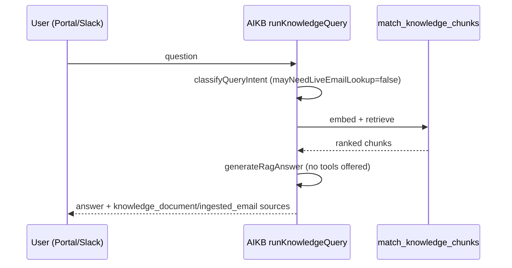
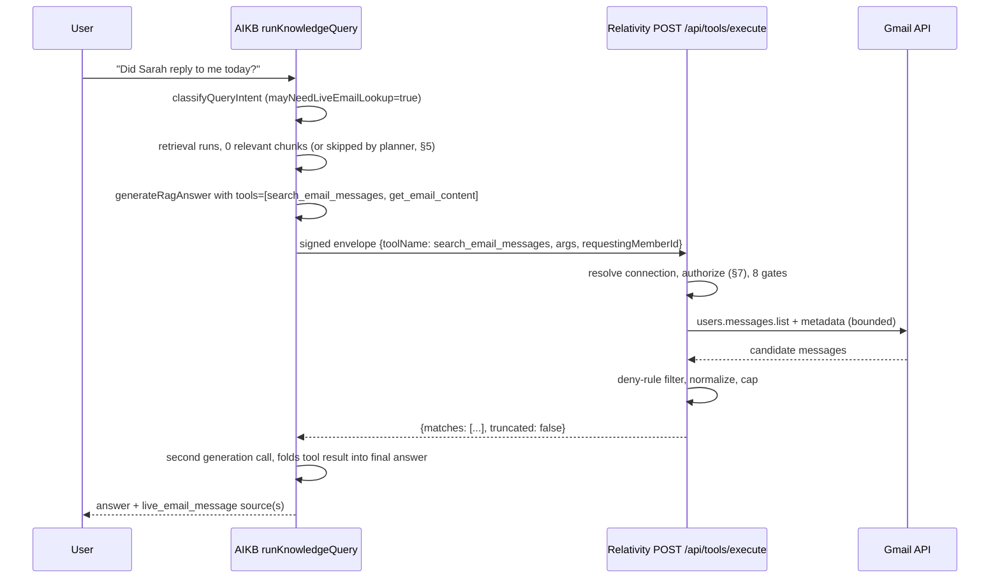
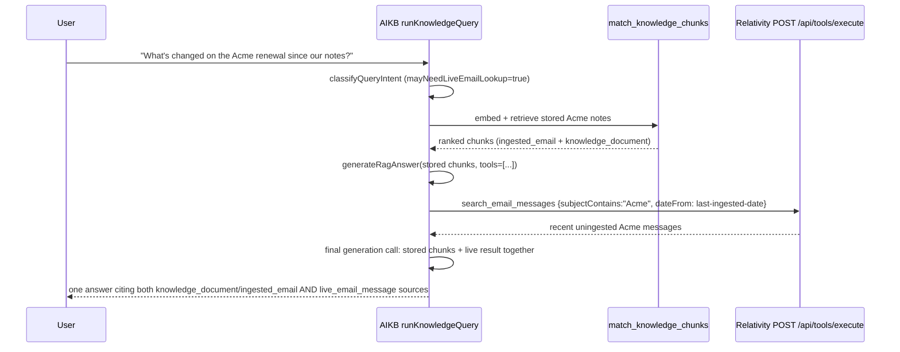
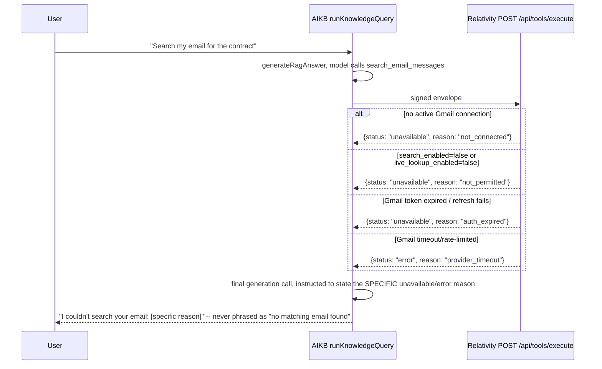

# Live Email Lookup — Architecture and Implementation Plan

**Status of this document: Proposed, with implementation underway. EL1–EL3 are implemented as of 2026-07-30** — architecture/contracts (EL1), the read-only tool registry (EL2, [§EL2](#el2--read-only-tool-registry)), and the signed AIKB→Relativity execution endpoint proven end-to-end with one hardcoded no-op tool (EL3, [§EL3](#el3--signed-aikb-to-relativity-execution-endpoint)). **EL4 onward remain unimplemented** — no real Gmail call, no mailbox authorization gate, and no portal/Slack UI exists in `relativitysystems/Relativity` or `relativitysystems/aikb` yet. Treat each milestone's own Status line as authoritative over this banner if the two ever disagree.

Source repositories: `relativitysystems/Relativity` and `relativitysystems/aikb`. Cross-reference [ADR-010](../decisions/ADR-010-LIVE-TOOL-CALLS-ORCHESTRATED-BY-AIKB.md) (authoritative for the orchestration boundary this plan implements — see [ADR-010 Conformance](#adr-010-conformance-and-one-proposed-clarification) below for the one place this plan asks for a narrow, explicit clarification), [EMAIL_INGESTION.md](EMAIL_INGESTION.md) (the existing ingestion pipeline this plan sits beside, not replaces), [CONNECTOR_FRAMEWORK.md](CONNECTOR_FRAMEWORK.md) (why a live-query connector does not follow the ingestion pattern), [SERVICE_CONTRACTS.md](SERVICE_CONTRACTS.md) and [SECURITY.md](SECURITY.md) (the signed-envelope mechanism this plan reuses unchanged), and [../product/AI_AGENTS.md](../product/AI_AGENTS.md) (confirms: **no tool/function calling exists anywhere in either codebase today** — this plan is the first).

## Executive Summary

Relativity Systems' email feature today only ever ingests: a member labels (or, in `automatic` mode, an org policy matches) a Gmail message, Relativity fetches and normalizes it, and it becomes a permanent, embedded, cross-employee-searchable `knowledge_documents` row in AIKB. This is durable, cheap-per-query, and good for company knowledge that should persist and be found later — but it is wrong for "did Sarah reply to me today," "what's currently unread," or anything where the value is the mailbox's *current* state, not a synchronized copy. Building that as a second ingestion pipeline would mean re-syncing constantly to stay fresh, which either goes stale between syncs or burns exactly the sync cost EM7's incremental cursor was built to avoid — and still wouldn't answer "right now" questions correctly between syncs.

This plan adds a second, structurally distinct mechanism: a small, fixed set of **read-only, bounded, request-scoped live email tools**, orchestrated by AIKB and executed by Relativity, following [ADR-010](../decisions/ADR-010-LIVE-TOOL-CALLS-ORCHESTRATED-BY-AIKB.md) — the same shape ADR-010 already locked in for the platform's first live-query connector (CRM), here applied to email instead. Nothing a live tool call returns is ever embedded, stored, or added to `knowledge_documents`. Ingestion is untouched and remains the right mechanism for durable, cross-session, cross-employee company knowledge; live lookup is the right mechanism for "what does this specific mailbox say right now."

The two mechanisms share as much as safely possible: the same organization deny-rule engine (`evaluateMessageAgainstPolicy`, extended — see [§5](#5-hybrid-retrieval-planner)), the same Gmail OAuth connections and normalization code, the same signed-envelope pattern between Relativity and AIKB, and the same portal/Slack surfaces. They differ in exactly the ways ADR-010 says a live-query connector must differ from an ingestion connector: no collection assignment, no embedding, no persistence of the raw result, and a bounded tool-call loop instead of a scheduled sync.

## Scope

**In scope for this plan (design/planning only):**
- A versioned, read-only email tool registry (2 tools — see [§4](#4-tool-registry)) executed by Relativity, orchestrated by AIKB.
- Portal and Slack activation design, including disclosure and consent controls.
- Hybrid retrieval planning (stored knowledge vs. live lookup vs. both vs. neither).
- Source/citation model distinguishing ingested from live email sources.
- Security threat model, cost/token controls, reliability/fallback behavior, and observability.
- A milestone sequence (EL1–EL12).

**Out of scope (explicitly, for this and the initial implementation milestones):**
- Any write/send/delete/archive/label/forward capability — read-only only, per the task's explicit instruction.
- Arbitrary Gmail query syntax exposed to the model — the model receives a structured argument schema only (see [§4](#4-tool-registry)).
- Attachment *content* access (`get_email_attachment_text`) — deferred until [EM11](EMAIL_INGESTION.md#em11--attachments)'s unresolved malware-scanning question is answered; this plan does not reopen that question.
- Outlook — this plan is Gmail-first, following the same "prove it once, for real, then repeat it" sequencing [EMAIL_INGESTION.md](EMAIL_INGESTION.md) uses for its own EM12. The tool contracts are written provider-neutral so an Outlook adapter is additive later (see [§4](#4-tool-registry) and [EL12](#el12--outlook-provider-adapter)).
- Multi-step, open-ended agentic loops — bounded to at most two tool-call round trips per question (see [ADR-010 Conformance](#adr-010-conformance-and-one-proposed-clarification)), never an unbounded "keep calling tools until satisfied" loop.
- Cross-member "shared mailbox" search — no such entitlement model exists today (see [§2](#2-portal-activation) and [§7](#7-security-and-threat-model)); flagged as a real gap, not solved here.

## ADR-010 Conformance and One Proposed Clarification

ADR-010 is treated as authoritative throughout this plan. Every design decision below traces back to one of its seven decision points:

| ADR-010 decision | How this plan applies it |
|---|---|
| 1. AIKB orchestrates via `runKnowledgeQuery`, extended with tool-calling | [§1](#1-query-flow) — the generation step gains `tools`, exactly as ADR-010 anticipates; no second answer-generation path is created |
| 2. Relativity is the only credential holder/API caller; AIKB calls a generic `POST /api/tools/execute` | [§1](#1-query-flow), [§4](#4-tool-registry) — `toolName` is bounded and provider-agnostic to AIKB; Relativity resolves Gmail internally |
| 3. Reuse the existing signed-envelope mechanism | [§1](#1-query-flow) — reuses `signServiceRequest`/`verifyServiceRequest` (the same clientId-scoped envelope `/ask` already uses), not a new scheme, and not the system-scoped variant EM8 built (that one deliberately carries no `clientId`, which a per-question tool call always has) |
| 4. Fail-closed authorization, never silently "no data" | [§7](#7-security-and-threat-model), [§9](#9-reliability-and-fallback-behavior) — a missing/revoked connection returns a distinct `unavailable` result, never an empty match list |
| 5. Nothing a tool call returns is ingested | [§3-tool-registry-boundaries](#4-tool-registry), [§7](#7-security-and-threat-model) — enforced structurally: the tool-execute response never touches `knowledge_documents`/`knowledge_chunks`, and is discarded after the one generation call it served |
| 6. Small, fixed, named tool set — never freeform provider queries | [§4](#4-tool-registry) — exactly 2 tools, each with a declared, validated argument schema |
| 7. Bounded to a small fixed maximum, recommended one call per question | See below — this plan asks for a narrow, explicit **clarification**, not an amendment to the boundary's intent |

**Confirmed clarification (2026-07-30 — see [Decision Log](#decision-log-2026-07-30)):** ADR-010 item 7 recommends "one tool call per question" and explicitly anticipates that raising this bound requires its own deliberate decision, not a default. This plan's tool registry is designed so the common case still needs only one call (`search_email_messages` returns snippets sufficient to answer most questions directly — see [§4](#4-tool-registry)), but a search-then-read-full-content flow (e.g., "what exactly did the customer say in the latest Acme thread" — search finds the thread, then the model needs the full body) genuinely needs a second, different tool (`get_email_content`) chained after the first. **Approved: the bound is raised to a hard maximum of two tool calls per question, structured as one bounded logical operation, not a general loop: Call 1 is always `search_email_messages`; Call 2, if it happens at all, is always `get_email_content` for one result Call 1 already returned.** The model cannot call `search_email_messages` twice, cannot call `get_email_content` before `search_email_messages` in the same turn, cannot call `get_email_content` for an id it did not receive from Call 1, and cannot chain a third call of any kind — AIKB must never be allowed to repeatedly search and fetch until it decides it's satisfied. This is recorded here as the short, explicit clarification to ADR-010 item 7 this plan needed; a corresponding short addendum to ADR-010 itself has been added (see that ADR's "Second Proposed Application" section) rather than left implicit. [EL5](#el5--aikb-bounded-tool-orchestration) must enforce this bound in code, not merely in a system prompt — see that milestone's Security requirements.

---

## 1. Query Flow

### 1.1 End-to-end sequence, narrated

1. **Session resolution** — unchanged from today (`runKnowledgeQuery`'s existing session/history logic, [AI_AGENTS.md](../product/AI_AGENTS.md)). Portal: `clientId`/`memberId`/`memberRole` from the JWT. Slack: resolved via the workspace's `oauth_connections` row, per [CONNECTOR_FRAMEWORK.md](CONNECTOR_FRAMEWORK.md) — see [§3](#3-slack-activation) for why "which member's mailbox" is a materially harder question here than for the portal.
2. **Intent classification (extended)** — the existing `classifyQueryIntent` (`gpt-4o-mini`, temperature 0) gains one additional output field, `mayNeedLiveEmailLookup: boolean`, decided in the same call at negligible extra cost (a few extra output tokens, no extra model call). This is a **gate, not a decision** — it only controls whether the generation step is even offered the tools; the generation step (which sees retrieved chunks and full context) makes the real call.
3. **Stored knowledge retrieval** — unchanged (`buildRetrievalQuery` → embed → `match_knowledge_chunks`), run whenever the existing retrieval gate says to, exactly as today. Live lookup does not replace this — see [§5](#5-hybrid-retrieval-planner).
4. **Live-lookup availability check (no new network call)** — Relativity already knows, at the moment it forwards a question to AIKB, whether the requesting member (portal) or resolved member (Slack, post-[EL7](#el7--slack-identity-and-disclosure-controls)) has an active, live-lookup-enabled Gmail connection. Relativity attaches `emailLookupAvailable: boolean` to the existing `/query`/`/ask` request body. AIKB only offers the tools to the model when both `mayNeedLiveEmailLookup` (step 2) and `emailLookupAvailable` are true — avoiding the token cost of a tools schema on every single query, and avoiding a wasted round trip on a member who has never connected Gmail.
5. **Tool-augmented generation** — when the gate passes, `generateRagAnswer` (or a new sibling, see [§1.3](#13-should-tool-selection-extend-intent-classification-happen-in-generation-or-be-a-separate-step)) is called with `tools: [searchEmailMessages, getEmailContent]` (JSON schemas, [§4](#4-tool-registry)) alongside the existing retrieved-chunk context. The model either answers directly from stored context (no tool call — most "company knowledge" questions) or emits one `tool_calls` entry.
6. **Tool selection and argument construction** — the model, not application code, picks which tool and constructs its structured arguments (sender/recipient/subject/date-range/keywords/unread/attachment-presence, [§4](#4-tool-registry)) — never raw Gmail query syntax (see [§4](#4-tool-registry) for why).
7. **AIKB → Relativity signed tool request** — AIKB calls `POST /api/tools/execute` with the existing clientId-scoped signed envelope (`signServiceRequest`, [ADR-004](../decisions/ADR-004-SIGNED-SERVICE-REQUESTS.md)), wrapping `{ toolName, args, requestingMemberId, origin, originMetadata }`. `clientId` is the envelope's own bound field, not part of the payload — same discipline every other signed route already follows.
8. **Mailbox and user authorization** — Relativity resolves the requesting member's active Gmail connection (`email_connections` + `oauth_connections`), re-checks `client_members.status = 'active'`, `role != 'viewer'`, `search_enabled = true`, connection `status = 'active'`, and a **new**, independent `live_lookup_enabled` flag (org-wide and per-mailbox — see [§7](#7-security-and-threat-model) for why this is a separate toggle from ingestion's `automatic_sync_enabled`). Any failure returns a distinct, named `unavailable` reason (see [§9](#9-reliability-and-fallback-behavior)) — never an empty match list.
9. **Gmail API execution** — Relativity calls Gmail using the already-built `gmailService.js` primitives (`listMessageIdsByQuery`/`getMessageMetadata` for search, `getMessageBody` for content) — no new Gmail-facing code, only new bounded orchestration around existing calls.
10. **Deny-rule re-verification** — every candidate result is checked against the client's organization **deny** rules (`emailPolicyService.evaluateMessageAgainstPolicy`, extended — see [§5](#5-hybrid-retrieval-planner)) before it is returned. A message a deny rule excludes is silently dropped from the result set, the same way it would never be ingested.
11. **Normalization into a provider-neutral result** — `get_email_content` reuses `emailNormalizationService.normalizeEmailBody` unchanged (strip quotes/signatures, HTML→text) before the body ever reaches AIKB; `search_email_messages` returns Gmail's own metadata/snippet fields mapped onto the shared, provider-neutral schema ([§4](#4-tool-registry)) so an eventual Outlook adapter needs no AIKB-side change.
12. **Returning the result to AIKB** — a bounded, capped JSON result (see [§8](#8-cost-and-token-controls) for exact caps), never raw HTML/MIME, never an OAuth token, never another member's content.
13. **Final answer generation** — the tool result is appended as a `tool` role message and one more `chat.completions.create` call produces the final answer, citing stored chunks and/or the live result together in one coherent response.
14. **Source/citation presentation** — see [§6](#6-sources-and-citations).
15. **Persistence and audit behavior** — the generated answer text is persisted to `knowledge_chat_messages` exactly as any other answer (per ADR-002/ADR-010 item 5); the raw tool call/result is never persisted as knowledge, but a redacted audit row is written (see [§10](#10-observability-and-auditability)).
16. **Timeout and fallback behavior** — see [§9](#9-reliability-and-fallback-behavior).

### 1.2 Sequence diagrams

**Stored retrieval only** (unchanged from today):



**Live email lookup only** (question has no stored-knowledge match, or is inherently about mailbox state):



**Hybrid: stored retrieval + live lookup**:



**Failed or unauthorized live lookup**:



### 1.3 Should tool selection extend intent classification, happen in generation, or be a separate step?

| Option | Description | Cost | Reliability | ADR-010 fit |
|---|---|---|---|---|
| A. Classifier-only | Extend `classifyQueryIntent` (`gpt-4o-mini`) to directly decide the tool name and construct arguments in the same cheap call | Cheapest — no tools schema ever sent to `gpt-4.1` | Weak — a small model constructing structured search arguments *before* seeing retrieved chunks, with no chance to revise, is the least reliable point to do this | Partially conflicts with ADR-010 item 1, which places tool-calling in the generation step |
| B. Generation-only | Always give `generateRagAnswer` the `tools` array; let `gpt-4.1` decide on every single query | Most expensive — every query pays the tools-schema token overhead (~300–600 tokens) even when never used | Most reliable — full retrieved-context awareness at decision time | Matches ADR-010 item 1 literally, but ignores its Consequences section's explicit steer toward extending the classifier as "the natural place tool availability... is decided" |
| **C. Two-stage gate + generation-time selection (recommended)** | Cheap classifier adds a boolean gate (`mayNeedLiveEmailLookup`) at near-zero marginal cost; **only when the gate (and `emailLookupAvailable`) both pass** does `generateRagAnswer` receive the `tools` array and make the real tool-name/argument decision | Pays the tools-schema overhead only on the minority of queries that plausibly need it | Full-context reliability exactly where it matters (the model sees stored chunks before deciding), cheap gating everywhere else | Matches ADR-010 item 1 (tool-calling lives in generation) **and** its Consequences section (classifier decides *availability*, not the tool call itself) |

**Recommendation: Option C.** It is the only option that satisfies both halves of ADR-010's own text without contradiction, and it is the design with the best cost/reliability tradeoff — the classifier gate is nearly free (a few extra JSON output tokens on a call that already runs on every question), and the token cost of a full tools schema is paid only when a live lookup is plausible in the first place. See [§8](#8-cost-and-token-controls) for the token-cost comparison across these options.

---

## 2. Portal Activation

### 2.1 Design (MVP)

- **Automatic tool use, gated as in [§1](#1-query-flow)** — no user action required for the common case; the model decides.
- **Mode selector, MVP shape**: `Company knowledge` / `Live email` / `Automatic` (default: `Automatic`), a per-member, `localStorage`-persisted preference — following the exact precedent of Knowledge Base's existing "Search scope" collection filter (`portal.js`, backlog M10), not a new UI pattern. `Company knowledge` suppresses tool offering entirely (skips step 4/5 of [§1.1](#11-end-to-end-sequence-narrated)); `Live email` forces the gate open regardless of the classifier's `mayNeedLiveEmailLookup` value (still subject to every authorization gate in [§1.1](#11-end-to-end-sequence-narrated) step 8 — a forced mode never bypasses authorization); `Automatic` is the two-stage design in [§1.3](#13-should-tool-selection-extend-intent-classification-happen-in-generation-or-be-a-separate-step). **See [§2.2](#22-long-term-ux-direction-confirmed-adjustment-2026-07-30) — this three-way selector is a launch/testing surface, not the intended permanent UI.**
- **"Searching connected email…" activity state** — the portal's existing loading-dots bubble ([CLIENT_PORTAL.md](../product/CLIENT_PORTAL.md)) gains a second phase, shown only while a tool call is in flight (a `tool_call_started`/`tool_call_finished` pair the non-streaming `/query` response can't emit mid-request today — see the note on streaming below).
- **Mailbox-scope control — confirmed (2026-07-30): "My mailbox" only, full stop, for the entire MVP.** Not merely the default; the other two options the task originally raised (`A permitted shared mailbox` / `All mailboxes I'm authorized to search`) are **not built at all** until a real mailbox-access policy model exists — explicit grants, revocation, and audit history, not an implicit "everyone at the client can see everyone's mailbox" default. [EMAIL_INGESTION.md §22](EMAIL_INGESTION.md#22-knowledge-collections-and-authorization) and [§30 item 3](EMAIL_INGESTION.md#30-risks-and-unresolved-decisions) already flag this exact gap for *ingested* content ("no per-user document visibility model exists anywhere in the platform"); live lookup reopens the identical question for *live* content, and this plan confirms it stays unresolved until that policy model is built as its own, later piece of work — see [§7](#7-security-and-threat-model).
- **Stored vs. live sources shown separately** — see [§6](#6-sources-and-citations).
- **Live provenance indicator** — a small "🔴 Live" or "Searched just now" badge distinguishes a `live_email_message`/`live_email_thread` citation from an `ingested_email` one, since both can appear in the same answer (the hybrid case).
- **Full metadata on a live citation** — sender, recipients (to/cc, when returned), subject, received timestamp, thread id, and deep link — see [§6](#6-sources-and-citations) for the exact shape and what is deliberately withheld (bcc, other recipients the requesting member isn't already privy to).
- **No Gmail connected**: the mode selector's `Live email` option and the `Automatic` mode's tool-offering are both silently inert (never offered) — the portal shows the same "Connect Gmail" prompt the existing Email panel already has, not a new error state.
- **Per-member setting to disable automatic live lookup** — the mode selector itself doubles as this control (`Company knowledge` = off) in the MVP UI; see [§2.2](#22-long-term-ux-direction-confirmed-adjustment-2026-07-30) for how this survives the later UX simplification.
- **Org-wide admin policy** — a new `email_organization_settings.live_lookup_enabled` boolean (default `false`, fail-closed — mirrors `automatic_sync_enabled`'s existing default), owner/admin-only, alongside the existing automatic-sync toggle on the same settings panel. This is **independent of** `automatic_sync_enabled` — an org may allow automatic ingestion but not live lookup, or vice versa (see [§7](#7-security-and-threat-model) for why these must not be the same flag). Confirmed: this must remain a hard, complete disable — when off, the tools are never offered to the model for any member of that client, regardless of individual mode-selector preference.

### 2.2 Long-term UX direction (confirmed adjustment, 2026-07-30)

The three-way mode selector in [§2.1](#21-design-mvp) is explicitly **not** the intended permanent experience — it is a launch/testing surface, valuable while the planner ([§5](#5-hybrid-retrieval-planner)) is still being tuned against real usage, but not the eventual default. Confirmed target shape, to converge toward once the planner is proven (no new milestone number assigned yet — this is a product direction recorded now so [EL6](#el6--portal-automatic-live-search-experience) is built in a way that doesn't have to be thrown away to get there):

- **`Automatic` becomes the only default mode** — the agent chooses the source (stored, live, both, neither) intelligently per [§5](#5-hybrid-retrieval-planner), with no per-question mode toggle required from ordinary users.
- **A small, secondary "source control" menu for advanced users** — not the prominent three-way selector; a compact, less prominent control (e.g., a small icon/menu near the chat input) for a user who wants to override the planner for one question.
- **"Search live email" becomes an explicit shortcut**, not a mode — directly satisfying the "Search my email" portal shortcut already listed in [§11](#11-additional-product-features) as MVP-adjacent; this is the same underlying mechanism (`Live email` mode, forced), just surfaced as an action rather than a persistent selector state.
- **The org-wide `live_lookup_enabled` disable switch is unchanged and remains the hard override** regardless of how the per-question UI evolves — an org that has turned live lookup off never sees any of this, at any UX maturity level.

This does not change anything about [§1](#1-query-flow)'s orchestration logic or [§5](#5-hybrid-retrieval-planner)'s planner — it is purely a front-end presentation evolution, sequenced after real usage data justifies simplifying the explicit selector into an intelligent default.

### 2.3 Consent design (confirmed, 2026-07-30)

- **Trigger**: the first time `Automatic` or `Live email` mode actually attempts a mailbox search for a given member (i.e., the first time [§1.1](#11-end-to-end-sequence-narrated) step 8 would otherwise proceed) — not at Gmail-connect time, and not gated behind a separate settings visit. Tracked via a new `client_members.live_lookup_consented_at` (nullable timestamp; `null` blocks tool-offering and forces the modal instead, mirroring the fail-closed pattern every other email-feature gate already uses).
- **Confirmed exact wording**: *"Relativity can search your connected mailbox when a question requires current email information. Live results are used only to answer your request and are not added to the company knowledge base unless you explicitly save them."*
- **This is a product consent record, explicitly separate from Google's OAuth consent screen** — Gmail's own `gmail.readonly` OAuth consent (already granted at connect time, per [EMAIL_INGESTION.md §10](EMAIL_INGESTION.md#10-gmail-integration-design)) authorizes *Relativity* to read the mailbox at all; this second, lightweight, in-product consent specifically covers *live, per-question* use of that access, distinct from ingestion's separate label/allow-rule consent mechanism ([EMAIL_INGESTION.md §22](EMAIL_INGESTION.md#22-knowledge-collections-and-authorization)). Three independent consent surfaces now exist for one Gmail connection (OAuth scope grant, ingestion's per-message label, live lookup's one-time product consent) — each answering a different question, deliberately not collapsed into one.
- **Revocation**: a visible toggle in the Email integration panel ("Live email search: On/Off, since [date]") lets a member revoke this consent at any time, distinct from disconnecting Gmail entirely — revoking sets `live_lookup_consented_at` back to `null`, which re-blocks tool-offering and re-triggers the modal on next attempted use, without touching the underlying OAuth connection or ingestion settings at all.
- **Lightweight, not a multi-step flow**: one dismissible modal, one confirm action — no separate onboarding sequence, matching the task's explicit "keep it lightweight" instruction.

### 2.4 MVP vs. later

| | MVP | Later |
|---|---|---|
| Mode selector | ✅ Company knowledge / Live email / Automatic, prominent | Collapses into Automatic-by-default + a small advanced source-control menu + an explicit "Search live email" shortcut, [§2.2](#22-long-term-ux-direction-confirmed-adjustment-2026-07-30) |
| Mailbox scope | ✅ "My mailbox" only — confirmed as the model, not just the launch default | Shared/authorized-mailbox search, only once a real mailbox-access policy model (explicit grants, revocation, audit history) exists |
| Activity state | ✅ Static "Searching connected email…" text | A streamed, incremental "found 3 messages, reading thread…" progress state (needs streaming — [AI_AGENTS.md](../product/AI_AGENTS.md) confirms neither repo streams today; a larger, separate change) |
| Consent | ✅ One-time lightweight modal, revocable in settings, [§2.3](#23-consent-design-confirmed-2026-07-30) | A richer, revisitable "what Relativity can see" privacy center |
| Admin policy | ✅ Org-wide on/off | Per-role or per-collection live-lookup restrictions |

---

## 3. Slack Activation

### 3.1 The identity gap this plan must confront directly

Every design in this section is downstream of one fact, confirmed against the code and [FEATURE_BACKLOG.md](../roadmap/FEATURE_BACKLOG.md) item M13: **Relativity has no mapping from a Slack user to a `client_members` row today.** M13 explicitly, deliberately descoped "employee-level authorization" — any user in a connected Slack workspace may DM the bot or `@mention` it in a channel, and every such request is authorized only at the *client* (workspace) level, never the *individual Slack user* level. This was a correct, deliberate decision for stored-knowledge Q&A (the whole client's knowledge base is already uniformly accessible to any workspace member), but it is a **hard blocker** for live email lookup specifically: "search my email" has no resolvable "my" without knowing which `client_members` row (and therefore which `email_connections` row) the Slack user maps to. This is a real, material gap this plan cannot design around — it must be closed, narrowly, before Slack live lookup can exist at all. See [EL7A](#el7a--slack-identity-linking).

**This plan does not build the deferred, full Milestone 7** (general per-employee authorization, re-consent rollout, admin linking UI for every feature). It proposes a **much smaller, purpose-built identity link, scoped only to enabling live mailbox lookup**: writes a new `slack_user_links` table (`client_id`, `slack_user_id`, `member_id`, `linked_at`) — nothing else about the platform's authorization model changes. A Slack user who never links gets exactly today's behavior (workspace-wide stored-knowledge Q&A) plus a polite "link your account to search your email" prompt if they ask something live-lookup-shaped; a linked user's live-lookup questions resolve `requestingMemberId` from this new table.

**Confirmed (2026-07-30): the link must be completed through an authenticated portal page, not inferred automatically.** A member logs into the existing portal (Supabase-JWT-authenticated, exactly like every other member-scoped action in this platform) and generates a short-lived, single-use linking code there; the code is then submitted to the bot in Slack (a slash command or a DM reply) to complete the link. **This plan explicitly rejects automatic email-address matching** (e.g., inferring a link because a Slack user's profile email matches a `client_members.email` row) — a Slack workspace's profile email is self-reported, not verified by this platform, and silently trusting it would reintroduce exactly the kind of unverified-identity assumption this plan's whole point is to avoid. The portal-authenticated code exchange is the one direction identity verification is allowed to flow: portal (already-authenticated) → Slack, never Slack (unauthenticated-by-this-platform) → portal.

### 3.2 Design

- **DMs to the bot**: automatic lookup allowed for a **linked** user only (`mayNeedLiveEmailLookup` gate applies, same as portal); an unlinked user gets the link-prompt instead of a silent failure.
- **`@mention` in channels**: **live email lookup is disabled by default in any channel context**, linked or not. Rationale, stated plainly: a DM is private to the requester; a channel `@mention` posts the bot's reply visibly to every channel member, and Slack's own M13 decision means the platform has no concept of "this channel's members are entitled to see this content" — posting live mailbox content into a channel is a disclosure risk with no existing control to bound it. This is the single most conservative, safest default available and is this plan's explicit recommendation.
- **Explicit opt-in phrase for channels**: confirmed as **not part of MVP** ([§3.3](#33-recommended-mvp-policy--confirmed-2026-07-30)) — no channel support ships at all initially, not even behind a trigger phrase. If channel support is ever built later, the design recorded here (a literal trigger phrase, e.g. "search my email," in the `@mention` text, summarize-only, and only for the linked requester's own mailbox — never "the channel's," which doesn't exist as a concept) is the recommended shape to build it in, not a decision to build it.
- **Private vs. group conversations**: a 1:1 DM is the only channel type this plan recommends enabling by default. Slack group DMs (`mpim`) are already unsupported for the base Q&A pipeline (M13) and should stay that way for live lookup too — no new work needed, just no new exception carved out.
- **Never leak private mailbox content into a channel — confirmed as a standing rule, not a channel-specific workaround.** Even in a hypothetical future opt-in-phrase channel case, and **even after Slack identity linking exists and is fully trusted**, `search_email_messages`/`get_email_content` results are never posted with full sender/subject/snippet/body detail into any surface other than the requester's own DM or a portal deep-link. A channel message (if channel support is ever built) is limited to a generic summary ("found 2 messages matching that from the last week — view details in your DM / the portal"); the actual content is always delivered via a Slack **ephemeral message** (visible only to the requester) or a portal deep-link. Identity linking answers "who is asking," never "who is allowed to see the answer posted publicly" — those remain two different questions, and confirming the first does not relax the second.
- **Rate limits and abuse controls**: reuse the existing Slack-path rate-limiting posture (no dedicated per-feature limiter exists anywhere in this platform today, per [SECURITY.md](SECURITY.md)) — flagged, not solved, as an accepted platform-wide gap this feature inherits rather than one this feature introduces. A per-connection tool-call budget (see [§8](#8-cost-and-token-controls)) provides a partial backstop.
- **Slack responses**: summaries only, matching the ADR-007-era `slackAnswerFormatter.js` convention of compact citations — a live email citation in Slack shows subject/sender/date and a portal deep-link for full detail, never inlines the normalized body text into the channel/DM message.

### 3.3 Recommended MVP policy — confirmed (2026-07-30)

**Conservative by default, exactly as the task asks, and exactly as confirmed**: live email lookup in Slack is permitted **only** in a direct message with the Relativity bot, **only** for a Slack user who has completed the new lightweight, portal-authenticated identity link ([EL7A](#el7a--slack-identity-linking)). It is **not** permitted in public channels, private channels, group DMs (`mpim`), or threads, initially — not even behind an opt-in phrase; that remains a near-term follow-up, not MVP, precisely because it is the one place disclosure risk is highest and the platform's existing controls are thinnest. This prioritizes preventing accidental disclosure over convenience, per the task's explicit instruction, and holds regardless of how [§3.2](#32-design)'s content/audience split ("ephemeral or portal-link only") might later be extended to channels.

---

## 4. Tool Registry

### 4.1 Design principle: two tools, not nine

The task lists nine candidate tools. Consolidated per the task's own "avoid duplicative tools" instruction:

| Candidate | Disposition |
|---|---|
| `search_email_messages` | **Kept** — the one search primitive |
| `get_email_thread` | **Merged into `get_email_content`** (accepts either a `messageId` or `threadId`) |
| `get_email_message` | **Merged into `get_email_content`** |
| `get_recent_emails` | **Folded into `search_email_messages`** with no filters set (default sort: most recent first) |
| `get_unread_email_summary` | **Folded into `search_email_messages`** — the response always includes `totalMatched`/`unreadCount` alongside the returned page, so "how many unread" never needs its own call |
| `search_email_attachments` | **Folded into `search_email_messages`** as `hasAttachment`/`attachmentNameContains` filters — metadata-only (which messages have an attachment matching X), never attachment bytes |
| `get_email_attachment_text` | **Deliberately not built** — deferred with ingestion's own attachments milestone ([EM11](EMAIL_INGESTION.md#em11--attachments)), blocked on the same unresolved malware-scanning question |
| `find_messages_from_contact` | **Not a separate tool** — a parameterization of `search_email_messages` (`senderContains`) |
| `find_messages_about_topic` | **Not a separate tool** — a parameterization of `search_email_messages` (`keywords`/`subjectContains`) |

**Model receives a structured schema, never raw Gmail search syntax.** Gmail's query language (`from:`, `after:`, `-in:chats`, etc.) is compiled server-side from the structured arguments by Relativity, reusing `gmailService.js`'s existing `compileSearchQuery` pattern (already built for ingestion's automatic-mode policy compilation) — the model never sees or constructs a raw query string, so there is no way for a crafted argument to smuggle an unintended Gmail search operator through.

### 4.2 `search_email_messages`

| | |
|---|---|
| **Purpose** | Find candidate messages matching structured criteria; returns metadata + a short snippet, never full body |
| **Gmail API operation** | `users.messages.list` (query compiled server-side) + `users.messages.get?format=metadata` per candidate — the same two-call primitive `emailSyncService.js` already uses for historical import, reused, not reinvented |
| **Input schema** | `{ senderContains?: string, recipientContains?: string, subjectContains?: string, keywords?: string, dateFrom?: string (ISO date), dateTo?: string (ISO date), unreadOnly?: boolean, hasAttachment?: boolean, attachmentNameContains?: string, mailboxScope?: "mine" (default; only value in MVP, §2), maxResults?: integer (default 10, hard cap 25) }` |
| **Output schema** | `{ status: "ok", totalMatched: integer, unreadCount: integer, truncated: boolean, matches: [{ messageId, threadId, subject, from: {name, address}, receivedAt, snippet (≤200 chars), isUnread, hasAttachments, deepLinkUrl }] }` (or the `unavailable`/`error` shapes, [§9](#9-reliability-and-fallback-behavior)) |
| **Max result count** | 25 messages per call (hard server-side cap, not model-adjustable upward) |
| **Timeout** | 8000ms end-to-end (Relativity-side; mirrors `AIKB_ASK_TIMEOUT_MS`'s order of magnitude, tuned down from `/ask`'s 4000ms baseline to allow one Gmail list call + up to 25 metadata calls — see [§8](#8-cost-and-token-controls) for why metadata-only keeps this bounded) |
| **Authorization** | Full 8-gate chain, [§1.1](#11-end-to-end-sequence-narrated) step 8, plus deny-rule filtering, [§7](#7-security-and-threat-model) |
| **Privacy considerations** | Snippet is Gmail's own auto-generated preview (already truncated, already used in Gmail's own UI) — not a fresh full-body read; recipients returned are only `from`, never `to`/`cc`/`bcc` lists (see [§6](#6-sources-and-citations) for why) |
| **Failure states** | `unavailable` (`not_connected`/`not_permitted`/`auth_expired`), `error` (`provider_timeout`/`rate_limited`/`validation_error`) |

### 4.3 `get_email_content`

| | |
|---|---|
| **Purpose** | Fetch the normalized full body of one specific message or thread already surfaced by `search_email_messages` (or referenced directly, e.g. a citation the user is following up on) |
| **Gmail API operation** | `users.messages.get?format=full` (single message) or one call per message in a thread (bounded, see below), reusing `gmailService.js#getMessageBody` and `emailNormalizationService.js#normalizeEmailBody` byte-for-byte — no new normalization logic |
| **Input schema** | `{ messageId?: string, threadId?: string (exactly one of messageId/threadId required), maxMessagesInThread?: integer (default 5, hard cap 20) }` |
| **Output schema** | `{ status: "ok", threadId, messages: [{ messageId, subject, from: {name, address}, receivedAt, normalizedBody (≤3000 chars, truncated: boolean), deepLinkUrl }], totalMessagesInThread: integer, truncated: boolean }` |
| **Max result count** | 20 messages per thread (hard cap); 3000 characters per message body (hard cap, truncated with `truncated: true` rather than silently cut with no signal) |
| **Timeout** | 10000ms (allows up to 20 sequential `format=full` fetches plus normalization) |
| **Authorization** | Identical 8-gate chain plus deny-rule filtering — a `messageId`/`threadId` the model didn't get from this member's own `search_email_messages` call is still re-verified against the same ownership/policy checks, never trusted at face value (defense in depth, matching the platform's existing "re-verify server-side even when a client-side filter already narrowed it" convention, e.g. AIKB's own ownership re-check on top of a signed envelope) |
| **Privacy considerations** | This is the tool that reads real body content — every body passes through `normalizeEmailBody` (quote/signature stripping) before it ever reaches AIKB, and through the deny-rule filter before that |
| **Failure states** | Same as `search_email_messages`, plus `not_found` (message/thread id doesn't resolve to this member's mailbox — never distinguished from "exists but you can't see it," to avoid confirming another mailbox's content exists) |

### 4.4 Provider-neutral by construction

Both tools' output schemas use `messageId`/`threadId`/`deepLinkUrl` as opaque, provider-supplied strings — never a Gmail-specific field name — matching exactly how [EMAIL_INGESTION.md §10](EMAIL_INGESTION.md#10-gmail-integration-design)/[§11](EMAIL_INGESTION.md#11-microsoft-outlook--microsoft-365-integration-design) already normalize `provider_thread_id`/deep links across Gmail and (future) Outlook. An Outlook adapter ([EL12](#el12--outlook-provider-adapter)) implements the same two tool contracts against Microsoft Graph; AIKB's tool schemas and orchestration code need zero changes.

---

## 5. Hybrid Retrieval Planner

### 5.1 Classification of the example questions

| Question | Best served by | Why |
|---|---|---|
| "What is our refund policy?" | **Ingestion only** | Durable company knowledge; no reason to ever touch a live mailbox |
| "Did Sarah reply to me today?" | **Live lookup only** | Inherently about current mailbox state; almost certainly never ingested (no reason anyone would have labeled a "did they reply" check) |
| "What did the customer say in the latest Acme thread?" | **Hybrid, live-leaning** | Ingested Acme history may exist; "latest" implies the most recent message may postdate the last sync — live lookup fills the freshness gap |
| "Summarize everything we know about the Acme renewal." | **Ingestion only** (unless stored context looks stale — see below) | "Everything we know" is durable-knowledge-shaped; only escalate to live lookup if the planner detects the stored context itself looks incomplete/dated |
| "What changed since the renewal notes were added to the knowledge base?" | **Hybrid, explicitly** | Requires both the stored note's timestamp (to know the "since") and a live search bounded to messages after that date — a natural `dateFrom` argument for `search_email_messages` |
| "Find the attachment David sent last week." | **Live lookup only** | Attachment *content* isn't ingested at all yet (EM11 deferred) and may never be for this message; `hasAttachment`/`attachmentNameContains` on `search_email_messages` answers "which message," even though the attachment's own text isn't fetchable |
| "What are the recurring complaints customers have emailed us about this year?" | **Ingestion only** | A pattern-across-many-messages question is exactly what a vector index over ingested email is good at and live lookup is bad at (bounded to ≤25 results per call, no aggregation) — this is the clearest case for steering *toward* ingestion rather than live lookup, including recommending the client enable `automatic` mode or label more of this content (see [§11](#11-additional-product-features), "recommend ingestion") |

### 5.2 Planner logic

The planner is not a new component — it is the two-stage gate from [§1.3](#13-should-tool-selection-extend-intent-classification-happen-in-generation-or-be-a-separate-step) plus the model's own generation-time judgment, with the following **explicit signals** fed into the classifier prompt so the gate isn't guessing blind:

- Presence of time-relative language ("today," "just now," "latest," "since," "recently," "unread") — a strong live-lookup signal.
- Presence of a specific named person/thread the retrieved stored chunks don't already cover well (low top similarity score from the stored retrieval pass, which already runs first per [§1.1](#11-end-to-end-sequence-narrated) step 3 — a genuinely useful, already-computed signal the classifier didn't have before this feature).
- Aggregation/pattern language ("recurring," "overall," "trends," "everything we know") — a signal *against* live lookup (bounded per-call result counts can't answer an aggregate question correctly, and offering the tool here risks a misleadingly partial answer).
- Explicit user intent via the portal mode selector ([§2](#2-portal-activation)) or Slack's link-gated DM path ([§3](#3-slack-activation)) overrides the heuristic signals above.

**The planner must avoid calling Gmail for every knowledge query** (the task's explicit requirement) — this is enforced structurally, not just by prompting: the tools array is only ever attached to the generation call when the cheap classifier gate *and* `emailLookupAvailable` both pass ([§1.1](#11-end-to-end-sequence-narrated) step 4), so a client with no email connection, or a question with no live-lookup signal at all, never pays the tool-schema token cost and never gives the model the *option* to call Gmail, let alone reaches Relativity.

### 5.3 Deny-rule reuse, not allow-rule reuse — confirmed (2026-07-30, see [Decision Log](#decision-log-2026-07-30))

`emailPolicyService.evaluateMessageAgainstPolicy` is reused for live lookup, but **only its deny-rule half**, not the full allow-rule/label gate ingestion requires. Confirmed rationale, stated explicitly because this is a real design fork, not an obvious extension:

- **Deny rules apply unchanged.** An org that has configured a deny rule (e.g., excluding `@payroll-vendor.com` or a legal-hold domain) means that content should never reach an LLM prompt *at all*, regardless of whether the read is durable or ephemeral. Live lookup must honor this exactly as ingestion does.
- **Allow rules and the Gmail label are NOT required for live lookup.** These are the platform's *consent-to-persist* mechanisms ([EMAIL_INGESTION.md §22](EMAIL_INGESTION.md#22-knowledge-collections-and-authorization): "the Gmail label is the member's own, ongoing, per-message act of consent for that specific email to participate in the shared knowledge base"). A live lookup is not persistence — it is the member using an assistant to read their *own*, already-theirs mailbox, scoped to one answer, discarded immediately after (ADR-010 item 5). Requiring the label/allow-rule match here would mean "did Sarah reply today" only works for messages the member had *already separately decided to make permanent company knowledge* — which defeats the feature for the overwhelming majority of realistic live-lookup questions.
- **This is gated by a separate, explicit toggle instead** (`live_lookup_enabled`, org-wide and per-mailbox, [§2](#2-portal-activation)/[§7](#7-security-and-threat-model)) precisely because it is a materially different trust decision than ingestion's allow-rule policy, and conflating the two flags would either (a) silently expand what automatic-mode ingestion implies it's approving, or (b) make live lookup unusable under a conservative, label-only ingestion policy that was never meant to describe live-read boundaries in the first place.

**Confirmed as the live-lookup authorization model**, alongside the following additional, live-lookup-specific restrictions (distinct from — layered on top of — the deny-rule check itself):

- **Maximum date range**: bounded by the org's own `max_historical_days` policy setting, [§7](#7-security-and-threat-model) — reused as an upper bound even though live lookup never persists anything, so a live search can't be used to informally exfiltrate a mailbox's entire history beyond what the org has already decided is a reasonable historical window for anything this platform touches.
- **Mailbox ownership**: `requestingMemberId` resolves to exactly one connection, re-verified on every call, [§4.3](#43-get_email_content)/[§7](#7-security-and-threat-model).
- **Excluded domains/senders/categories**: the deny-rule engine itself, confirmed above — an org's existing HR/payroll/legal exclusions apply to live lookup automatically, with no separate configuration surface to keep in sync.
- **Admin disablement**: the independent `live_lookup_enabled` toggle (org-wide and per-mailbox), [§2](#2-portal-activation)/[§7](#7-security-and-threat-model) — an admin can turn off live lookup platform-wide for a client without touching ingestion policy at all.

**UI requirement, confirmed**: the portal must state plainly, near the mode selector and in the consent modal ([§2](#2-portal-activation)), that an email can be found via live lookup **without** being stored in the knowledge base — this is a real, load-bearing distinction users need to understand, not an implementation detail to leave implicit. Exact language is specified in [§2.3](#23-consent-design-confirmed-2026-07-30).

---

## 6. Sources and Citations

### 6.1 Source types

| Type | Used for | New vs. existing |
|---|---|---|
| `knowledge_document` | An uploaded/Drive-imported document chunk | Existing, unchanged |
| `ingested_email` | An email that was ingested (label/policy-approved, embedded, permanent) | Existing (EM10), unchanged |
| `live_email_message` | A single message returned by `get_email_content` (or a single-message `search_email_messages` result the answer cites directly) | **New** |
| `live_email_thread` | Multiple messages from one thread returned by `get_email_content` | **New** |
| `live_email_attachment` | Reserved for when `search_email_messages`'s attachment-presence metadata is cited (e.g. "David sent an attachment named X on [date]") — **metadata only, no content**, consistent with [§4](#4-tool-registry)'s scope | **New**, MVP-usable today since it never depends on attachment content |

### 6.2 Shape returned to Relativity (portal and Slack)

```json
{
  "type": "live_email_message",
  "subject": "Re: Acme renewal terms",
  "from": "jane@acme.example.com",
  "receivedAt": "2026-07-29T14:02:00Z",
  "mailboxOwnerMemberId": "member-uuid",
  "providerMessageId": "gmail-msg-id",
  "providerThreadId": "gmail-thread-id",
  "deepLinkUrl": "https://mail.google.com/mail/u/0/#all/gmail-msg-id",
  "live": true
}
```

**Never included**: OAuth tokens or any credential material; the raw Gmail API payload; `bcc`/hidden-recipient fields; any recipient the requesting member cannot already see in their own mailbox view of the message; content excluded by a deny rule (it is never returned to AIKB in the first place, so it structurally cannot appear in a citation).

`mailboxOwnerMemberId` matters specifically for the (deferred, [§2](#2-portal-activation)) future shared-mailbox case — even in MVP ("my mailbox" only) it is included now so the schema doesn't need a breaking change later, following this codebase's own established pattern of schema-ready-but-inert fields (e.g. `email_source_messages.contributing_member_id`, populated since EM6 but not surfaced in citations until a later milestone).

### 6.3 Terminology: "live sources," not "citations"

Recommendation: call these **"Live sources"** in the UI, kept in a visually distinct group from the "Sources" (stored-knowledge citations) list already shown today — not a shared, undifferentiated "Citations" heading. Rationale: "citation" already means "here's the durable document this came from" in this product's existing UI; a live result is fresher and can change or disappear the next time someone looks (a message could be deleted, a label removed, etc.) — using the same word for both risks a user treating a live result as equally durable/re-checkable as an ingested one, which it structurally is not (nothing is stored — asking the same question again re-searches, and may get a different answer if the mailbox changed).

---

## 7. Security and Threat Model

Threat model, in the same table shape [EMAIL_INGESTION.md §25](EMAIL_INGESTION.md#25-security-and-threat-model) already uses — stating what's mitigated and what's explicitly not:

| Threat | Mitigation proposed here | Residual risk / explicitly not solved |
|---|---|---|
| **Prompt injection inside email bodies** | Every tool result is appended as a `tool` role message, never a `system` message; the RAG system prompt (already updated per [EMAIL_INGESTION.md §25](EMAIL_INGESTION.md#25-security-and-threat-model)'s recommendation for ingested email) is extended to explicitly say live tool results are untrusted data to cite, never instructions — the same discipline, applied to a second, now-live, source of the identical risk class | No automated prompt-injection detection exists or is proposed; live lookup is a strictly larger *volume* exposure to this exact, already-flagged risk (every question can now trigger a fresh untrusted read, not just whatever was already ingested) — dedicated red-team testing is recommended before this ships to any adversarial-sender scenario, exactly as ingestion's own record already recommends and never fully resolved |
| **Malicious attachments** | Not reachable — `get_email_attachment_text` is not built ([§4](#4-tool-registry)); `search_email_messages`'s attachment fields are metadata-only | Same unresolved gap as ingestion (EM11); this plan does not reopen or solve it |
| **Cross-tenant data exposure** | `clientId` is bound into the signed envelope, never read from the payload — identical discipline to every other signed AIKB↔Relativity route | Same platform-wide "no RLS backstop, application-layer filtering only" risk every existing table already carries ([SECURITY.md](SECURITY.md)) — this plan does not fix it and does not claim to |
| **Searching another employee's mailbox** | `requestingMemberId` resolves to exactly one `email_connections` row (the requester's own); `get_email_content`'s `messageId`/`threadId` is re-verified against that same connection's mailbox, never trusted at face value ([§4.3](#43-get_email_content)) | "Shared mailbox"/"all mailboxes I'm authorized to search" is explicitly out of MVP ([§2](#2-portal-activation)) precisely because no entitlement model exists to make this safe yet |
| **Slack channel leakage** | Live lookup disabled in channels by default; DM-only, link-gated MVP ([§3](#3-slack-activation)) | If channel opt-in is built later (not MVP), the ephemeral-message/summary-only discipline in [§3.2](#32-design) is the only planned control — flagged as needing its own dedicated review before that ships |
| **Overly broad Gmail scopes** | No new scope needed — `gmail.readonly` (already granted for ingestion) covers both tools; no `gmail.modify`/`gmail.compose`/`gmail.send` is ever requested | None beyond what ingestion already accepted |
| **Revoked/offboarded employees** | Reuses [EM9](EMAIL_INGESTION.md#em9--member-offboarding-and-policy-reconciliation)'s existing atomic `sync_enabled = false` cascade — this plan adds `live_lookup_enabled` to the **same** offboarding gate check ([§1.1](#11-end-to-end-sequence-narrated) step 8), not a second, separately-maintained gate that could drift out of sync with EM9's | The exact race-condition risk EM9's own record already names (status write and gate flip must be one atomic operation) now also applies to this new flag — must be added to `offboard_client_member`'s existing RPC, not a follow-up write |
| **Stale OAuth connections** | Reuses `getValidGmailAccessToken`'s existing refresh-if-expiring logic unchanged; an unrefreshable connection returns `unavailable: auth_expired` ([§9](#9-reliability-and-fallback-behavior)), never a silent empty result | Same Microsoft Graph token-revocation asymmetry flagged in ingestion's own model, inherited unchanged, relevant once [EL12](#el12--outlook-provider-adapter) ships |
| **Model-generated unrestricted searches** | Structured argument schema only, compiled server-side ([§4.1](#41-design-principle-two-tools-not-nine)) — there is no code path by which model output becomes a raw Gmail query string | None identified beyond the schema-validation discipline itself needing to be correct and tested |
| **Excessive result sizes** | Hard server-side caps: 25 messages/search, 20 messages/thread, 3000 chars/body, not model-adjustable upward ([§4](#4-tool-registry), [§8](#8-cost-and-token-controls)) | A client with an unusually large relevant result set gets a `truncated: true` signal and a smaller answer, not a bigger token bill — a deliberate tradeoff, not an oversight |
| **Sensitive fields in logs** | Audit rows never contain the message body or full subject text (see [§10](#10-observability-and-auditability)) — the same "sanitized search parameters, never content" discipline `email_ingestion_events.reason` already established | None beyond ensuring the audit-writing code is actually reviewed against this rule at implementation time |
| **Live results accidentally being embedded** | Structural, not procedural: `POST /api/tools/execute`'s response is only ever read by `runKnowledgeQuery`'s in-memory generation step — there is no code path from this response to `POST /api/knowledge/ingest` at all (a live tool result and an ingestion payload are different shapes entering different functions) | If a future refactor merges these code paths carelessly, this guarantee could erode — recommend an explicit test asserting the live-tool-execute response is never passed to any ingestion function, as a regression guard |
| **Email HTML, tracking URLs, remote content** | `get_email_content` normalizes through the exact same `normalizeEmailBody` (HTML→plain text) ingestion already uses — no HTML is ever rendered, no remote image/tracking pixel is ever fetched by Relativity or AIKB | None beyond what ingestion already accepts as a residual risk (a normalized-to-text body can still *describe* a URL; this plan doesn't add link-following of any kind) |
| **Indirect instructions inside retrieved emails** | Same mitigation as prompt injection above — treated as data, never instructions, in the system prompt | Same residual gap — no automated detection |

**Specification of controls** (the task's explicit list):
- **Scope checks**: `gmail.readonly` only, verified unchanged from ingestion — no new OAuth consent screen change needed.
- **Role checks**: `client_members.role != 'viewer'`, identical to every other email-feature gate.
- **Mailbox ownership rules**: `requestingMemberId` → exactly one `email_connections` row; every returned `messageId`/`threadId` re-verified against that row.
- **Organization policy rules**: deny-rules only, [§5.3](#53-deny-rule-reuse-not-allow-rule-reuse--a-deliberate-flagged-design-choice).
- **Per-tool argument validation**: JSON-schema validation server-side before any Gmail call is made (mirrors `emailPolicyService.js#validateRule`'s existing input-validation convention).
- **Maximum date ranges**: `dateFrom`/`dateTo` bounded to the org's own `max_historical_days` policy setting (reuses the existing field, [EMAIL_INGESTION.md §16.1](EMAIL_INGESTION.md#161-organization-policy)) as an upper bound, defaulting to 90 days if unset.
- **Maximum result counts**: 25 (search) / 20 (thread), [§4](#4-tool-registry).
- **Content-size caps**: 200 chars/snippet, 3000 chars/message body, [§4](#4-tool-registry).
- **Attachment-type restrictions**: N/A — no attachment content is ever fetched.
- **Timeout behavior**: 8s (search) / 10s (content), [§4](#4-tool-registry), [§9](#9-reliability-and-fallback-behavior).
- **Rate limits**: a per-connection tool-call budget, [§8](#8-cost-and-token-controls); no general-purpose rate limiter exists platform-wide today ([SECURITY.md](SECURITY.md)) — inherited gap, not newly introduced.
- **Audit records**: [§10](#10-observability-and-auditability).
- **Log redaction**: never log message body/full subject; sanitized args only.
- **Data-retention rules**: audit rows follow the same open retention-duration question `slack_event_log`/`email_ingestion_events` already carry unresolved ([EMAIL_INGESTION.md §25](EMAIL_INGESTION.md#25-security-and-threat-model)) — not solved here either, same shape.

---

## 8. Cost and Token Controls

Token estimates below are **ranges, not verified prices** — grounded in this codebase's actual model choices (`gpt-4.1` for generation, `gpt-4o-mini` for classification, per [AI_AGENTS.md](../product/AI_AGENTS.md)) and typical schema/content sizes, not a pricing claim. Verify against current OpenAI pricing before using these for a cost projection.

### 8.1 Token categories

- **Intent/tool-routing tokens**: the existing `classifyQueryIntent` call, plus a handful of extra output tokens for `mayNeedLiveEmailLookup` — negligible incremental cost (same call that already runs today).
- **Tool argument generation**: part of the generation call's own output — a `tool_calls` entry is typically 30–80 tokens.
- **Gmail API calls**: no token cost (not an LLM call) — cost here is latency and provider rate-limit consumption, not tokens.
- **Normalized email content passed to the model**: bounded by [§4](#4-tool-registry)'s caps — up to ~25 × 200-char snippets (~1,500–2,500 tokens) for a full search result, or up to ~20 × 3,000-char bodies (~15,000–20,000 tokens, only if the model requests the maximum thread size, which is a hard ceiling, not a typical case — a realistic single-message or short-thread fetch is more like 500–3,000 tokens).
- **Final answer tokens**: unchanged from today's typical RAG answer (~200–600 tokens output).
- **Optional summarization/compression calls**: not proposed for MVP — see [§8.3](#83-token-control-mechanisms) for why the caps below are meant to make this unnecessary at the sizes involved.

### 8.2 Example query cost shapes

| Scenario | Approx. added tokens vs. a stored-only query | Notes |
|---|---|---|
| 1. No tool call (classifier gate closed, or model answers from stored context alone) | **~0–20 tokens** | Just the `mayNeedLiveEmailLookup` field in the existing classifier output |
| 2. Metadata-only email lookup (`search_email_messages`, no follow-up fetch) | **~1,500–3,000 tokens** | Tools schema (~300–500 tokens) + up to 25 snippets (~1,500–2,500 tokens) + second generation call's context re-send |
| 3. Three-message lookup (`search_email_messages` returning 3 matches, answered from snippets) | **~600–1,200 tokens** | Much smaller than the 25-result ceiling — most real questions land here, not at the cap |
| 4. One medium email thread (`get_email_content`, ~5 messages, ~800 chars each after normalization) | **~2,000–3,500 tokens** | Dominated by normalized body content, not schema overhead |
| 5. Hybrid: stored RAG (existing ~1,000–3,000 token baseline) + one live thread fetch | **~3,000–6,000 tokens added on top of the existing baseline** | Two generation calls total (as today's pipeline already does with query-rewrite) plus one tool round trip |
| 6. Attachment lookup (metadata-only — "find the attachment David sent") | **~1,500–3,000 tokens**, same order as scenario 2 | No attachment content is ever fetched, so this never approaches scenario 4's cost regardless of the attachment's real size |

### 8.3 Token-control mechanisms

- **Search before full-body fetch** — `search_email_messages`'s snippet-first design (matching Gmail's own UI convention) means most questions never need `get_email_content` at all; see the two-call bound in [ADR-010 Conformance](#adr-010-conformance-and-one-proposed-clarification).
- **Metadata-first results** — `search_email_messages` never returns a normalized body.
- **Fetch only selected messages/threads** — `get_email_content` requires an explicit id, never "fetch everything matching this search."
- **Snippets before full content** — as above.
- **Hard maximum result counts** — 25/20, [§4](#4-tool-registry), not model-adjustable upward.
- **Date-range limits** — bounded by org policy's `max_historical_days`, [§7](#7-security-and-threat-model).
- **Per-message character limits** — 200 (snippet) / 3,000 (body), [§4](#4-tool-registry).
- **Thread compression** — not proposed for MVP; the 20-message/3,000-char caps are the compression mechanism (truncation with a signal, not summarization) — a dedicated thread-summarization call is a reasonable later addition if real thread sizes prove the flat cap too blunt (see [§11](#11-additional-product-features)).
- **Attachment-extraction limits** — N/A (no content fetched).
- **Total live-context token budget** — recommend a soft cap (e.g. 6,000 tokens across everything a single question's tool results contribute to the final generation call) enforced in `runKnowledgeQuery`'s orchestration code, independent of any one tool's own per-call cap, so a hybrid stored+live answer can't silently balloon past a sane context size even when both halves are individually within their own limits.
- **Deduplication against already-retrieved ingested emails** — before calling `get_email_content`, check whether the same `providerMessageId` already exists in `email_source_messages` for this client (a cheap existence check Relativity can do locally); if so, prefer citing the already-ingested (already-cheap, already-cited) version instead of re-fetching it live. This directly avoids the wasteful case of live-fetching content that's already sitting in the vector index.
- **Model escalation only when necessary** — the classifier stays on `gpt-4o-mini` regardless of whether live lookup fires; only the existing generation model (`gpt-4.1`) is ever given the tools array — no new, more expensive model tier is introduced by this feature.

---

## 9. Reliability and Fallback Behavior

The task's core requirement — **never let unavailable data look like a negative search result** — is enforced by a fixed, named set of result shapes every tool returns, and a system-prompt instruction that the final generation call must relay the *specific* reason verbatim-in-substance, never paraphrase it into "no matching email was found":

| Condition | Result shape | User-facing phrasing (required distinct wording) |
|---|---|---|
| Gmail timeout | `{status:"error", reason:"provider_timeout"}` | "The live email search timed out — try again." |
| Expired access token | `{status:"unavailable", reason:"auth_expired"}` | "This mailbox needs to be reconnected before it can be searched." |
| Failed refresh | `{status:"unavailable", reason:"auth_expired"}` (same as above — a refresh failure is indistinguishable in effect from an already-expired token to the caller) | Same as above |
| Gmail rate limit | `{status:"error", reason:"rate_limited"}` | "The live email search hit a rate limit — try again shortly." |
| Disconnected mailbox | `{status:"unavailable", reason:"not_connected"}` | "No mailbox is connected to search." |
| Tool validation error | `{status:"error", reason:"validation_error"}` (never reaches Gmail) | Generic "the search couldn't be completed" — this is an internal/model-construction error, not user-actionable detail |
| Zero matches | `{status:"ok", totalMatched:0, matches:[]}` | "No matching email was found." — the **only** case allowed to use this phrasing |
| Partial results | `{status:"ok", truncated:true, ...}` | Answer includes "(showing the most recent N of at least M matches)" |
| Model requests an unavailable tool (e.g. a tool name from a stale schema) | Rejected before reaching Relativity — AIKB's own tool-call handler validates `toolName` against the registry | Never reaches the user as a distinct case — treated as a model error, generation retried without tools |
| Result exceeds context budget | Truncated per [§8.3](#83-token-control-mechanisms)'s soft cap, `truncated:true` propagated | Same "(showing...)" phrasing as partial results |
| Slack response timeout | Reuses the existing bounded-retry-then-`delivery_failed` pattern ([ADR-007](../decisions/ADR-007-SLACK-BOUNDED-DELIVERY-RETRY.md)) unchanged — a live-lookup-augmented Slack answer is still just "an answer," subject to the same delivery machinery | N/A — existing behavior |
| AIKB→Relativity signed-request failure | Treated as `{status:"error", reason:"provider_timeout"}`-equivalent at the orchestration layer (the tool-execute call itself didn't complete) | "The live email search failed — try again." |

**No silent fallback** — every non-`ok` status is required to reach the final generation call as an explicit fact the model must state, not an internal detail the orchestration code swallows. This is enforced by making the tool-result message AIKB appends always include the `status`/`reason` fields verbatim (never just the `matches` array), so the model has no way to omit the distinction even if a prompt were imperfectly worded — the structure itself carries the signal.

---

## 10. Observability and Auditability

### 10.1 Schema decision: extend, don't duplicate

**Recommendation: extend `email_ingestion_events`, do not build a new table** — verified against its actual schema ([EMAIL_INGESTION.md §13.1](EMAIL_INGESTION.md), confirmed via the EM1–EM10 Implementation Records): it already models `{client_id, connection_id, provider_message_id, outcome, reason, matched_rule_id, created_at}`-shaped rows with a constrained `outcome` CHECK list (already widened once, by EM9's migration, to add `tombstoned_policy_change` — precedent for widening it again). Adding two new `outcome` values (`live_lookup_search`, `live_lookup_fetch`) plus a small number of new nullable columns (`origin`, `origin_metadata`, `tool_name`, `result_count`, `provider_latency_ms`, `token_usage`, `used_in_final_answer`) is additive and follows the exact CHECK-widening migration pattern EM9 already established, rather than introducing a structurally near-identical second table.

Trade-off named explicitly: `email_ingestion_events` is Relativity-owned and keyed to a *connection*, which fits perfectly (live lookup always resolves through one `email_connections` row, exactly like ingestion). The one field ingestion's rows never needed but this does is `origin`/`origin_metadata` (portal vs. Slack, channel/session id) — additive, nullable columns, not a breaking change to any existing reader of this table.

### 10.2 Fields (never storing full message bodies by default, per the task's explicit requirement)

| Field | Source | Notes |
|---|---|---|
| `client_id` | Signed envelope | Existing column |
| `connection_id` / `member_id` | Resolved at authorization time | Existing column (`email_connections` FK) |
| `origin` | `'portal'` \| `'slack'` | New, nullable |
| `origin_metadata` | Slack channel id / portal session id | New, nullable — never message content |
| `tool_name` | `search_email_messages` \| `get_email_content` | New |
| `sanitized_search_parameters` | e.g. `{senderDomain: "acme.example.com", hasSubjectFilter: true, dateRangeDays: 30}` — **never** the raw `keywords`/`subjectContains` string values themselves | New — deliberately more sanitized than even `email_ingestion_events.reason` today, since a search argument is closer to user-typed free text than a rule-match reason is |
| `result_count` | `matches.length` / `messages.length` | New |
| `provider_latency_ms` | Measured around the Gmail call | New |
| `success/failure category` | Maps directly to [§9](#9-reliability-and-fallback-behavior)'s named reasons | Reuses the existing `outcome`/`reason` pair |
| `token_usage` | From the OpenAI response's own usage field, attributable to the tool-augmented generation call | New — the one field with no existing precedent in this table; store as a small integer, not a breakdown, to avoid over-engineering this for MVP |
| `timestamp` | `created_at` | Existing column |
| `used_in_final_answer` | Whether the model's final answer actually cited this tool result (vs. calling it and discarding — a real, useful signal for tuning the planner later) | New, boolean |

**Explicitly not stored**: the message body, the full subject line, sender/recipient addresses beyond what's already visible in existing `email_ingestion_events` rows for ingestion — matching the platform's existing "reason is a short structured string, never content" discipline verbatim.

---

## 11. Additional Product Features

| Feature | Priority |
|---|---|
| "Search my email" portal shortcut (forces `Live email` mode with a pre-filled prompt) | **MVP-adjacent** — trivial once the mode selector exists ([§2](#2-portal-activation)); cheap to include in EL6 |
| Recent-email briefing | Near-term — a thin wrapper over `search_email_messages` with no filters; needs a UI treatment (a card, not just chat) |
| Unread-email summary | Near-term — same tool, `unreadOnly:true`; no new backend work |
| "What changed since yesterday?" | Near-term — needs a `dateFrom` default sourced from the member's last portal visit or last chat session, a small new piece of state |
| Compare live email with existing company knowledge | Near-term — this is exactly the hybrid planner case ([§5](#5-hybrid-retrieval-planner)) already designed; the "feature" is mostly a prompt/UX framing, not new plumbing |
| Identify emails that should become durable knowledge | Future — requires a heuristic ("this live result keeps getting asked about") and a UI affordance to promote it |
| "Save this thread to the knowledge base" | Future — a genuinely new capability: a live tool result becoming a real ingestion call on explicit user action. This is the **one place this plan's "never auto-embed" rule has a deliberate, explicit escape hatch** — but only via an unambiguous user action (a button), never automatically, and it reuses the existing `/ingest` contract unchanged (the live result's normalized body is already in the exact shape ingestion expects) |
| Admin-approved shared mailboxes | Future — blocked on the same missing entitlement model flagged in [§2](#2-portal-activation)/[§7](#7-security-and-threat-model); do not build ahead of that model existing |
| Mailbox search policies by role | Future — a refinement of the org-wide `live_lookup_enabled` toggle into a per-role one |
| Sensitive-domain/sender exclusions | **MVP** — this is just the existing deny-rule mechanism ([§5.3](#53-deny-rule-reuse-not-allow-rule-reuse--a-deliberate-flagged-design-choice)), already required, not a separate feature |
| Date and sender filters | **MVP** — already in `search_email_messages`'s schema ([§4.2](#42-search_email_messages)) |
| Attachment discovery | **MVP** — metadata-only, already in scope ([§4](#4-tool-registry)) |
| Live-source freshness labels | **MVP** — the "🔴 Live"/"searched just now" badge, [§2](#2-portal-activation) |
| Per-client live-lookup budgets | Near-term — a rate-limit/quota layer on top of [§8](#8-cost-and-token-controls)'s per-call caps; worth building once real usage data exists, not speculatively now |
| User-facing lookup history | Future — would need its own portal surface reading [§10](#10-observability-and-auditability)'s audit table; not required for the feature to function |
| Feedback when the agent chose the wrong retrieval mode | Future — a thumbs-up/down on the mode choice specifically, feeding back into planner tuning; no mechanism like this exists anywhere in the platform today for anything |
| Automatic recommendation to ingest frequently-referenced threads | Future — depends on "identify emails that should become durable knowledge" above existing first |
| Outlook support via the same provider-neutral schemas | Near-term, sequenced as [EL12](#el12--outlook-provider-adapter), after EM10.5-equivalent real-account validation of the Gmail live-lookup tools specifically (see the milestone plan) |
| Eventual read/write tools | **Explicitly out of scope**, not merely deferred — the task is unambiguous that v1 is read-only; any future write tool (send/label/archive) is a materially larger trust and product decision that deserves its own dedicated planning pass, not a bullet on this list |

---

## Architectural Recommendation, Verified Against the Repositories

The task's proposed 12-step flow was checked line-by-line against the code and documentation above. It holds almost entirely as proposed; corrections below.

| Proposed step | Verified? | Correction |
|---|---|---|
| 1–3. Portal/Slack → shared AIKB query endpoint → identity/session/capability resolution → stored retrieval | **Holds** | None — this is exactly today's `runKnowledgeQuery` |
| 4. A bounded model step determines whether one approved live tool is needed | **Holds, refined** | Refined to the two-stage design in [§1.3](#13-should-tool-selection-extend-intent-classification-happen-in-generation-or-be-a-separate-step) — "a bounded model step" undersells that the cheap classifier gate and the generation-time tool selection are two different calls with two different jobs |
| 5. AIKB sends a signed internal request to Relativity with clientId, member identity, origin/channel context, tool name, validated args, correlation id | **Holds exactly** | Matches `signServiceRequest`'s existing shape byte-for-byte — no new envelope needed, confirmed by reading `serviceRequestAuth.js` directly |
| 6–7. Relativity verifies the signature, resolves the requesting user's permitted mailbox connection | **Holds for portal; does NOT hold for Slack without new work** | See [§3.1](#31-the-identity-gap-this-plan-must-confront-directly) — there is no Slack-user-to-member mapping today; this step is currently unimplementable for Slack until [EL7A](#el7a--slack-identity-linking) ships |
| 8–9. Relativity executes the Gmail API request, normalizes and truncates the result | **Holds** | `gmailService.js`/`emailNormalizationService.js` already have every primitive needed; no new Gmail-facing code, only new orchestration |
| 10–11. AIKB generates one answer using stored chunks/live results/both, returns structured stored and live sources | **Holds** | Matches [§5](#5-hybrid-retrieval-planner)/[§6](#6-sources-and-citations) exactly |
| 12. Raw live email content is discarded after the request, except narrowly-scoped redacted audit metadata | **Holds** | Matches [§10](#10-observability-and-auditability) exactly — extending `email_ingestion_events`, not a new table |

**The one structural gap the proposed flow didn't name**: nowhere in the original 12 steps is there a point where the *bound* on tool-call count is decided — this plan makes that explicit ([ADR-010 Conformance](#adr-010-conformance-and-one-proposed-clarification)) as a **maximum of two**, in the specific search-then-fetch shape only.

---

## Milestone Plan

Prefixed `EL` (Email Live-lookup), distinct from `EM` (email ingestion) and the platform's `H`/`M`/`L`/unprefixed-Slack-`Milestone` numbering, following the exact reasoning [EMAIL_INGESTION.md §31](EMAIL_INGESTION.md#31-milestone-breakdown) already gives for its own `EM` prefix (avoiding collision when this plan is eventually merged into `FEATURE_BACKLOG.md`/`MASTER_ROADMAP.md`).

### Recommended Implementation Order (confirmed, 2026-07-30)

**The milestone numbering below (EL1–EL12) is a dependency ordering, not a mandated build sequence** — mirroring the exact distinction [EMAIL_INGESTION.md §33](EMAIL_INGESTION.md#33-recommended-implementation-order) already draws between its own milestone breakdown and its separate recommended build order. **Confirmed build sequence: EL1–EL5 → EL8–EL10 → EL6 → EL7A–EL7B → EL11 → EL12.**

Rationale: EL8 (citations) and EL9 (audit, budgets, failure categories) are **foundational backend requirements this feature cannot be considered safe or complete without, not UI polish to add after the fact** — a tool-calling pipeline with no audit trail or citation model is not a smaller version of this feature, it's an unfinished one. Building and validating them immediately after EL5 (before either activation surface exists) means EL10's real-account validation pass exercises a complete, correctly-instrumented backend — not a backend that still owes citations or audit rows to a later milestone. Only once that backend is proven against real Gmail accounts (EL10) does UI work begin: the portal first (EL6, the lower-risk surface — identity is already resolved via JWT, per [§3.1](#31-the-identity-gap-this-plan-must-confront-directly)), then Slack (EL7A/EL7B, the surface requiring genuinely new identity-linking infrastructure). This gives the platform a secure, tested backend and source model before multiple activation surfaces are layered on top of it, rather than discovering a backend gap after two UIs already depend on it.

This reordering is compatible with every dependency listed in each milestone below — EL8 depends only on EL5, EL9 depends only on EL4, and neither depends on EL6 or EL7A/EL7B — so nothing here is actually built out of dependency order, only resequenced relative to the numbering's original presentation order.

### EL1 — Architecture and contracts
- **Objective**: this document, plus the narrow ADR-010 clarification ([ADR-010 Conformance](#adr-010-conformance-and-one-proposed-clarification)) recorded as a short addendum or its own small ADR. No code.
- **Repos**: Architecture only.
- **Files affected**: this document; a new addendum to ADR-010 or a new `ADR-011`.
- **Schema/env changes**: none.
- **API contracts**: defined here, not yet implemented.
- **Dependencies**: none.
- **Security requirements**: none (no code).
- **Tests**: none.
- **Acceptance criteria**: the two-call bound is explicitly, separately recorded as a decision, not left implicit in this planning document alone.
- **Deferred**: everything else.

### EL2 — Read-only tool registry
- **Status: Implemented (2026-07-30).** See the Implementation Record immediately below for exact file references. EL3 onward remain unimplemented.
- **Objective**: define the tool schemas as real, validated JSON Schema objects in code (both repos need to agree on the shape), with no execution wiring yet — mirrors [EMAIL_INGESTION.md](EMAIL_INGESTION.md)'s own EM1 ("land the schema, wire nothing yet") precedent.
- **Repos**: AIKB (tool schema definitions passed to `tools:`), Relativity (argument-validation schema, reusing the `validateRule`-style convention).
- **Likely files**: `aikb/services/emailToolSchemas.js` (new), `Relativity/services/emailToolValidation.js` (new).
- **Schema/env changes**: none.
- **API contracts**: the two tool JSON schemas, frozen ([§4](#4-tool-registry)).
- **Dependencies**: EL1.
- **Security requirements**: argument validation must reject anything outside the declared schema before any later milestone wires it to a real Gmail call.
- **Tests**: schema-validation unit tests (valid/invalid argument shapes), mirroring `emailPolicyService.test.js`'s `validateRule` convention.
- **Acceptance criteria**: both repos' schema definitions are provably identical (a shared-fixture test, mirroring how `serviceRequestAuth.js`'s signing-string format is cross-verified today).
- **Deferred**: execution, authorization, Gmail calls.

#### EL2 Implementation Record

`aikb/services/emailToolSchemas.js` (new) defines `TOOL_NAMES`, `SEARCH_EMAIL_MESSAGES_TOOL`, `GET_EMAIL_CONTENT_TOOL`, and `EMAIL_TOOLS` — plain data, no factory, no DI, matching `openaiService.js`'s existing precedent of extracting anything network-free into directly-testable pure exports. Both tools' `parameters` match §4.2/§4.3 exactly: every field optional (`required: []`), `additionalProperties: false`, `mailboxScope` restricted to the `'mine'` enum. `get_email_content`'s "exactly one of messageId/threadId" constraint is documented in the tool description (plain JSON Schema can't express it) and enforced in code on the Relativity side, per the plan's own note. 6 new tests in `aikb/test/emailToolSchemas.test.js` (pure assertions — array shape, per-tool `parameters` deep-equal against a hardcoded fixture with descriptions stripped, `required`/`additionalProperties` checks).

`Relativity/services/emailToolValidation.js` (new) mirrors `emailPolicyService.js#validateRule`'s convention byte-for-byte: hand-rolled checks (confirmed no schema-validation library exists in either repo), throws a plain `Error` with `.status = 400` and a field-naming message on the first invalid field, returns a normalized object on success. `validateSearchEmailMessagesArgs`/`validateGetEmailContentArgs` reject unknown keys, wrong types, an out-of-order date range, and — the one real business rule beyond type-checking — a `maxResults`/`maxMessagesInThread` above the new hard caps below (rejected, never silently clamped) and `get_email_content`'s neither/both `messageId`/`threadId` cases. 32 new tests in `Relativity/test/emailToolValidation.test.js`.

New config (`Relativity/config/index.js`, `.env.example`): `email.liveLookup.{maxResultsPerSearch, defaultResultsPerSearch, maxMessagesPerThread, defaultMessagesPerThread}` (defaults 25/10/20/5, matching §4's stated caps exactly), via the existing `parsePositiveInt` convention, env vars `EMAIL_LIVE_LOOKUP_MAX_RESULTS`/`EMAIL_LIVE_LOOKUP_DEFAULT_RESULTS`/`EMAIL_LIVE_LOOKUP_MAX_THREAD_MESSAGES`/`EMAIL_LIVE_LOOKUP_DEFAULT_THREAD_MESSAGES`.

**Cross-repo "provably identical" acceptance criterion**: since the two repos share no package, this is satisfied the same way `serviceRequestAuth.js`'s signing-string format already is — two independent hardcoded fixtures (one per repo's test file), each commented with a pointer to its counterpart, verified by manual side-by-side review (done at implementation time) rather than a live cross-process check. A future change to one schema without the other is caught at PR review, not automatically.

Full suites green: 731/731 Relativity, 141/141 AIKB (both include this milestone's new tests). No route, no execution, no authorization, no Gmail call exists yet — confirmed by grep, nothing outside the two new files and the config/env additions above changed.

### EL3 — Signed AIKB-to-Relativity execution endpoint
- **Status: Implemented (2026-07-30).** See the Implementation Record immediately below for exact file references. EL4 onward remain unimplemented.
- **Objective**: `POST /api/tools/execute` exists, authenticates via the existing `signServiceRequest`/`requireServiceRequest` (clientId-scoped, unchanged), and can execute exactly one hardcoded no-op tool end-to-end (proves the plumbing before any real Gmail call is wired in) — mirrors how EM1 proved the schema/migration layer before EM2 added real OAuth.
- **Repos**: Relativity (new route), AIKB (new client, mirroring `aikbAskClient.js`'s existing shape).
- **Likely files**: `Relativity/routes/toolExecution.js` (new), `Relativity/middleware/` (reuses existing `requireServiceRequest.js`, no new middleware needed), `aikb/services/toolExecutionClient.js` (new, sibling to `relativityDeliverClient.js`).
- **Schema/env changes**: none (reuses `SERVICE_REQUEST_SIGNING_SECRET`).
- **API contracts**: `POST /api/tools/execute` request/response envelope, [§1.1](#11-end-to-end-sequence-narrated) step 7.
- **Dependencies**: EL2.
- **Security requirements**: signature verification, `clientId` cross-check (same discipline every other signed route already has); a missing/tampered envelope 401s, exactly like every existing signed route's test convention.
- **Tests**: HTTP-level auth-gating tests (missing/tampered/expired envelope), mirroring `emailRoutes.test.js`'s existing convention exactly.
- **Acceptance criteria**: a correctly-signed request to a stub tool succeeds; every malformed-envelope case 401s; no tool logic is real yet.
- **Deferred**: real tool implementations, authorization gates beyond signature verification.

#### EL3 Implementation Record

`Relativity/routes/toolExecution.js` (new) defines `POST /api/tools/execute`, gated by the existing `requireServiceRequest` middleware unchanged — no new signing scheme. Mounted in `app.js` as a new top-level `/api/tools` namespace (not under `/api/integrations/*`, since a tool call isn't scoped to one provider). The handler always responds `200` on a well-authenticated request; a business-level failure (an unrecognized tool name) is expressed as `{status:'error', reason:'unknown_tool'}` in the body, never an HTTP error — only `requireServiceRequest`'s own auth failure returns `401`. This anticipates [§9](#9-reliability-and-fallback-behavior)'s "no silent fallback, every non-ok status reaches the caller as an explicit named reason" design. The actual dispatch logic lives in a new sibling, `Relativity/services/toolExecutionService.js` (`executeTool({toolName, args})`), mirroring `slackDeliverService.js`'s route/service separation. A `'noop'` sentinel tool name (not one of EL2's real `TOOL_NAMES`) proves the round trip; every other tool name — including EL2's real `search_email_messages`/`get_email_content` — correctly returns `unknown_tool` this milestone, confirming no real dispatch exists yet. 8 new tests in `Relativity/test/toolExecutionRoutes.test.js`, notably including this repo's **first HTTP-level test of a full successful signed round-trip** (every prior signed-route test only covered the 401 auth-gating paths, since their real business logic makes a network call this test style avoids) — safe here specifically because the `noop` tool makes none.

`aikb/services/toolExecutionClient.js` (new, sibling to `relativityDeliverClient.js`) signs and calls the endpoint above via the existing clientId-scoped `signServiceRequest` (unchanged). Request body: envelope fields flat, `payload: {toolName, args, requestingMemberId, origin, originMetadata}` nested — matching [§1.1](#11-end-to-end-sequence-narrated) step 7 exactly, `clientId` staying envelope-only, never duplicated into the payload (verified by a dedicated test). Unlike `relativityDeliverClient.js#deliverResult` (which ignores the response body), this client parses and returns `response.json()` — the tool result is data a future caller needs, matching `relativityTickClient.js#callTick`'s pattern instead. New `config.relativity.toolExecuteTimeoutMs` (env `RELATIVITY_TOOL_EXECUTE_TIMEOUT_MS`, default `8000`, matching `deliverTimeoutMs`'s convention and default) and `ERROR_CODES` (`TOOL_EXECUTE_NOT_CONFIGURED`/`TOOL_EXECUTE_HTTP_ERROR`/`TOOL_EXECUTE_TIMEOUT`). 6 new tests in `aikb/test/toolExecutionClient.test.js`, mirroring `relativityDeliverClient.test.js`'s `withFakeFetch` global-stub convention, plus a `NOT_CONFIGURED` case (asserting `fetch` is never even attempted) that the sibling test file didn't bother with.

Confirmed via grep, per this milestone's own "Deferred" scope: `toolExecutionClient.js` is not referenced from `inngest/functions.js`, `routes/knowledge.js`, or anywhere else — it is genuinely inert/untriggered code this milestone. No mailbox/connection/role authorization gate exists beyond the envelope's own signature verification, and no Gmail call exists anywhere in this endpoint's path. EL4 replaces `toolExecutionService.js`'s `unknown_tool` branch with real dispatch to `search_email_messages`/`get_email_content`; EL5 wires `toolExecutionClient.js` into AIKB's actual tool-calling orchestration.

Full suites green: 739/739 Relativity, 147/147 AIKB (both include this milestone's new tests).

### EL4 — Gmail search and content tools
- **Objective**: `search_email_messages` and `get_email_content` actually call Gmail, applying the full 8-gate authorization chain plus deny-rule filtering ([§7](#7-security-and-threat-model)), returning the capped, normalized shapes ([§4](#4-tool-registry)). No AIKB orchestration yet — this milestone is testable via a direct route call, the same way EM5's preview route was built and tested before EM6 wired it into a full pipeline.
- **Repos**: Relativity only.
- **Likely files**: `Relativity/services/emailLiveLookupService.js` (new, `createEmailLiveLookupService(deps)` factory, reusing `gmailService.js`'s `listMessageIdsByQuery`/`getMessageMetadata`/`getMessageBody` and `emailNormalizationService.js`'s `normalizeEmailBody` unchanged); `Relativity/routes/toolExecution.js` (extended, real tool dispatch); a new `email_organization_settings.live_lookup_enabled` and `email_connections.live_lookup_enabled` column (migration).
- **Schema/env changes**: one additive migration (two new boolean columns, both nullable/defaulted `false` — fail-closed, matching `automatic_sync_enabled`'s existing default precedent).
- **API contracts**: the two tools' real request/response shapes, now backed by real Gmail calls.
- **Dependencies**: EL3.
- **Security requirements**: the full 8-gate chain ([§1.1](#11-end-to-end-sequence-narrated) step 8), deny-rule re-verification ([§5.3](#53-deny-rule-reuse-not-allow-rule-reuse--a-deliberate-flagged-design-choice)), hard result/size caps ([§4](#4-tool-registry)) enforced server-side, not merely documented.
- **Tests**: DI-faked Gmail client tests mirroring `emailSyncService.test.js`'s existing fixture-mailbox convention — every authorization gate's rejection case, deny-rule filtering, cap enforcement (26+ results truncated, oversized body truncated with `truncated:true`), cross-member isolation (member A's call never touches member B's connection).
- **Acceptance criteria**: a fixture mailbox's messages are correctly searched/fetched, capped, and deny-filtered; every named `unavailable`/`error` reason in [§9](#9-reliability-and-fallback-behavior) is independently testable via DI fakes.
- **Deferred**: AIKB-side tool-calling orchestration, portal/Slack UI.

### EL5 — AIKB bounded tool orchestration
- **Objective**: `runKnowledgeQuery`/`openaiService.js` gain real `tools:`/`tool_calls` handling — the two-stage gate ([§1.3](#13-should-tool-selection-extend-intent-classification-happen-in-generation-or-be-a-separate-step)), the two-call bound ([ADR-010 Conformance](#adr-010-conformance-and-one-proposed-clarification)), and the hybrid planner logic ([§5](#5-hybrid-retrieval-planner)) all become real code, calling EL4's endpoint. This is the milestone ADR-010 itself calls "a genuinely new capability, not a configuration change... the first place either codebase gives a model the ability to trigger a side-effecting call."
- **Repos**: AIKB.
- **Likely files**: `aikb/services/openaiService.js` (extended — `classifyQueryIntent` gains `mayNeedLiveEmailLookup`; a new tool-aware generation path), `aikb/services/runKnowledgeQuery.js` (extended — the orchestration loop, hybrid source-merging, [§8.3](#83-token-control-mechanisms)'s dedup-against-already-ingested check).
- **Schema/env changes**: none in AIKB's own DB (tool results are never persisted, per ADR-010 item 5).
- **API contracts**: `/query`/`/ask` gain the `emailLookupAvailable` request field (Relativity-supplied, [§1.1](#11-end-to-end-sequence-narrated) step 4).
- **Dependencies**: EL4.
- **Security requirements**: the loop must hard-stop at 2 tool calls in the specific search-then-fetch shape ([ADR-010 Conformance](#adr-010-conformance-and-one-proposed-clarification)) — tested directly, not just documented; a tool result must never be routed to any ingestion function ([§7](#7-security-and-threat-model)'s "accidentally embedded" row).
- **Tests**: fixture-driven tests mirroring `runKnowledgeQuery.test.js`'s existing DI-fake convention — gate-closed (no tools offered), gate-open-no-call (model answers from stored context), single-tool-call, two-call search-then-fetch, bound-enforcement (a third call attempt is rejected/ignored), hybrid source-merging, every [§9](#9-reliability-and-fallback-behavior) failure shape reaching the final answer with the correct distinct phrasing.
- **Acceptance criteria**: a fixture question with no live-lookup signal never reaches EL4's endpoint at all (verified via a call-count assertion, directly enforcing [§5.2](#52-planner-logic)'s "must avoid calling Gmail for every knowledge query" requirement); a hybrid fixture question cites both stored and live sources correctly.
- **Deferred**: portal/Slack UI, real-account validation.

### EL6 — Portal automatic/live-search experience
- **Objective**: [§2](#2-portal-activation)'s full design — mode selector, activity state, consent modal, "Search my email" shortcut.
- **Repos**: Relativity (portal frontend + the `live_lookup_ack_at`/settings routes), AIKB (none — consumes the existing `/query` contract, extended in EL5).
- **Likely files**: `Relativity/public/portal/portal.html`/`portal.js`/`portal.css` (extended, inside the existing Email panel); `Relativity/routes/integrations/email.js` (extended — `GET`/`PUT` for the new `live_lookup_enabled` org setting and the member's own mode preference/ack timestamp, following the exact `member-settings` precedent EM4 established).
- **Schema/env changes**: `client_members.live_lookup_ack_at` (new, nullable timestamp).
- **API contracts**: new `GET`/`PUT /api/integrations/email/live-lookup-settings` (member-scoped) and an extension to the existing `GET`/`PUT /settings` (org-wide `live_lookup_enabled`).
- **Dependencies**: EL5.
- **Security requirements**: the consent modal must gate automatic tool-offering server-side (`live_lookup_ack_at IS NOT NULL`), not merely client-side — a member who dismisses the modal via a direct API call without ever seeing it must still be blocked, matching this platform's consistent "server enforces regardless of what the UI shows" convention (e.g. EM4's `automatic` sync-mode gate).
- **Tests**: route-level auth-gating tests mirroring `emailRoutes.test.js`; a dedicated test that an un-acked member's questions never reach EL5's tool-offering gate.
- **Acceptance criteria**: a member sees the consent modal exactly once; the mode selector visibly and functionally changes tool-offering behavior; "Company knowledge" mode provably never calls EL4's endpoint (a call-count assertion, same discipline as EL5's own gate test).
- **Deferred**: shared-mailbox scope, streaming activity states.

### EL7A — Slack identity linking

Split out from a single "EL7" milestone (confirmed, 2026-07-30) specifically so identity-linking infrastructure doesn't get buried inside the email-tool milestone — it is a real, standalone piece of identity plumbing with its own risk profile, distinct from the email-tool authorization work that consumes it.

- **Objective**: map a Slack workspace + Slack user id to a verified `client_members` row, via an authenticated portal page — never automatic email-address matching ([§3.1](#31-the-identity-gap-this-plan-must-confront-directly)).
- **Repos**: Relativity.
- **Likely files**: `Relativity/services/slackUserLinkService.js` (new), `Relativity/routes/integrations/slack.js` (extended — a new linking command/callback), `Relativity/public/portal/portal.js`/`portal.html` (extended — a "Link Slack account" control generating the short-lived code, inside the existing Email panel), a new migration for `slack_user_links`.
- **Schema/env changes**: `slack_user_links` (new table: `client_id`, `slack_user_id`, `slack_team_id`, `member_id`, `linked_at`, unique on `(client_id, slack_user_id)`); a short-lived linking-code table or a reuse of the existing `oauth_states`-style hashed, single-use, TTL'd token pattern (`oauthStateService.js`'s existing convention is directly reusable here, not a new mechanism).
- **API contracts**: `POST /api/integrations/slack/link/generate-code` (portal-authenticated, `clientAuth`-gated) and whatever Slack-side slash-command/interactive-message contract consumes the code (implementation detail, not decided here).
- **Dependencies**: none from this plan's own milestones (this is pure identity plumbing) — can be built in parallel with EL1–EL5 if useful, though it has no consumer until EL7B.
- **Security requirements**: the code must be short-lived, single-use, and hashed at rest (mirroring `oauthStateService.js`'s existing pattern exactly); cross-member isolation (Slack user A's link can never resolve to member B's mailbox, and re-linking a Slack user id replaces, never appends to, any prior link for that id); no automatic matching on Slack profile email under any circumstance.
- **Tests**: link-flow tests (successful link, expired/reused code, re-linking replaces the prior link for that Slack user, cross-client isolation), mirroring `oauthStateService`'s and `slackIntegrationService.test.js`'s existing conventions.
- **Acceptance criteria**: a member can generate a code in the portal and complete linking in Slack; an already-linked Slack user id re-linking to a different member cleanly replaces the old mapping; no code path resolves a link from a Slack-reported email address alone.
- **Deferred**: any actual live-lookup behavior — this milestone only builds the mapping, consumed by EL7B.

### EL7B — Slack live-email access
- **Objective**: the conservative DM-only, link-gated, no-channel-support MVP policy ([§3.3](#33-recommended-mvp-policy--confirmed-2026-07-30)), consuming EL7A's mapping.
- **Repos**: Relativity.
- **Likely files**: `Relativity/services/slackEventsService.js` (extended — a live-lookup-shaped DM resolves `requestingMemberId` via `slackUserLinkService`, or replies with the link prompt if unlinked); `Relativity/services/slackAnswerFormatter.js` (extended — stricter output limits than the portal, [§3.2](#32-design)'s ephemeral/portal-link-only discipline).
- **Schema/env changes**: none (consumes EL7A's table).
- **API contracts**: none new — reuses the existing `/ask` path, now with `requestingMemberId` resolved from `slack_user_links` instead of being absent.
- **Dependencies**: EL7A (the mapping to consume), EL5 (the tool-offering gate to consume), EL9 (the audit fields this milestone's own acceptance criteria require — see below).
- **Security requirements**: **every** request re-verifies the linked member on every call (a stale/cached link is never trusted across requests); searches only that member's own connected mailbox, never another's; channel `@mention`s never offer the tools regardless of link status, matching [§3.3](#33-recommended-mvp-policy--confirmed-2026-07-30) exactly; output limits (message count, snippet length) are tighter than the portal's own caps, reflecting Slack's smaller message-size norms and the higher accidental-disclosure risk of a DM transcript.
- **Tests**: a linked user's DM resolves and searches correctly; an unlinked user gets the link-prompt, never a silent failure or a wrong-mailbox result; a channel `@mention` never offers the tools even from a linked user; audit rows correctly record the Slack user, workspace, resolved member, mailbox, tool, and result count ([§10](#10-observability-and-auditability)).
- **Acceptance criteria**: a linked Slack user's DM resolves `requestingMemberId` correctly and searches only their own mailbox; every live-lookup Slack interaction produces an audit row naming the Slack user, workspace, member, mailbox, tool, and result count.
- **Deferred**: channel opt-in phrase support (explicitly deferred past MVP, [§3.3](#33-recommended-mvp-policy--confirmed-2026-07-30)).

### EL8 — Citations and live-source UI
- **Objective**: [§6](#6-sources-and-citations)'s full design — the "Live sources" grouping, freshness badges, sender/date/deep-link display, portal and Slack citation rendering.
- **Repos**: Relativity (portal + Slack formatter), AIKB (source-shape generation in `runKnowledgeQuery.js`, extending EM10's existing `sourceMap` logic with the two new `live_email_*` branches).
- **Likely files**: `aikb/services/runKnowledgeQuery.js` (extended), `Relativity/public/portal/portalCitations.js` (extended, reusing EM10's exact dual-module pattern), `Relativity/services/slackAnswerFormatter.js` (extended).
- **Schema/env changes**: none.
- **API contracts**: the `live_email_message`/`live_email_thread`/`live_email_attachment` source shapes, [§6.2](#62-shape-returned-to-relativity-portal-and-slack).
- **Dependencies**: EL5.
- **Security requirements**: verify no OAuth/credential/hidden-recipient field ever appears in a rendered citation (a dedicated test, not just code review).
- **Tests**: citation-rendering unit tests mirroring `portalCitations.test.js`'s and `slackAnswerFormatter.test.js`'s existing conventions, for both pure-live and hybrid answers.
- **Acceptance criteria**: a portal answer citing a live email shows subject/sender/date/deep-link and a "Live" badge, visually distinct from an `ingested_email` citation in the same answer.
- **Deferred**: nothing significant — this is a UI-completeness milestone.

### EL9 — Audit, budgets, and observability
- **Objective**: [§10](#10-observability-and-auditability)'s `email_ingestion_events` extension, [§8.3](#83-token-control-mechanisms)'s soft token budget and per-connection call-rate budget.
- **Repos**: Relativity (schema + audit writes), AIKB (token-usage reporting back to the audit call, if wired through Relativity's endpoint — an implementation detail to resolve at this milestone, not decided here).
- **Likely files**: a migration widening `email_ingestion_events.outcome`'s CHECK constraint (mirroring EM9's own precedent) plus new nullable columns; `Relativity/services/emailLiveLookupService.js` (extended to write audit rows).
- **Schema/env changes**: the `email_ingestion_events` migration, [§10.1](#101-schema-decision-extend-dont-duplicate).
- **API contracts**: none new — this is internal bookkeeping.
- **Dependencies**: EL4 (audit rows are written at execution time).
- **Security requirements**: audit rows must never contain a message body or full subject — a dedicated test asserting this, mirroring the platform's existing discipline for `email_ingestion_events.reason`.
- **Tests**: audit-row-shape tests; budget-enforcement tests (a connection exceeding its per-window call budget is rejected with a distinct, honest reason, not silently rate-limited into looking like "no results").
- **Acceptance criteria**: every tool call, success or failure, produces exactly one audit row; no audit row ever contains message content.
- **Deferred**: a user-facing lookup-history UI (listed as a Future feature, [§11](#11-additional-product-features)).

### EL10 — Staging validation and security testing
- **Objective**: mirrors [EM10.5](EMAIL_INGESTION.md#em105--gmail-staging-validation) exactly — a real-account verification pass (real Gmail mailboxes, real searches, real content) plus the dedicated prompt-injection red-team testing flagged as unresolved in [§7](#7-security-and-threat-model). Builds **nothing new** — validates EL1–EL5, EL8, EL9. **Scoped deliberately to the backend only, per the confirmed build order below** — EL6 (portal UI) and EL7A/EL7B (Slack) have not been built yet at this point in the recommended sequence, so this milestone validates entirely via direct, signed `POST /api/tools/execute`/`runKnowledgeQuery` calls (a small test harness or script), not through any user-facing surface.
- **Repos**: Relativity, AIKB — no code changes except fixes for whatever this milestone finds.
- **Likely files**: a new `EL10_STAGING_CHECKLIST.md` (Architecture repo), mirroring `EM10_5_STAGING_CHECKLIST.md`'s fill-in-the-blanks structure.
- **Schema/env changes**: none (unless a found bug requires one).
- **Dependencies**: EL1–EL5, EL8, EL9, and — explicitly — [EM10.5](EMAIL_INGESTION.md#em105--gmail-staging-validation) itself having already run, since this milestone reuses the same real Gmail OAuth Client/test mailboxes rather than provisioning a second set.
- **Security requirements**: this milestone's entire purpose is security/reliability verification — treat its scenario list as a hard gate, mirroring EM9's "treat acceptance criteria as a hard gate, not a best-effort pass" precedent.
- **Tests**: N/A — this milestone *is* the test, against real accounts, not more unit tests.
- **Acceptance criteria**: mirrors EM10.5's own four-part output shape — (1) a completed checklist with pass/fail/partial per scenario, (2) a written bug/divergence list, (3) documentation corrections this document needs as a result, (4) an explicit written readiness decision ("proceed" / "proceed with caveats" / "block").
- **Scenarios to validate** (real accounts, at least two real members, via direct signed calls): search returns real matches with correct authorization boundaries; the two-call search-then-fetch bound is enforced against a real model, not just a fixture (a third call attempt is genuinely rejected); a deny-listed sender's message never surfaces even when directly searched for; an expired/revoked connection returns the correct `unavailable` reason, never an empty result; a real prompt-injection-shaped test email does not alter model behavior; a real hybrid (stored + live) answer cites both correctly; audit rows ([EL9](#el9--audit-budgets-and-observability)) are correctly populated end-to-end against real calls.
- **Not validated here, by design**: portal UI behavior (EL6) and Slack DM linking/lookup (EL7A/EL7B) — a short, non-blocking supplementary smoke check of both is recommended once EL6/EL7B ship, confirming the already-proven backend surfaces correctly through each UI, but this is not this milestone's job and should not delay it.
- **Deferred**: attachments, Outlook — gated on this milestone's readiness decision, exactly as EM11/EM12 are gated on EM10.5's.

### EL11 — Hybrid ingestion recommendations
- **Objective**: the "identify emails that should become durable knowledge" / "Save this thread to the knowledge base" features from [§11](#11-additional-product-features) — the one deliberate, user-action-gated bridge from live lookup back into ingestion.
- **Repos**: Relativity (UI action, calling the existing `/ingest` contract unchanged), AIKB (none — no new ingestion path, reuses EM6's existing generalized route).
- **Likely files**: `Relativity/public/portal/portal.js` (a "Save to knowledge base" button on a live-source citation); `Relativity/services/emailLiveLookupService.js` (a thin adapter from a live result's already-normalized shape to `aikbService.uploadAndIngest`'s existing `emailMetadata` parameter, EM6).
- **Schema/env changes**: none — reuses `email_source_messages`/`knowledge_documents` unchanged.
- **API contracts**: none new — an existing internal call, triggered from a new place.
- **Dependencies**: EL8 (needs a live-source citation to attach the button to); EM6 (the ingestion path being promoted into).
- **Security requirements**: this action must still pass through organization policy's deny-rule check before ingesting (reuse, don't bypass, the existing ingestion gate) — a user clicking "save" does not override an admin's deny rule.
- **Tests**: a fixture test that "save this thread" produces the identical `email_source_messages`/`knowledge_documents` shape a normal EM6 sync would have produced for the same message.
- **Acceptance criteria**: a saved live thread becomes citable as `ingested_email` on the next query, exactly as if EM6 had synced it.
- **Deferred**: automatic (non-user-initiated) promotion of frequently-referenced threads — listed as Future in [§11](#11-additional-product-features), not this milestone.

### EL12 — Outlook provider adapter

**Status: kept in this plan's architecture; implementation deferred, not committed (confirmed 2026-07-30).** This milestone stays in the sequence specifically so [§4](#4-tool-registry)'s tool contracts are designed provider-neutral from the start (they already are — `messageId`/`threadId`/`deepLinkUrl` as opaque strings, [§4.4](#44-provider-neutral-by-construction)), but building it is explicitly **not** committed to immediately following [EM12](EMAIL_INGESTION.md#em12--outlook)'s Outlook *ingestion* adapter. Reassess whether to build it based on real customer demand and whether Gmail live lookup (EL1–EL11) actually proves useful in practice — the same "don't pre-commit to the next connector before feedback exists" discipline [MASTER_ROADMAP.md](../roadmap/MASTER_ROADMAP.md) already applies to the platform's other connector decisions.

- **Objective (if and when built)**: repeat EL4 for Microsoft Graph, now that the tool contracts are proven provider-neutral on Gmail (mirrors [EMAIL_INGESTION.md](EMAIL_INGESTION.md)'s own EM12 sequencing rationale exactly — "prove it once, for real, then repeat it").
- **Repos**: Relativity (Graph adapter), AIKB (none — same tool schemas).
- **Likely files**: a new `Relativity/services/graphLiveLookupService.js`, implementing the same `search_email_messages`/`get_email_content` contracts against `GET /me/messages` (`$filter`/`$search`) and `GET /me/messages/{id}`.
- **Schema/env changes**: none beyond whatever [EM12](EMAIL_INGESTION.md#em12--outlook)'s own Outlook OAuth adapter already requires.
- **Dependencies**: [EM12](EMAIL_INGESTION.md#em12--outlook) (Outlook ingestion must exist first — this milestone reuses its OAuth connection, not a second one) and EL10 (Gmail live lookup validated for real first).
- **Security requirements**: identical 8-gate chain and deny-rule filtering, re-verified against Graph's own data shapes (e.g., Graph's `bcc` field must be excluded from tool output exactly as Gmail's is).
- **Tests**: mirrors EL4's fixture-driven test suite against Graph fixtures instead of Gmail ones.
- **Acceptance criteria**: a fixture Outlook mailbox's messages are searchable/fetchable through the identical AIKB-side tool-calling code with zero AIKB changes.
- **Deferred**: nothing further — this is the last milestone in this plan.

---

## Decision Log (2026-07-30)

Every open decision this plan originally flagged has been confirmed. Recorded here, in the same spirit as [EMAIL_INGESTION.md](EMAIL_INGESTION.md)'s own Decision Log, so a future reader can see what was decided and why without reconstructing it from conversation history.

1. **Two-call bound**: approved exactly as proposed — a hard maximum of two tool calls per question, structured only as `search_email_messages` optionally followed by one `get_email_content` call for a result the first call returned. No further autonomous search/fetch loop. Recorded as the confirmed clarification to ADR-010 item 7 — see [ADR-010 Conformance](#adr-010-conformance-and-one-proposed-clarification) and the corresponding note added to ADR-010 itself.
2. **Policy model for live lookup**: deny rules only, confirmed — existing organization deny rules (blocked senders/domains/categories) always apply; ingestion's allow-rules and the Gmail managed label are **not** required, because live lookup answers a different question (current mailbox state) than ingestion's consent-to-persist mechanism. Layered with new, live-lookup-specific restrictions: a maximum date range (reusing `max_historical_days`), mailbox ownership re-verification, and a fully independent `live_lookup_enabled` admin disablement switch. The UI must state plainly that a live result is not thereby stored in the knowledge base — see [§2.3](#23-consent-design-confirmed-2026-07-30). See [§5.3](#53-deny-rule-reuse-not-allow-rule-reuse--confirmed-2026-07-30-see-decision-log-2026-07-30).
3. **Mailbox scope**: "My mailbox" only, confirmed as the model for the entire MVP, not merely its launch default — the safest and simplest entitlement model available. Shared mailboxes and employee-to-employee mailbox access wait for a real mailbox-access policy model with explicit grants, revocation, and audit history, built as its own future piece of work. See [§2.1](#21-design-mvp).
4. **Slack channel support**: none, confirmed — DM-only, linked-member-only, for the entire MVP; no public channels, private channels, group DMs, or threads, and no opt-in-phrase exception. Even once linking exists, sensitive detail is delivered only via the requester's own DM or a portal link, never posted to a shared surface. See [§3.3](#33-recommended-mvp-policy--confirmed-2026-07-30).
5. **Consent design**: a lightweight, one-time modal, triggered on the first real search attempt (not at connect time), with confirmed exact wording (see [§2.3](#23-consent-design-confirmed-2026-07-30)), revocable afterward in the Email integration panel, and explicitly recorded as a product consent distinct from Google's own OAuth consent screen.
6. **Outlook live-lookup adapter**: kept in this plan's milestone sequence ([EL12](#el12--outlook-provider-adapter)) so the tool contracts stay provider-neutral by design, but implementation is explicitly deferred, not committed — reassess based on customer demand and how much value Gmail live lookup (EL1–EL11) actually proves out first.

**One additional adjustment, confirmed alongside the above**: the portal's three-way mode selector ([§2.1](#21-design-mvp)) is a launch/testing surface, not the intended permanent UX — see [§2.2](#22-long-term-ux-direction-confirmed-adjustment-2026-07-30) for the confirmed target shape (Automatic-by-default, a small advanced source-control menu, an explicit "Search live email" shortcut, and an unchanged org-wide hard disable).

**Recommended build order, confirmed**: EL1–EL5 → EL8–EL10 → EL6 → EL7A–EL7B → EL11 → EL12, with EL7 split into EL7A (Slack identity linking) and EL7B (Slack live-email access) so identity-linking infrastructure is built and reviewed as its own milestone rather than buried inside the email-tool work. See [Recommended Implementation Order](#recommended-implementation-order-confirmed-2026-07-30).

No further product-level open decisions remain from this planning pass. Ordinary implementation-level judgment calls (exact linking-code transport mechanism, exact activity-state copy, etc.) are left to whoever implements each milestone, consistent with how this document's level of detail is meant to be used.
