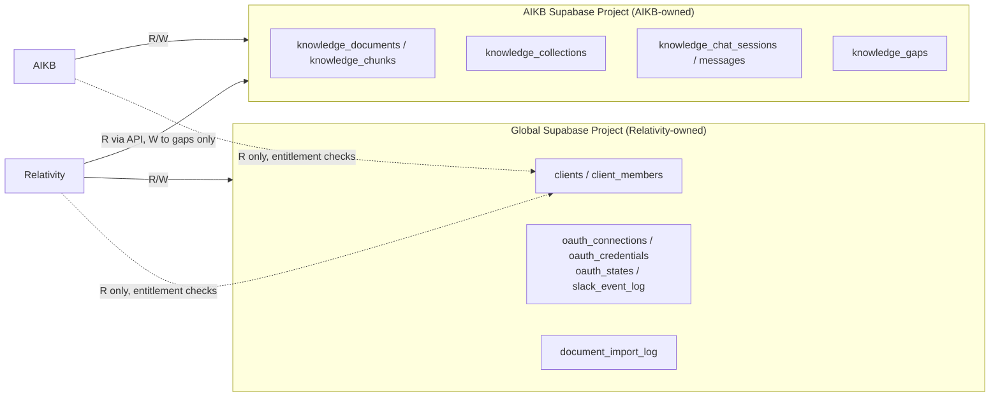
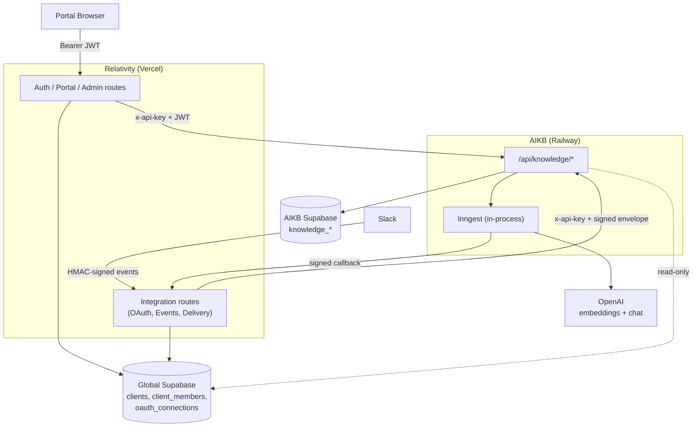
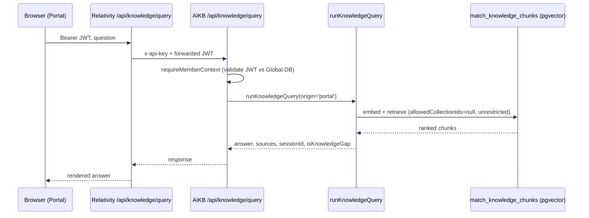
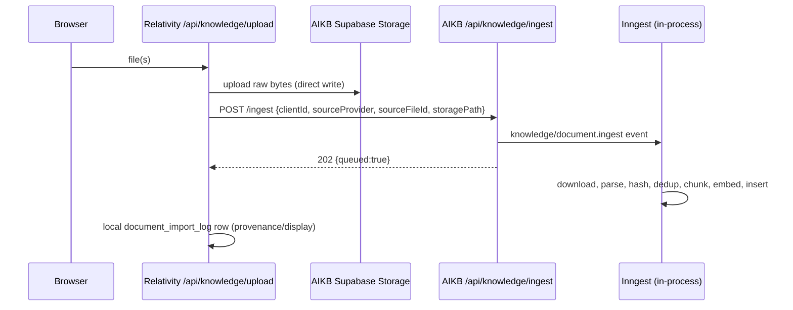
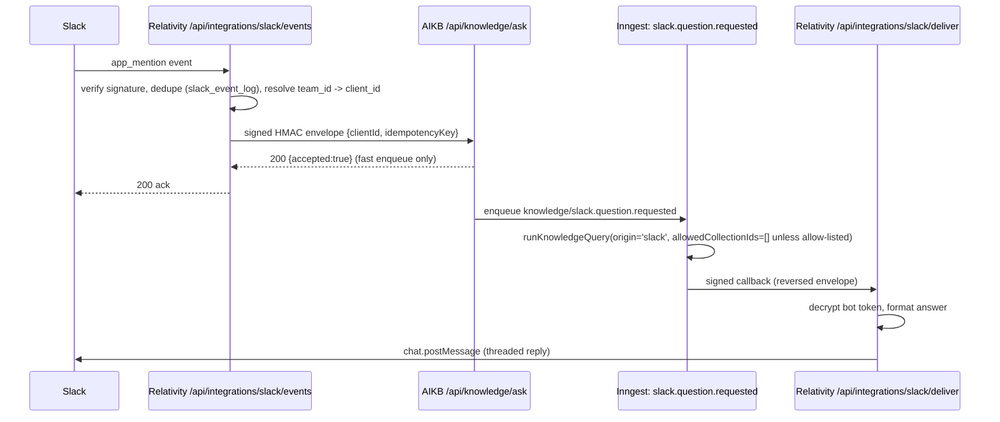

# System Overview

Source repositories: `relativitysystems/Relativity` (customer-facing gateway) and `relativitysystems/AIKB` (knowledge engine). This is the primary technical entry point for the platform — read this first, then follow the links below into the document that covers the area you're changing.

## Purpose

Relativity Systems is a two-repository platform: **Relativity** is the customer-facing gateway, identity provider, and integration layer; **AIKB** is the provider-agnostic knowledge engine that performs ingestion, retrieval, answer generation, and conversation/gap persistence. This document explains how the two fit together, who owns what, where data lives, and how a request travels across the boundary between them. It does not repeat the detail already covered by the documents it links to.

## Executive Summary

Relativity (`app.js`, deployed on Vercel via `api/index.js`) is a multi-tenant Express **gateway**: it owns client/team identity (Supabase Auth + `clients`/`client_members` in the "Global" Supabase project), the portal and admin UIs, upload intake, and every external OAuth integration (Slack, Google Drive, Dropbox). It performs no retrieval, embedding, or LLM answering itself — it proxies knowledge/chat/gap operations to AIKB over HTTP (`services/aikbService.js`) and, for Slack, over a signed service-request envelope (`services/aikbAskClient.js`).

AIKB (`server.js`, deployed on Railway) is the **knowledge engine**: it owns document parsing/chunking/embedding (Inngest functions, `services/documentParser.js`, `services/openaiService.js`), pgvector retrieval (`match_knowledge_chunks` RPC), answer generation, citations, chat session/message persistence, knowledge collections, and knowledge-gap records — all in its own Supabase project. AIKB has no identity system of its own: it validates the caller's Supabase JWT (portal traffic) or a signed HMAC envelope (Slack traffic) and reads, but never writes, `clients`/`client_members` in Relativity's Global Supabase project.

The platform boundary the codebase actually implements today is: **Relativity owns identity, tenancy, and every provider integration; AIKB owns ingestion, retrieval, reasoning, conversations, and knowledge gaps.** This split held up well enough that the one significant violation found during the original architecture review — a disconnected, unsafe Slack Events handler living inside AIKB — has since been retired, and Slack's Events ingestion now lives entirely in Relativity as designed. See [decisions/ADR-001](../decisions/ADR-001-RELATIVITY-OWNS-INTEGRATIONS.md), [ADR-002](../decisions/ADR-002-AIKB-OWNS-KNOWLEDGE-PROCESSING.md), and [ADR-003](../decisions/ADR-003-SLACK-EVENTS-LIVE-IN-RELATIVITY.md) for the decisions behind this, and [history/ARCHITECTURE_REVIEW_PHASES.md](../history/ARCHITECTURE_REVIEW_PHASES.md) for how the platform got here.

## Repository Map

### Relativity

| Aspect | Detail |
|---|---|
| Runtime | Node/Express, single serverless function on Vercel |
| Entry points | `app.js` (the app), `server.js` (local dev), `api/index.js` (Vercel wrapper), `vercel.json` (routes `/api/*`, `/auth/*`, `/admin/*`) |
| Major route groups | `routes/auth.js` (session, OAuth for Google/Dropbox, invites, password reset — legacy Slack routes retired to `410`), `routes/api.js` (uploads, chat/query proxy, gaps proxy, analytics), `routes/integrations/slack.js` (Slack OAuth, events, delivery, and a deprecated sweep endpoint pending removal — see [CONNECTOR_FRAMEWORK.md](CONNECTOR_FRAMEWORK.md)), `routes/team.js`, `routes/admin.js` |
| Database | "Global" Supabase project — `clients`, `client_members`, `team_invites`, `client_member_sessions`, `oauth_connections`/`oauth_credentials`, `oauth_states`, `slack_event_log`, `oauth_tokens` (legacy, Google Drive/Dropbox only), `document_import_log` |
| External dependencies | Supabase (Global project), AIKB REST API, OpenAI (audio transcription only), Slack OAuth + Events + Web API, Google Drive API, Dropbox API |

Full detail: [CONNECTOR_FRAMEWORK.md](CONNECTOR_FRAMEWORK.md) (integrations), [SECURITY.md](SECURITY.md) (auth), [../product/CLIENT_PORTAL.md](../product/CLIENT_PORTAL.md) (portal).

### AIKB

| Aspect | Detail |
|---|---|
| Runtime | Node/Express, single process on Railway |
| Entry points | `server.js` — mounts `/health`, `/api/inngest`, `/api/knowledge` (`routes/knowledge.js`), `/api/slack` (retired, `410`-only) |
| Major route groups | `routes/knowledge.js` — `x-api-key`-gated management routes (ingest/reindex/delete/list/jobs/summary/analytics/collections), `requireMemberContext`-gated `/query`/`/chat/*`/`/gaps`, `requireServiceRequest`-gated `/ask` (Slack) |
| Database | AIKB's own Supabase project — `knowledge_documents`, `knowledge_chunks` (pgvector), `knowledge_ingestion_jobs`, `knowledge_chat_sessions`, `knowledge_chat_messages`, `knowledge_gaps`, `knowledge_collections`. Read-only access to Relativity's Global project for `auth.getUser()`, `clients`, `client_members` |
| External dependencies | OpenAI (embeddings + chat), Inngest (in-process), Supabase (two projects) |

Full detail: [AIKB.md](AIKB.md), [INGESTION_PIPELINE.md](INGESTION_PIPELINE.md).

## Responsibility Matrix

| Capability | Relativity | AIKB |
|---|---|---|
| Client/org identity, Supabase Auth | Owns (`clients`, `client_members`) | Reads only, for entitlement checks |
| Portal & admin UI | Owns | — |
| OAuth (Slack, Google Drive, Dropbox) | Owns entirely | Never involved |
| Upload intake | Owns (routes, storage write) | — |
| Document parsing/chunking/embedding | — | Owns entirely |
| Vector retrieval | — | Owns (`match_knowledge_chunks`) |
| Answer generation, citations | — | Owns |
| Chat sessions/messages | Local ownership-mapping only | Owns content |
| Knowledge gaps | Portal-triggered `POST /gaps` only | Owns schema/persistence |
| Knowledge collections | Portal UI for CRUD/assignment | Owns schema, assignment, retrieval enforcement |
| Slack Events ingestion, signature verification, delivery | Owns entirely | Not involved (legacy handler retired) |
| Background jobs (Inngest) | None | Owns entirely |
| Analytics | Displays | Computes on demand |
| Tenant isolation enforcement | App-layer `client_id` filtering | App-layer filtering + SQL-level `client_id`/`collection_id` filter in retrieval RPC |

See [SECURITY.md](SECURITY.md) for the security implications of this split, and [decisions/ADR-001](../decisions/ADR-001-RELATIVITY-OWNS-INTEGRATIONS.md)/[ADR-002](../decisions/ADR-002-AIKB-OWNS-KNOWLEDGE-PROCESSING.md) for why it's split this way.

## Data Ownership Map

| Entity | Relativity | AIKB |
|---|---|---|
| `clients`, `client_members` (Global DB) | R/W (owner) | R only |
| `team_invites`, `client_member_sessions` (Global DB) | R/W (owner) | — |
| `oauth_connections` / `oauth_credentials` (Global DB) | R/W (owner — Slack, encrypted) | — |
| `oauth_tokens` (Global DB, legacy) | R/W (owner — Google Drive/Dropbox, plaintext) | — |
| `oauth_states`, `slack_event_log` (Global DB) | R/W (owner) | — |
| `document_import_log` (Global DB) | R/W (owner — provenance/display only) | — |
| `knowledge_documents`, `knowledge_chunks` (AIKB DB) | — (via API only) | R/W (owner) |
| `knowledge_collections` (AIKB DB) | R/W via API (CRUD, assignment) | R/W (owner) |
| `knowledge_ingestion_jobs` (AIKB DB) | R (via API, display) | R/W (owner) |
| `knowledge_chat_sessions` / `knowledge_chat_messages` (AIKB DB) | R (via API, display/ownership filtering) | R/W (owner) |
| `knowledge_gaps` (AIKB DB) | W (via `POST /gaps` proxy only) | R/W (owner) |
| Supabase Storage — AIKB bucket | W (uploads directly) | R/W (downloads, deletes) |

## Deployment Topology

- **Relativity**: single Vercel serverless function (`api/index.js` → `app.js`); static assets served by Vercel's CDN. No independent worker process.
- **AIKB**: single Railway web process; Inngest functions run **in-process**, invoked via webhook callback to `/api/inngest` — there is no separate worker deployment.
- **Databases**: two independent Supabase projects — the Global project (Relativity-owned identity/tenancy/integrations) and the AIKB project (knowledge data). No cross-project foreign keys; cross-project references are plain UUID columns.
- **Scheduled jobs**: none are planned for Slack delivery. Relativity's Slack delivery-retry sweep (`GET /api/integrations/slack/sweep`) was designed as a Vercel Cron job but has been **unscheduled** since production launch — the project's Vercel Hobby plan rejects a sub-daily cron schedule. Rather than restoring that scheduler, the approved design is bounded, immediate delivery retries followed by a terminal `delivery_failed` status, requiring no scheduler at all — see [ADR-007](../decisions/ADR-007-SLACK-BOUNDED-DELIVERY-RETRY.md), [CONNECTOR_FRAMEWORK.md](CONNECTOR_FRAMEWORK.md), and [../roadmap/FEATURE_BACKLOG.md](../roadmap/FEATURE_BACKLOG.md).

## Cross-Repository Request Flows

### System context

### Portal question flow

### Document upload / ingestion flow

See [INGESTION_PIPELINE.md](INGESTION_PIPELINE.md) for full step detail.

### Slack question flow

See [CONNECTOR_FRAMEWORK.md](CONNECTOR_FRAMEWORK.md) for the full Slack architecture and [SERVICE_CONTRACTS.md](SERVICE_CONTRACTS.md) for the `/ask`/`/deliver` contract.

## Platform Boundary

- **Identity, tenancy, and every provider integration (OAuth, webhooks, provider API calls)** live in Relativity. AIKB never owns identity and never contains provider-specific logic beyond tagging `origin` metadata. See [ADR-001](../decisions/ADR-001-RELATIVITY-OWNS-INTEGRATIONS.md).
- **Ingestion, retrieval, answer generation, citations, conversations, and knowledge gaps** live in AIKB. Relativity never performs retrieval or LLM reasoning. See [ADR-002](../decisions/ADR-002-AIKB-OWNS-KNOWLEDGE-PROCESSING.md).
- **Knowledge collections**: definition, CRUD, and assignment all live in AIKB today (a simpler arrangement than the fully split Relativity-definition/AIKB-enforcement model originally proposed — see [history/ARCHITECTURE_REVIEW_PHASES.md](../history/ARCHITECTURE_REVIEW_PHASES.md)); enforcement happens inside AIKB's retrieval SQL. See [ADR-005](../decisions/ADR-005-COLLECTION-FILTERING-FAILS-CLOSED.md).
- Every new customer-facing integration (Teams, Gmail, Outlook, CRM, meeting transcripts) should follow the same pattern Slack established: thin provider adapter in Relativity, normalized calls into AIKB's existing knowledge pipeline, never a parallel retrieval implementation. See [CONNECTOR_FRAMEWORK.md](CONNECTOR_FRAMEWORK.md) and [../roadmap/CONNECTOR_ROADMAP.md](../roadmap/CONNECTOR_ROADMAP.md).

## Known Limitations

These affect the whole architecture, not just one document — see the linked document for full detail on each:

- **No database-level tenant isolation (RLS) anywhere.** Every isolation check is application-layer `client_id` filtering; both Supabase projects are accessed exclusively with the service-role key. See [SECURITY.md](SECURITY.md).
- **The cross-repository contract is not unified.** Portal traffic uses a Supabase JWT + shared `x-api-key`; Slack traffic uses a narrow, additive HMAC-signed envelope scoped only to `/ask`/`/deliver`; every other AIKB management route (`/ingest`, `/reindex`, `/documents/:clientId`, etc.) still trusts the shared `x-api-key` alone. See [SERVICE_CONTRACTS.md](SERVICE_CONTRACTS.md) and [SECURITY.md](SECURITY.md).
- **Slack's automated delivery-retry sweep is unscheduled and will not be restored.** The product decision is bounded, immediate delivery retries with a terminal `delivery_failed` state instead of a scheduled sweep — see [ADR-007](../decisions/ADR-007-SLACK-BOUNDED-DELIVERY-RETRY.md). Until that is implemented, a stuck event is only recovered via AIKB's own Inngest `onFailure` callback. See [CONNECTOR_FRAMEWORK.md](CONNECTOR_FRAMEWORK.md).
- **Google Drive and Dropbox remain on the legacy plaintext `oauth_tokens` table** — only Slack has been migrated to the encrypted `oauth_connections`/`oauth_credentials` model. See [SECURITY.md](SECURITY.md).
- **In-process Inngest** — AIKB's background jobs share the same process as its REST API; there is no independently scaled worker.

## Related Documents

- [AIKB.md](AIKB.md) — the knowledge engine in detail
- [INGESTION_PIPELINE.md](INGESTION_PIPELINE.md) — upload through indexing
- [CONNECTOR_FRAMEWORK.md](CONNECTOR_FRAMEWORK.md) — Slack, Google Drive, Dropbox, and the pattern for future connectors
- [SERVICE_CONTRACTS.md](SERVICE_CONTRACTS.md) — the Relativity ↔ AIKB request/response contracts
- [SECURITY.md](SECURITY.md) — authentication, tenant isolation, current risks
- [../product/CLIENT_PORTAL.md](../product/CLIENT_PORTAL.md) — the portal product surface
- [../decisions/](../decisions/) — architecture decision records
- [../roadmap/MASTER_ROADMAP.md](../roadmap/MASTER_ROADMAP.md) — where the platform is headed next
- [../history/ARCHITECTURE_REVIEW_PHASES.md](../history/ARCHITECTURE_REVIEW_PHASES.md) — how the platform got here
