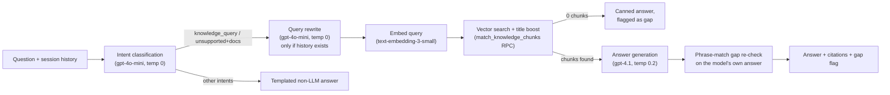

# AI Agents

Source repository: `relativitysystems/AIKB` (`services/openaiService.js`, `services/runKnowledgeQuery.js`, `routes/knowledge.js`).

## Overview

**No autonomous agent behavior exists in either codebase today.** There is no OpenAI tool/function calling, no multi-step autonomous reasoning loop, and no self-directed action-taking by a model anywhere in AIKB or Relativity — a repository-wide search for `tools:`, `tool_calls`, and `function_call` across `openaiService.js` and the rest of the codebase returns zero matches. What exists is a well-structured, single-shot retrieval-augmented generation (RAG) pipeline with a small amount of code-driven branching (intent classification, query rewriting) ahead of the answer-generation call. This document describes that pipeline precisely, then separately describes how it could evolve toward agentic behavior — clearly marked as unimplemented.

## Current Implementation

The full query pipeline, orchestrated by `runKnowledgeQuery()`:

1. **Session resolution** — create or resume a `knowledge_chat_sessions` row; persist the user's message immediately.
2. **Recent history load** — the last 8 non-deleted messages in the session, used only as disambiguation context, never as a fact source.
3. **Intent classification** — guardrails first (an exact-match greeting set, a vague-single-word set), otherwise a call to **`gpt-4o-mini`** at `temperature: 0` with a JSON-mode system prompt, classifying the question into `knowledge_query | casual_conversation | help_request | clarification_needed | unsupported`. A classifier failure falls back to `clarification_needed` (retrieval is not run).
4. **Retrieval gate** — a `knowledge_query` intent (or an `unsupported` intent when the client has any indexed documents) proceeds to retrieval; other intents return a templated, non-LLM answer.
5. **Query rewriting** — only when session history exists, a second **`gpt-4o-mini`** call (`temperature: 0`) folds a follow-up question ("it", "that", "the checklist") into a standalone search query. Falls back to the raw question on error.
6. **Embedding** — the (rewritten) query is embedded via `text-embedding-3-small`.
7. **Retrieval** — cosine-similarity vector search via the `match_knowledge_chunks` Postgres RPC (threshold 0.15, top 10), combined with a title/filename-matching boost layer. See [AIKB.md](../architecture/AIKB.md) for full detail.
8. **No-results path** — zero chunks retrieved returns a canned answer and flags a knowledge gap without an LLM call — see [KNOWLEDGE_GAP_DETECTION.md](KNOWLEDGE_GAP_DETECTION.md).
9. **Answer generation** — a single **`gpt-4.1`** call at `temperature: 0.2`, given a numbered context block of retrieved chunks (each headed `Source: filename[, p. X]`) and the recent session history, using a system prompt that instructs the model to answer only from the provided context, cite sources inline, and explicitly say "This is not fully documented in our knowledge base." when it cannot answer.
10. **Gap re-check** — the generated answer text is checked for gap-indicating phrases (see [KNOWLEDGE_GAP_DETECTION.md](KNOWLEDGE_GAP_DETECTION.md)), then the assistant message (with structured `sources[]`) is persisted and returned.

**No streaming.** Every `openai.chat.completions.create` call in the codebase is non-streaming — the caller waits for the full response before returning it.

**No conversation-level planning or multi-turn tool use.** Session history is fed into three of the LLM calls above purely as disambiguation context (resolving "it"/"that" in a follow-up); it is never used to plan a sequence of actions, and the model never decides to call anything beyond generating text.

**Models in use**: `gpt-4.1` (answer generation), `gpt-4o-mini` (intent classification, query rewriting), `text-embedding-3-small` (embeddings).

## Architecture

The pipeline above is entirely code-driven branching around single-purpose LLM calls — not an LLM-driven control loop. Every step's inputs and possible outputs are fixed by application code; the model never chooses which step to run next, never invokes a tool, and never takes an action with side effects (writing to the database, calling an external API) — every database write and API call in the pipeline is issued by JavaScript code, never by the model itself.

## Current Limitations

- No tool/function calling — the model cannot look anything up beyond the chunks already retrieved for it, and cannot take any action (e.g., create a support ticket, update a document, search a second time with a refined query) on its own.
- No multi-step reasoning loop — there is exactly one retrieval pass and one generation pass per question; the model cannot decide "I need more context" and re-query.
- No memory beyond the last 8 messages of the current session — there is no long-term user- or client-level memory the model draws on across sessions.
- Query rewriting only fires when session history exists, and only handles pronoun/reference resolution — it is not a general-purpose planning step.

## Future Roadmap

Everything below is **not currently implemented**. It is included because the existing architecture — a clean separation between retrieval, generation, and persistence, plus an established session/history model — provides plausible, low-friction extension points toward more autonomous behavior. None of it should be read as a description of current capability.

- **Tool/function calling**: the existing single-purpose OpenAI calls (`classifyQueryIntent`, `generateRagAnswer`) are natural places to introduce `tools`/`function_call` support — e.g., letting the model explicitly request a second, refined retrieval pass instead of the current fixed one-shot retrieval, or letting it call a "create knowledge gap" or "escalate to a human" action directly instead of the current phrase-matching heuristic in [KNOWLEDGE_GAP_DETECTION.md](KNOWLEDGE_GAP_DETECTION.md).
- **Multi-step retrieval loops**: the existing retrieval/generation split could be extended into a loop (retrieve → assess sufficiency → optionally retrieve again with a refined query) bounded by a fixed step limit, building on the query-rewrite step that already exists for a single case (follow-up disambiguation).
- **Cross-session memory**: the current 8-message, single-session context window could be extended with a client- or member-level memory store, but no such store exists today.
- **Autonomous actions across connectors**: as more connectors are built (see [CONNECTOR_FRAMEWORK.md](../architecture/CONNECTOR_FRAMEWORK.md)), an agent capable of, for example, posting a follow-up in Slack after a delay, or updating a CRM record based on a conversation, would require both tool-calling support (not present) and a durable, multi-step execution model beyond the current single Inngest ingestion/query event pattern.
- **Streaming responses**: not implemented today; would improve perceived responsiveness for both the current single-shot pipeline and any future multi-step agent loop.

Any of the above would be a significant architectural addition, not an incremental change to the current pipeline — they are listed as directions the existing RAG architecture could grow toward, not as scoped or scheduled work.
