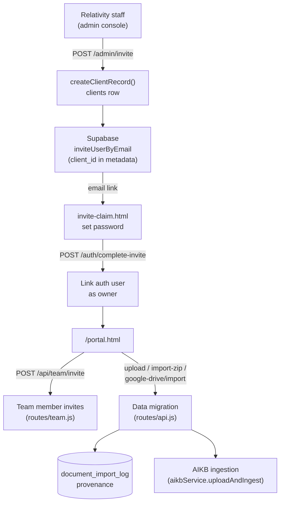

# Client Onboarding

Source repository: `relativitysystems/Relativity`, primarily `routes/admin.js`, `routes/auth.js`, `routes/team.js`, `routes/api.js`, `services/supabaseService.js`, `services/googleDriveImportService.js`, `public/portal/invite-claim.js`. Cross-reference [CLIENT_PORTAL.md](CLIENT_PORTAL.md) for the portal surface these flows land in, [SECURITY.md](../architecture/SECURITY.md) for the auth mechanisms, and [INGESTION_PIPELINE.md](../architecture/INGESTION_PIPELINE.md) for what happens to a document after it's imported.

## Overview

Onboarding a new client is a two-stage process with no self-serve signup: **account provisioning** (Relativity staff create the client and invite its first user) followed by **data migration** (the client's own initial knowledge import). There is no dedicated "onboarding wizard" — the flow is assembled from the admin console, the invite-claim page, and the same upload/import surfaces a client uses on an ongoing basis.

## Current Implementation

### 1. Client Creation & Owner Invite

- Relativity staff, authenticated against the internal admin console (`routes/admin.js`, password-gated `adminAuth`, not per-user Supabase auth), call `POST /admin/invite` with `{ name, email }`.
- The server creates the client record first — `supabaseService.createClientRecord(name, email)` inserts into `clients` — then issues a Supabase `auth.admin.inviteUserByEmail(email, { redirectTo: '.../invite-claim.html', data: { client_id: client.id } })`.
- **Compensating delete on partial failure:** if the Supabase invite call itself fails after the client record was created, the route calls `supabaseService.deleteClient(client.id)` to avoid an orphaned client with no owner (`routes/admin.js:117-142`).
- There is no other path to create a client — no public signup form, no self-serve trial.

### 2. Owner Acceptance (First Login)

- The invite email link lands on `invite-claim.html`, driven by `public/portal/invite-claim.js`.
- Supabase resolves the invite token client-side into a session (`onAuthStateChange` / `getSession()`); the page then asks the invitee to set a password (min. 8 characters, confirmed twice) via `supabase.auth.updateUser({ password })`.
- With a fresh session token, the page calls `POST /auth/complete-invite`, which is what actually links the new Supabase auth user to the `clients` row as `owner` — password-setting alone does not grant access.
- On success, the browser is redirected straight to `/portal.html` — there's no separate "welcome" or setup-checklist screen; the owner lands directly on the same portal every subsequent user sees.

### 3. Team Member Invites (Post-Owner)

- Once an owner exists, they (or another admin) invite additional members through the portal, not the admin console: `POST /api/team/invite` (`routes/team.js`), a portal-issued token distinct from the Supabase admin invite above, with a 7-day expiry, per-client seat limits, and a no-duplicate-active-member rule.
- `supabaseService.createClientMember({ clientId, email, fullName, role, status, invitedBy, invitedAt })` records the pending member; acceptance signs the user up or in and links them. See [CLIENT_PORTAL.md](CLIENT_PORTAL.md#team-management) for the full member-management surface.

### 4. Data Migration (Initial Knowledge Import)

This is the part of onboarding most likely to involve a client's *existing* body of documents, not day-to-day usage. There is no dedicated bulk-migration tool or admin-assisted import — a new client migrates its own data through the same four import paths available to any client at any time, all under `routes/api.js` and gated by `clientAuth`:

| Path | Route | Mechanism |
|---|---|---|
| Single/multi-file upload | `POST /api/knowledge/upload` | One file per request (`.txt/.md/.pdf/.docx`), `multer`-buffered, forwarded to AIKB via `aikbService.uploadAndIngest()` |
| ZIP archive import | `POST /api/knowledge/import-zip` | Client-side ZIP of a folder tree, extracted server-side with `AdmZip`, ingested with concurrency 2 |
| Folder picker | (client-side only) | Portal filters a native folder-picker's files to supported extensions, then drives them through the single-upload path |
| Google Drive import | `POST /api/google-drive/import` | One-time copy via the Google Drive Picker (browser OAuth token, not a stored connection) — files are fetched and ingested, no ongoing sync |

Every import records provenance in `document_import_log` via `supabaseService.logImportBatch()` — `sourceType` (`local`/`zip`/`google_drive`), `sourcePath`, `fileName`, `sourceFileId`, `importBatchId`, and `importedBy` — so a migration batch can be traced back after the fact even though there's no dedicated "migration" concept in the schema.

**ZIP import is the closest thing to a bulk-migration path** and has migration-specific handling worth calling out:
- Two-pass processing: pass 1 classifies entries (path validation, hidden/system-file skip, unsupported-extension skip, in-batch duplicate detection) before any decompression; pass 2 extracts and ingests with concurrency 2, continuing past individual file failures rather than aborting the batch.
- **Retry-only re-upload:** because extracted bytes aren't retained between requests, a client that had partial failures must re-send the *entire* archive but can pass `retryOnly` (a list of paths) to limit reprocessing to just those entries. A `retryOnly` path missing from the re-uploaded archive is surfaced as an explicit failure rather than silently dropped.
- Every numeric limit below is a real ceiling a data migration can hit, not just an anti-abuse guard — sourced from `config/index.js` (env-overridable):

| Limit | Default | Env var |
|---|---|---|
| Max documents per client | 50 | `MAX_DOCUMENTS` |
| Max single-file size | 20 MB | `MAX_FILE_SIZE_MB` |
| Max files per ZIP | 100 | `MAX_ZIP_FILES` |
| Max single extracted entry | 20 MB | `MAX_ZIP_ENTRY_MB` |
| Max total extracted size per ZIP | 200 MB | `MAX_ZIP_TOTAL_MB` |

A client migrating more than 50 documents, or a single ZIP larger than these ceilings, cannot complete the migration in one pass under current limits — see Current Limitations.

### 5. Slack Connection (Optional, Post-Data-Migration)

Not part of core onboarding, but commonly the next step once a knowledge base exists: connecting Slack (OAuth) and choosing which collections it may search. See [CONNECTOR_FRAMEWORK.md](../architecture/CONNECTOR_FRAMEWORK.md).

## Architecture

## Current Limitations

- **No self-serve signup.** Every client is provisioned manually by staff through the admin console; there is no public account-creation flow.
- **No bulk or API-driven migration path.** The four import paths are all synchronous, browser-driven, and person-operated — there's no server-side batch job, CLI, or API endpoint a client (or Relativity staff on their behalf) can point at an external system to migrate data unattended.
- **No structured-data migration.** All four paths import document files (`.txt/.md/.pdf/.docx`); there is no import path for structured sources (CSV/database exports, ticketing-system exports, wiki API pulls, etc.) — data must already exist as one of the supported file types.
- **Document- and size-ceilings apply during migration exactly as they do in steady-state usage** — a client with a large existing corpus can exceed the 50-document, 20 MB-file, or 200 MB-total-ZIP defaults and be blocked mid-migration, with no override path short of an env-var change and redeploy.
- **Google Drive import is one-time, not a sync.** There is no persistent Drive connection to onboard "the client's whole Drive" continuously — each import is a manual, one-shot Picker selection. Dropbox has no import path at all (its persistent-OAuth code was removed outright in backlog M15; see [CLIENT_PORTAL.md](CLIENT_PORTAL.md#integrations)).
- **No migration-specific UI.** The portal's upload/import surfaces are the same ones used for day-to-day document additions — there's no onboarding checklist, progress tracker across an entire migration batch, or dry-run/preview step. `importBatchId` groups a batch for provenance lookup only, not for a user-facing "migration status" view.
- **No admin-side visibility into a client's migration progress.** The admin console's per-client `aikb-health` endpoint (`GET /admin/clients/:clientId/aikb-health`) surfaces general health, not migration-specific status.

## Future Extension Points

Not currently implemented — noted here only because the current architecture makes each a plausible next step, not because any of it exists today:

- A dedicated bulk/API-driven data-migration path (e.g., a signed service endpoint or staff-operated import tool) for clients with corpora too large for the browser-driven upload paths, layered on the existing `document_import_log` provenance model.
- Structured-data connectors (CSV/export ingestion, third-party knowledge-base API pulls) alongside the current file-only import paths, likely following the extension pattern already established in [CONNECTOR_FRAMEWORK.md](../architecture/CONNECTOR_FRAMEWORK.md).
- A migration-specific progress view (per-`importBatchId` status, retry-all-failed) surfaced either in the portal or the admin console, distinct from the general document list.
- Self-serve client signup, if the product moves away from staff-provisioned onboarding.
