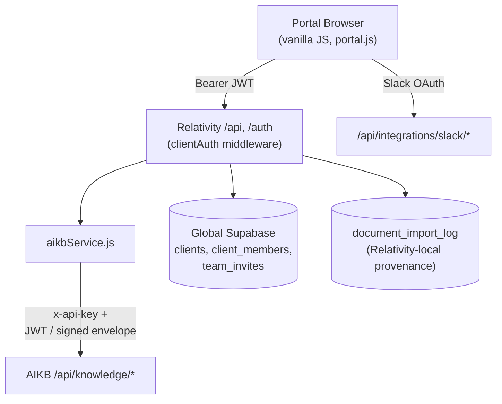

# Client Portal

Source repository: `relativitysystems/Relativity`, primarily `public/portal/` and `routes/api.js`, `routes/team.js`, `routes/collections.js`, `routes/auth.js`. Cross-reference [SECURITY.md](../architecture/SECURITY.md) for the authentication mechanisms summarized below, and [CONNECTOR_FRAMEWORK.md](../architecture/CONNECTOR_FRAMEWORK.md) for integration details.

## Overview

The client portal is a server-rendered-static, vanilla-JavaScript single-page application served directly from Relativity's Express app. There is no frontend framework — each page is a self-invoking async function directly manipulating the DOM. The portal is the primary user-facing surface of the platform: document upload, RAG chat, chat history, knowledge collections, team management, and (currently) one integration — Slack.

## Current Implementation

### Portal Architecture

- Served as static files under `public/`; root-level HTML files (`portal.html`, `login.html`, etc.) are thin redirect shims to their real counterparts under `public/portal/`.
- API routes are mounted at `/auth`, `/api` (covering upload, chat, team, collections), `/api/integrations/slack`, and `/admin` (a separate internal tool, not part of the client-facing portal — see below).
- `public/portal/portal.js` (a single ~2,500-line file) is structured as one bootstrap IIFE plus grouped feature sections (Slack integration, knowledge base upload/list, voice input, team management, collections), each with module-scoped state variables and its own render functions — there is no formal state-management library.
- A tab/hash-routing system (`setActiveTab()`) toggles visible panels and keeps `window.location.hash` in sync.

### Authentication Flow

1. **Login** (`login.js`): Supabase `signInWithPassword`, redirect to the portal on success.
2. **Session**: handled by the Supabase JS SDK's own storage; the portal reads the current session via `supabase.auth.getSession()` and sends the access token as `Authorization: Bearer <token>` on every API call.
3. **Bootstrap identity check**: after login, the portal calls `GET /auth/me`, a "soft-auth" endpoint that always returns `200` with `{authenticated, reason}`. If unauthenticated, the portal signs out of Supabase and redirects to login with a human-readable reason.
4. **Logout**: `supabase.auth.signOut()` then redirect to login.
5. **Password reset**: request/reset flow via Supabase's recovery link mechanism, rate-limited server-side (see [SECURITY.md](../architecture/SECURITY.md)).
6. **Owner invite (first user)**: an admin-issued Supabase invite carries `client_id` in user metadata; on acceptance the user sets a password and the server links them as the `owner` role.
7. **Team-member invite**: a separate, portal-issued token flow (`POST /api/team/invite`) with a 7-day expiry, enforcing a per-client seat limit and no-duplicate-active-member rule; accepting either signs up or signs in the invited user and links them to the pending member record.

### Knowledge Tab (Documents)

- Four upload entry points: single/multi-file picker (`.txt/.md/.pdf/.docx`), ZIP archive import, folder picker (client-filtered to the same extensions), and a Google Drive Picker-based one-time copy import. **No drag-and-drop** — every upload path is a native file-input click.
- After upload, the portal polls document and job status every 1.5 seconds (up to a 45-second timeout), showing phase text ("Preparing upload…" → "Uploading…" → "Processing document…" → "Indexing in knowledge base…" → "Ready in knowledge base.").
- An "Indexed Documents" list shows file name, source label, import date, and a status badge for non-`indexed` states.
- Deletion is per-document with a confirmation prompt.
- Separate "Recent Imports" (Relativity's own import-batch log) and "Recent Ingestion Jobs" (proxied from AIKB) panels exist; jobs can be client-side "dismissed" (a `localStorage` flag only — it does not delete server-side data).
- Owner/admin users additionally see a per-document collection-assignment dropdown.

### Chat

- Plain request/response — **not streaming**. The portal POSTs the question and waits for the full JSON response before rendering.
- A loading-dots bubble is shown while waiting.
- Citations are rendered as a "Sources" list under the assistant's reply (file name plus page numbers where available), suppressed if the answer text already contains an inline `Source:` reference.
- If a response is flagged as a knowledge gap, a card appears with "Save gap" / "Dismiss" actions — see [KNOWLEDGE_GAP_DETECTION.md](KNOWLEDGE_GAP_DETECTION.md) for what "save" actually does.
- A voice-input option records up to 2 minutes of audio, transcribes it server-side, and inserts the text into the query box (it does not auto-submit).

### History

- A dedicated "Chat History" tab lists the current member's own past sessions (filtered by a local member-to-session mapping, since AIKB itself is session-content source of truth but has no concept of per-member visibility).
- Selecting a session replays its messages, including previously-stored sources.
- Per-session delete and "Clear All History" are both implemented.
- ~~A session-rename endpoint exists on the backend... but has no corresponding UI control~~ **Resolved (backlog M9).** A rename button (✎) next to each session's delete button now calls this endpoint via a `prompt()`-based rename.

### Collections

- A full CRUD UI exists on a dedicated tab, visible only to owner/admin roles: create, rename, delete (delete is disabled in the UI, and refused server-side, for the default collection or any non-empty collection).
- A per-document dropdown on the Documents tab lets owner/admin move a document between collections.
- ~~**Collections' only currently-wired downstream effect is restricting what Slack is allowed to search**~~ **Resolved (backlog M10).** The Knowledge Base tab now has its own "Search scope" collection filter (per-member, persisted in `localStorage`, hidden when a client has zero or only its single default collection), and `POST /knowledge/query` forwards the selection to AIKB as `allowedCollectionIds` — AIKB itself needed no changes, since it already supported this parameter.

### Team Management

- A table of members (name/email, role, status, invited/last-active dates), visible to owner/admin.
- Invite modal (email + role: `admin`/`member`/`viewer` — `owner` is not assignable via invite).
- Per-row actions: resend invite, revoke invite, disable member, re-enable member, inline role change.
- The server prevents demoting or disabling the last remaining `owner`, and a user cannot edit or disable their own row.
- There is **no hard-delete of a member** — only disable/revoke (soft states), matching the available API surface.

### Integrations

- Slack's integration card on the Overview tab shows Connect/Disconnect and status, and — once connected — the "Collections Slack can search" checklist described in [CONNECTOR_FRAMEWORK.md](../architecture/CONNECTOR_FRAMEWORK.md).
- ~~Google Drive and Dropbox... neither is read or rendered anywhere in the portal frontend~~ **Resolved (backlog M8).** Both now have their own integration card in the same Overview panel (status badge + an owner/admin-only Connect button wired to the existing `/auth/google/start`/`/auth/dropbox/start` routes). Neither has a Disconnect button — no disconnect endpoint exists for either provider, so none was implied. Google Drive's one-time Picker import on the Documents tab is unchanged and separate from this connection-status display.

### Admin Console (distinct from the client portal)

`public/admin/` is a separate internal tool for Relativity staff, gated by a single shared password (not per-user Supabase auth), covering client management, website leads, and support issues. It is not part of the client-facing portal experience documented above and is mentioned here only to distinguish it clearly.

## Architecture

## Current Limitations

- No drag-and-drop upload despite an otherwise modern-looking upload UI.
- A "chat welcome chips" UI element (example-question shortcuts) is commented out in the HTML but its click handler is still wired in JavaScript — dead code referencing a non-rendered element.
- Several "TEMP DEBUG" `console.log`/`console.error` statements remain in production code paths (voice transcription).
- Team member removal is soft-only (disable/revoke); there is no hard-delete route.
- Slack delivery has no scheduled recovery of any kind, by design: bounded, immediate delivery retries with a terminal `delivery_failed` state are implemented in place of the removed sweep, so a sustained Slack outage can still lose an answer (the user must ask again), and AIKB-side redaction on that terminal state is best-effort, not guaranteed. See [CONNECTOR_FRAMEWORK.md](../architecture/CONNECTOR_FRAMEWORK.md) and [ADR-007](../decisions/ADR-007-SLACK-BOUNDED-DELIVERY-RETRY.md).

## Future Expansion

Not currently implemented — noted here only because the current architecture makes each a plausible next step, not because any of it exists today:

- ~~Surfacing Google Drive/Dropbox connection status in the UI~~ — done (backlog M8).
- ~~Extending collection-based access control to the portal's own chat~~ — done (backlog M10).
- ~~A UI control for the already-implemented chat-session rename endpoint~~ — done (backlog M9).
- Additional integration cards on the Overview tab as new connectors are built, following the pattern in [CONNECTOR_FRAMEWORK.md](../architecture/CONNECTOR_FRAMEWORK.md).
