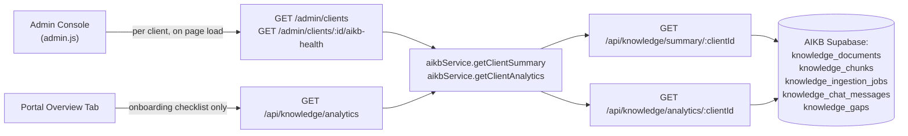

# Knowledge Analytics

Source repositories: `relativitysystems/AIKB` (`services/supabaseService.js`, `routes/knowledge.js`) and `relativitysystems/Relativity` (`services/aikbService.js`, `routes/api.js`, `routes/admin.js`, `public/portal/portal.js`, `public/admin/admin.js`).

## Overview

Analytics today are computed entirely on-the-fly, per request, from two aggregation functions in AIKB. There is no materialized rollup table, no scheduled aggregation job, and no charting/dashboard rendering in the client-facing portal — the only place these numbers are genuinely displayed to a human is the internal admin console, and even there only in a limited, per-client-row form.

## Current Implementation

Two distinct functions in `aikb/services/supabaseService.js`, both running several parallel Supabase queries per call, with no caching:

| Function | Endpoint | Returns |
|---|---|---|
| `getClientSummaryData(clientId)` | `GET /api/knowledge/summary/:clientId` | `totalDocuments`, `indexedDocuments`, `failedDocuments`, `indexingDocuments`, `deletedDocuments` (all derived by filtering an in-memory document list by `status`), `totalChunks` (exact count), `latestIngestionJob`, `failedJobsCount`, `totalQuestions` (count of user-role chat messages), `totalKnowledgeGaps` (exact count), `lastQuestionAt`, `lastIndexedAt` |
| `getClientAnalyticsData(clientId)` | `GET /api/knowledge/analytics/:clientId` | `totalQuestions`, `totalKnowledgeGaps`, `recentKnowledgeGaps` (last 10: question/reason/status/created_at), `failedIngestionJobs` (last 10), `recentIngestionActivity` (last 10 jobs) |

Both are proxied by Relativity as `GET /api/knowledge/summary` and `GET /api/knowledge/analytics` (behind `clientAuth`).

**Portal display**: `portal.js`'s `loadAnalytics()` fetches the analytics payload, but its **only** consumer is the Overview tab's onboarding-progress checklist, which checks `analytics.totalQuestions > 0` and `analytics.indexedDocuments > 0` to tick off onboarding steps. No dashboard, chart, or numeric analytics view exists anywhere in the client-facing portal — the gap list and job data returned by the endpoint are fetched but never rendered.

**Admin console display**: `GET /admin/clients` and `GET /admin/clients/:clientId/aikb-health` call the same two AIKB functions per client and surface `totalQuestions`, `totalKnowledgeGaps`, and `lastQuestionAt` as columns in a per-client table. This shows the gap **count** only — not the list of individual gap questions, even though `recentKnowledgeGaps` is returned by the underlying endpoint.

A separate cross-client `GET /admin/analytics` route aggregates document counts across all clients but explicitly leaves `totalQuestions: null`, with an in-code comment: `// TODO: totalQuestions — needs a dedicated AIKB analytics endpoint` — this specific cross-client rollup is confirmed **not implemented**.

## Architecture

Every number shown anywhere is computed fresh from these five source tables at request time — there is no analytics-specific table or cron job in either repository.

## Current Limitations

- **No dashboard or chart exists in the client-facing portal.** The analytics endpoint is called but its result is used only to gate onboarding-checklist items, not displayed as analytics.
- **No cross-client question-count rollup** — explicitly marked as a TODO in the admin route itself.
- **Two overlapping endpoints** (`/summary` and `/analytics`) compute similar aggregates (`totalQuestions`, document counts) independently on every call, with no shared computation or caching layer between them.
- **No time-series data** — every metric is a current-state count or a "last N" list; there is no historical trend (e.g., questions per day/week) computed or stored anywhere.
- **No self-service analytics for the client** — the admin console's per-client gap count and question count are visible only to Relativity staff, not to the client themselves in the portal.
- **Individual gap questions are not surfaced anywhere in the UI** despite `recentKnowledgeGaps` being returned by the API — see [KNOWLEDGE_GAP_DETECTION.md](KNOWLEDGE_GAP_DETECTION.md).

## Future Roadmap

Everything in this section is **not currently implemented**. It is listed because the current architecture (existing aggregation functions, existing tables) makes each item a plausible, low-friction next step — not because any of it exists today.

- A client-facing analytics view in the portal (question volume, document counts, gap trends) — the backend endpoint already returns most of the needed data; only rendering is missing.
- A dedicated, cached/materialized analytics table or scheduled rollup job, replacing the current on-request aggregation, to reduce redundant computation between `/summary` and `/analytics`.
- Time-series metrics (e.g., questions per day) — would require a new aggregation table or a query pattern not present in either function today.
- A cross-client question-count rollup for the admin console, closing the explicitly-marked TODO in `routes/admin.js`.
- An admin- or client-facing view of individual knowledge-gap questions (not just the count), using the already-returned but currently-unrendered `recentKnowledgeGaps` data.
