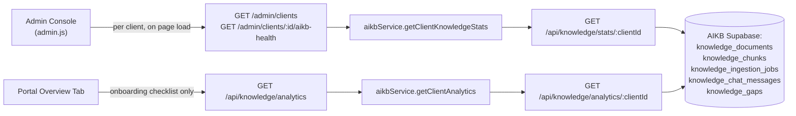

# Knowledge Analytics

Source repositories: `relativitysystems/AIKB` (`services/supabaseService.js`, `routes/knowledge.js`) and `relativitysystems/Relativity` (`services/aikbService.js`, `routes/api.js`, `routes/admin.js`, `public/portal/portal.js`, `public/admin/admin.js`).

## Overview

Analytics today are computed entirely on-the-fly, per request, from aggregation functions in AIKB. There is no materialized rollup table, no scheduled aggregation job, and no charting/dashboard rendering in the client-facing portal — the only place these numbers are genuinely displayed to a human is the internal admin console, and even there only in a limited, per-client-row form.

## Current Implementation

Three functions in `aikb/services/supabaseService.js`, all built on top of three shared query helpers (`fetchRecentIngestionJobs`, `fetchUserQuestionTimestamps`, `fetchKnowledgeGapsCount`) added to eliminate the duplicate-query problem described below (backlog L5):

| Function | Endpoint | Returns |
|---|---|---|
| `getClientSummaryData(clientId)` | `GET /api/knowledge/summary/:clientId` | `totalDocuments`, `indexedDocuments`, `failedDocuments`, `indexingDocuments`, `deletedDocuments` (all derived by filtering an in-memory document list by `status`), `totalChunks` (exact count), `latestIngestionJob`, `failedJobsCount`, `totalQuestions` (count of user-role chat messages), `totalKnowledgeGaps` (exact count), `lastQuestionAt`, `lastIndexedAt` |
| `getClientAnalyticsData(clientId)` | `GET /api/knowledge/analytics/:clientId` | `totalQuestions`, `totalKnowledgeGaps`, `recentKnowledgeGaps` (last 10: question/reason/status/created_at), `failedIngestionJobs` (last 10), `recentIngestionActivity` (last 10 jobs) |
| `getClientKnowledgeStats(clientId)` **(new)** | `GET /api/knowledge/stats/:clientId` | Superset of both rows above, plus `ingestionJobs` (the full up-to-100-row window). Added specifically for callers that previously needed data from more than one of the above for the same client in a single logical operation. |

All three are proxied by Relativity: `GET /api/knowledge/summary` and `GET /api/knowledge/analytics` (behind `clientAuth`, used by the portal), and `aikbService.getClientKnowledgeStats` (used internally by the admin routes below — no new Relativity-facing HTTP route was added for it, since only server-side admin code needed it).

**Portal display**: `portal.js`'s `loadAnalytics()` fetches the analytics payload, but its **only** consumer is the Overview tab's onboarding-progress checklist, which checks `analytics.totalQuestions > 0` and `analytics.indexedDocuments > 0` to tick off onboarding steps. No dashboard, chart, or numeric analytics view exists anywhere in the client-facing portal — the gap list and job data returned by the endpoint are fetched but never rendered. This call site was left untouched by the L5 consolidation below — it's a single, standalone call with nothing else fired alongside it in the same request, so there was no duplication to eliminate here.

**Admin console display**: `GET /admin/clients` and `GET /admin/clients/:clientId/aikb-health` surface `totalQuestions`, `totalKnowledgeGaps`, and `lastQuestionAt` as columns in a per-client table. This shows the gap **count** only — not the list of individual gap questions, even though `recentKnowledgeGaps` is returned by the underlying endpoint. As of backlog L5, both routes call `aikbService.getClientKnowledgeStats(clientId)` once per client instead of firing `getClientSummary` + `getClientAnalytics` + `listIngestionJobs` (which itself made a second, redundant `listDocuments` call purely to join file names it never used here) separately.

A separate cross-client `GET /admin/analytics` route aggregates document counts across all clients but explicitly leaves `totalQuestions: null`, with an in-code comment: `// TODO: totalQuestions — needs a dedicated AIKB analytics endpoint` — this specific cross-client rollup is confirmed **not implemented**.

## Architecture

`/summary` and `/jobs` still exist as independent routes/functions (unchanged, for any other current or future caller) but are no longer shown here since nothing currently calls them alongside another of these endpoints for the same client — the one place that pattern occurred (the admin console) now goes through `/stats` instead. Every number shown anywhere is still computed fresh at request time — there is no analytics-specific table or cron job in either repository.

## Current Limitations

- **No dashboard or chart exists in the client-facing portal.** The analytics endpoint is called but its result is used only to gate onboarding-checklist items, not displayed as analytics.
- **No cross-client question-count rollup** — explicitly marked as a TODO in the admin route itself.
- **No time-series data** — every metric is a current-state count or a "last N" list; there is no historical trend (e.g., questions per day/week) computed or stored anywhere.
- **No self-service analytics for the client** — the admin console's per-client gap count and question count are visible only to Relativity staff, not to the client themselves in the portal.
- **Individual gap questions are not surfaced anywhere in the UI** despite `recentKnowledgeGaps` being returned by the API — see [KNOWLEDGE_GAP_DETECTION.md](KNOWLEDGE_GAP_DETECTION.md).

~~**Two overlapping endpoints** (`/summary` and `/analytics`) compute similar aggregates independently on every call, with no shared computation or caching layer between them.~~ **Resolved (backlog L5).** The underlying query duplication was actually three-way, not two — `/summary`, `/analytics`, and `/jobs` all independently queried `knowledge_ingestion_jobs` for the same client (up to 4 separate reads across the three routes for one client), and `/summary`/`/analytics` duplicated `knowledge_chat_messages` and `knowledge_gaps` counts identically. This mattered in practice because Relativity's admin dashboard (`GET /admin/clients`) fired all three routes in parallel for **every client** on every page load. Fixed by adding `getClientKnowledgeStats`/`GET /api/knowledge/stats/:clientId`, which computes each underlying table exactly once, and switching the two admin routes to call it instead of the three separate functions. `/summary`, `/analytics`, and `/jobs` themselves are unchanged and still work standalone (still used by the portal and by `routes/api.js`'s own `/knowledge/jobs` route) — this was additive, not a breaking change, verified by a live diff against a real client showing the new endpoint's output is a byte-for-byte union of the three old ones.

## Future Roadmap

Everything in this section is **not currently implemented**. It is listed because the current architecture (existing aggregation functions, existing tables) makes each item a plausible, low-friction next step — not because any of it exists today.

- A client-facing analytics view in the portal (question volume, document counts, gap trends) — the backend endpoint already returns most of the needed data; only rendering is missing.
- A dedicated, cached/materialized analytics table or scheduled rollup job, replacing the current on-request aggregation. (Note: the specific *duplicate-computation-between-endpoints* problem this bullet used to cite is resolved — see L5 above. A materialized/scheduled layer would still reduce load further, but is a larger architectural change than L5's scope.)
- Time-series metrics (e.g., questions per day) — would require a new aggregation table or a query pattern not present in either function today.
- A cross-client question-count rollup for the admin console, closing the explicitly-marked TODO in `routes/admin.js`.
- An admin- or client-facing view of individual knowledge-gap questions (not just the count), using the already-returned but currently-unrendered `recentKnowledgeGaps` data.
