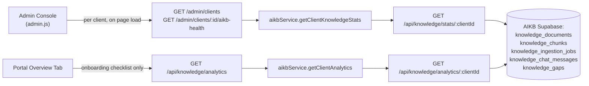

# Knowledge Analytics

Source repositories: `relativitysystems/AIKB` (`services/supabaseService.js`, `routes/knowledge.js`) and `relativitysystems/Relativity` (`services/aikbService.js`, `routes/api.js`, `routes/admin.js`, `public/portal/portal.js`, `public/admin/admin.js`).

## Overview

Analytics today are computed entirely on-the-fly, per request, from aggregation functions in AIKB. There is no materialized rollup table, no scheduled aggregation job, and no charting/dashboard rendering in the client-facing portal — the only place these numbers are genuinely displayed to a human is the internal admin console, and even there only in a limited, per-client-row form.

## Current Implementation

Three functions in `aikb/services/supabaseService.js`, all built on top of three shared query helpers (`fetchRecentIngestionJobs`, `fetchUserQuestionTimestamps`, `fetchKnowledgeGapsCount`) added to eliminate the duplicate-query problem described below (backlog L5):

| Function | Endpoint | Returns |
|---|---|---|
| `getClientSummaryData(clientId)` | `GET /api/knowledge/summary/:clientId` | `totalDocuments`, `indexedDocuments`, `failedDocuments`, `indexingDocuments`, `deletedDocuments` (all derived by filtering an in-memory document list by `status`), `totalChunks` (exact count), `latestIngestionJob`, `failedJobsCount`, `totalQuestions` (count of user-role chat messages), `totalKnowledgeGaps` (exact count), `lastQuestionAt`, `lastIndexedAt` |
| `getClientAnalyticsData(clientId)` | `GET /api/knowledge/analytics/:clientId` | `totalQuestions`, `totalKnowledgeGaps`, `recentKnowledgeGaps` (last 10: question/reason/status/created_at), `failedIngestionJobs` (last 10), `recentIngestionActivity` (last 10 jobs) |
| `getClientKnowledgeStats(clientId)` **(new)** | `GET /api/knowledge/stats/:clientId` | Superset of both rows above, plus `ingestionJobs` (the full up-to-100-row window). Added specifically for callers that previously needed data from more than one of the above for the same client in a single logical operation. |

All three are proxied by Relativity: `GET /api/knowledge/summary` and `GET /api/knowledge/analytics` (behind `clientAuth`, used by the portal), and `aikbService.getClientKnowledgeStats` (used internally by the admin routes below — no new Relativity-facing HTTP route was added for it, since only server-side admin code needed it).

**Portal display**: `portal.js`'s `loadAnalytics()` fetches the analytics payload, but its **only** consumer is the Overview tab's onboarding-progress checklist, which checks `analytics.totalQuestions > 0` and `analytics.indexedDocuments > 0` to tick off onboarding steps. No dashboard, chart, or numeric analytics view exists anywhere in the client-facing portal — the gap list and job data returned by the endpoint are fetched but never rendered. This call site was left untouched by the L5 consolidation below — it's a single, standalone call with nothing else fired alongside it in the same request, so there was no duplication to eliminate here.

**Admin console display**: `GET /admin/clients` and `GET /admin/clients/:clientId/aikb-health` surface `totalQuestions`, `totalKnowledgeGaps`, and `lastQuestionAt` as columns in a per-client table. This shows the gap **count** only — not the list of individual gap questions, even though `recentKnowledgeGaps` is returned by the underlying endpoint. As of backlog L5, both routes call `aikbService.getClientKnowledgeStats(clientId)` once per client instead of firing `getClientSummary` + `getClientAnalytics` + `listIngestionJobs` (which itself made a second, redundant `listDocuments` call purely to join file names it never used here) separately.

A separate cross-client `GET /admin/analytics` route aggregates document counts across all clients and, as of backlog M7, also aggregates `totalQuestions` — the same `Promise.allSettled`-and-accumulate pattern as the existing document-count rollup, now also fanning out `aikbService.getClientSummary(c.id)` per client and summing `totalQuestions` (`null`, not a wrong partial sum, if any client's call fails). The premise of the TODO this replaced turned out to be outdated — no new AIKB endpoint was needed, since `getClientSummaryData` already computed `totalQuestions` per client. **Caveat:** `GET /admin/analytics` has no frontend consumer anywhere in the repo — this rollup is data-layer-complete but not currently rendered as a dashboard tile (see [../roadmap/FEATURE_BACKLOG.md](../roadmap/FEATURE_BACKLOG.md)'s M7 entry).

**Admin knowledge-gap review**: as of backlog M5, `GET /admin/gaps` (also a per-client fan-out, following the same pattern) surfaces the individual gap question/reason/origin/reported-by/status — not just a count — in a new "Knowledge Gaps" admin tab, with an inline status `<select>` calling `PATCH /admin/gaps/:clientId/:gapId`. This closes the "gap count only, never the underlying question" limitation described above for the admin console specifically; the portal's own analytics display (previous paragraph) is unchanged.

## Architecture

```mermaid
flowchart LR
    Admin["Admin Console\n(admin.js)"] -->|per client, on page load| AdminRoute["GET /admin/clients\nGET /admin/clients/:id/aikb-health"]
    Portal["Portal Overview Tab"] -->|onboarding checklist only| PortalRoute["GET /api/knowledge/analytics"]
    AdminRoute --> StatsSvc["aikbService.getClientKnowledgeStats"]
    PortalRoute --> AnalyticsSvc["aikbService.getClientAnalytics"]
    StatsSvc --> Stats["GET /api/knowledge/stats/:clientId"]
    AnalyticsSvc --> Analytics["GET /api/knowledge/analytics/:clientId"]
    Stats --> DB[("AIKB Supabase:\nknowledge_documents\nknowledge_chunks\nknowledge_ingestion_jobs\nknowledge_chat_messages\nknowledge_gaps")]
    Analytics --> DB
```

`/summary` and `/jobs` still exist as independent routes/functions (unchanged, for any other current or future caller) but are no longer shown here since nothing currently calls them alongside another of these endpoints for the same client — the one place that pattern occurred (the admin console) now goes through `/stats` instead. Every number shown anywhere is still computed fresh at request time — there is no analytics-specific table or cron job in either repository.

## Current Limitations

- **No dashboard or chart exists in the client-facing portal.** The analytics endpoint is called but its result is used only to gate onboarding-checklist items, not displayed as analytics.
- ~~**No cross-client question-count rollup**~~ **Resolved (backlog M7).** `GET /admin/analytics` now sums `totalQuestions` across all clients — see above. It has no frontend consumer yet, so it isn't visible as a dashboard tile, but the data-layer gap is closed.
- **No time-series data** — every metric is a current-state count or a "last N" list; there is no historical trend (e.g., questions per day/week) computed or stored anywhere.
- **No self-service analytics for the client** — the admin console's per-client gap count and question count are visible only to Relativity staff, not to the client themselves in the portal.
- ~~**Individual gap questions are not surfaced anywhere in the UI**~~ **Resolved for the admin console (backlog M5)** — see above; a client-facing view (as opposed to admin-only) is still not built.

~~**Two overlapping endpoints** (`/summary` and `/analytics`) compute similar aggregates independently on every call, with no shared computation or caching layer between them.~~ **Resolved (backlog L5).** The underlying query duplication was actually three-way, not two — `/summary`, `/analytics`, and `/jobs` all independently queried `knowledge_ingestion_jobs` for the same client (up to 4 separate reads across the three routes for one client), and `/summary`/`/analytics` duplicated `knowledge_chat_messages` and `knowledge_gaps` counts identically. This mattered in practice because Relativity's admin dashboard (`GET /admin/clients`) fired all three routes in parallel for **every client** on every page load. Fixed by adding `getClientKnowledgeStats`/`GET /api/knowledge/stats/:clientId`, which computes each underlying table exactly once, and switching the two admin routes to call it instead of the three separate functions. `/summary`, `/analytics`, and `/jobs` themselves are unchanged and still work standalone (still used by the portal and by `routes/api.js`'s own `/knowledge/jobs` route) — this was additive, not a breaking change, verified by a live diff against a real client showing the new endpoint's output is a byte-for-byte union of the three old ones.

## Strategic Initiative: Knowledge Analytics v2

**Status: proposed, not implemented.** Cross-referenced from [MASTER_ROADMAP.md](../roadmap/MASTER_ROADMAP.md) (Version 1 Priority 3) and [../architecture/PRODUCT_MATURITY.md](../architecture/PRODUCT_MATURITY.md) (Stage 3, Intelligence pillar). This section replaces the old, narrower "Future Roadmap" list below with a single coherent initiative — the individual bullets that list used to contain (client-facing view, time-series, dashboard tile) are still true and are folded into this initiative rather than tracked as separate, disconnected asks.

**The point of this initiative is to help a customer improve their organization's knowledge, not to give them charts to look at.** A chart showing "47 questions asked this week" is decoration; a signal showing "these 12 questions kept getting low-confidence answers, and they cluster around your refund policy" is something a business owner can act on. Every capability below should be designed against that bar — if a metric doesn't suggest an action, reconsider whether it belongs on the surface at all.

### Proposed capabilities

| Capability | What it tells the customer | Builds on |
|---|---|---|
| Most searched topics | What employees actually ask about most — informs what to document better or promote in onboarding | `knowledge_chat_messages` (question text), not yet aggregated by topic |
| Search trends | Whether question volume is growing, shrinking, or spiking around a specific topic or time | Time-series over the above — not yet built (see Current Limitations) |
| Low-confidence answers | Which answers the model itself signaled uncertainty on, distinct from a full knowledge gap — an earlier warning signal than gap detection alone | New — no confidence signal is captured today; would require a change to `runKnowledgeQuery`'s existing generation step |
| Stale documents | Documents that haven't been updated in a long time, surfaced as an analytics signal (distinct from [KNOWLEDGE_COVERAGE.md](KNOWLEDGE_COVERAGE.md)'s per-source freshness score — this is the per-document drill-down) | `knowledge_documents.updated_at` |
| Duplicate content | Documents or chunks whose content substantially overlaps, suggesting redundant uploads worth consolidating | New — no similarity-clustering pass exists today; a candidate use of the same embeddings already computed for retrieval |
| Connector health | Per-connector status (last successful sync, failure rate) as an analytics signal, not just an operational one — see [MASTER_ROADMAP.md](../roadmap/MASTER_ROADMAP.md)'s Automatic Sync Polish and Trust pillar in [PRODUCT_MATURITY.md](../architecture/PRODUCT_MATURITY.md) for the operational half of this same data | `email_sync_state`, `slack_event_log`, future per-connector sync-state tables |
| Sync/ingestion statistics | Volume ingested per connector per period — a growth/health signal, not just a debugging aid | `knowledge_ingestion_jobs` (already queried by `getClientKnowledgeStats`) |
| Unused knowledge | Documents that are indexed but never retrieved by any query — a signal that content may be miscategorized, poorly worded, or genuinely not needed | `knowledge_chunks` retrieval logs — not currently tracked per-chunk; would need a new "was this chunk ever returned" signal |
| Citation frequency | Which documents get cited most/least often — a direct proxy for which content is actually valuable to employees | Existing `sources[]` structure on `knowledge_chat_messages`, not yet aggregated |
| Knowledge growth over time | Document/chunk count over time — a simple, motivating growth chart for a client to see their knowledge base maturing | `knowledge_documents.created_at` — needs a time-bucketed query, not a new table |

### Design considerations (not yet decided)

- **Reuse the existing shared query helpers.** `fetchRecentIngestionJobs`/`fetchUserQuestionTimestamps`/`fetchKnowledgeGapsCount` (backlog L5) already compute several of the raw numbers several rows above need — extend them rather than adding a fourth parallel query path per endpoint.
- **Time-series requires a real design decision**, not an incremental extension: either a new aggregation table populated on a schedule, or a query pattern that buckets existing timestamp columns on demand. Neither exists today; this document does not pick one.
- **Low-confidence answers and unused-knowledge/duplicate-content detection are the two genuinely new capabilities** in this list — everything else is an aggregation or presentation layer over data that already exists somewhere in the schema.
- **Client-facing framing matters more than technical accuracy.** Per the initiative's own framing above, prefer "these questions aren't well answered yet" over "47% of queries returned similarity scores below 0.4" — the latter is true but not actionable to a business owner.

## Current Limitations (unchanged from before this initiative)

Everything in this section is **not currently implemented**. It is listed because the current architecture (existing aggregation functions, existing tables) makes each item a plausible, low-friction next step — not because any of it exists today.

- A client-facing analytics view in the portal (question volume, document counts, gap trends) — the backend endpoint already returns most of the needed data; only rendering is missing.
- A dedicated, cached/materialized analytics table or scheduled rollup job, replacing the current on-request aggregation. (Note: the specific *duplicate-computation-between-endpoints* problem this bullet used to cite is resolved — see L5 above. A materialized/scheduled layer would still reduce load further, but is a larger architectural change than L5's scope.)
- Time-series metrics (e.g., questions per day) — would require a new aggregation table or a query pattern not present in either function today.
- ~~A cross-client question-count rollup for the admin console~~ — done (backlog M7); rendering it as a visible dashboard tile (no consumer exists yet) remains open.
- ~~An admin- or client-facing view of individual knowledge-gap questions~~ — the admin side is done (backlog M5, see [KNOWLEDGE_GAP_DETECTION.md](KNOWLEDGE_GAP_DETECTION.md)); a client-facing view remains open.

## Related Documents

- [../roadmap/MASTER_ROADMAP.md](../roadmap/MASTER_ROADMAP.md) — Version 1 Priority 3
- [../architecture/PRODUCT_MATURITY.md](../architecture/PRODUCT_MATURITY.md) — Stage 3, Intelligence pillar
- [KNOWLEDGE_COVERAGE.md](KNOWLEDGE_COVERAGE.md) — the sibling Intelligence-pillar initiative (completeness/health, vs. this document's usage/value framing)
- [KNOWLEDGE_GAP_DETECTION.md](KNOWLEDGE_GAP_DETECTION.md) — the existing gap-detection data this initiative's "low-confidence answers" capability is adjacent to
