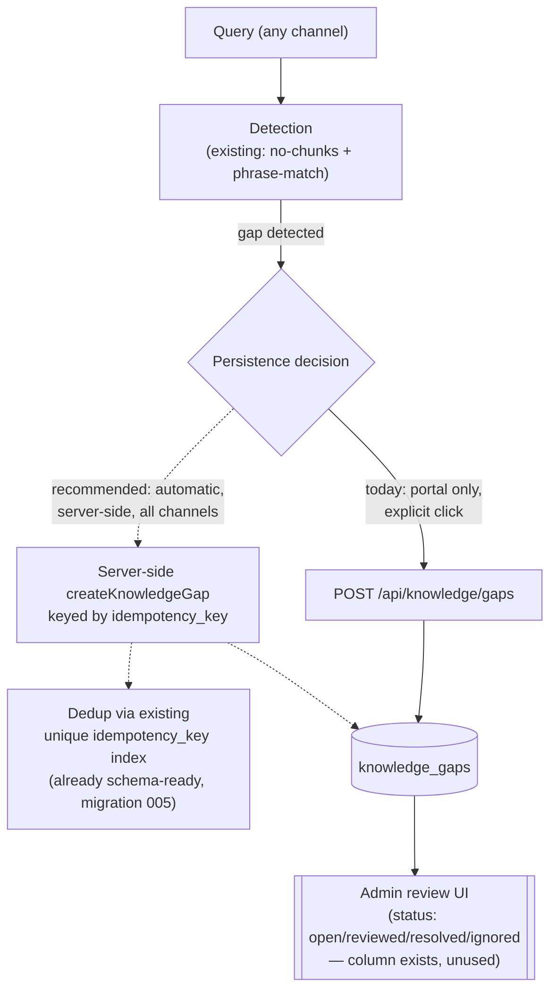

# Knowledge Gap Detection

Source repository: `relativitysystems/AIKB` (`services/runKnowledgeQuery.js`, `services/supabaseService.js`, `routes/knowledge.js`, `migrations/003_chat_history.sql`, `migrations/005_slack_origin_tracking.sql`) and `relativitysystems/Relativity` (`public/portal/portal.js`, `routes/api.js`).

## Overview

Knowledge-gap **detection** exists and runs automatically on every query. Knowledge-gap **persistence** does not — it requires an explicit user action. There is no deduplication, and there is no admin-facing review workflow, despite the database schema already supporting one. This document separates what is real from what would be needed for a complete gap-detection-and-review system.

## Current State

### Detection (automatic, heuristic — not LLM-judged)

Detection happens in two places inside `runKnowledgeQuery.js`, both triggered on every query, with no separate "is this a gap" model call:

1. **No chunks retrieved.** If vector search plus title-boost search return zero chunks above the similarity threshold, the response is flagged `isKnowledgeGap: true`, `gapReason: 'no_chunks_found'`, and a canned "couldn't find any relevant information" answer is returned without an LLM call.
2. **Answer-text phrase matching.** After the LLM generates an answer, `isKnowledgeGapAnswer()` lower-cases the text and checks it against a fixed list of substrings (`'not documented in'`, `'not found in'`, `"couldn't find"`, `'could not find'`, `'no information in'`, `'not in the knowledge base'`, `'not available in the knowledge base'`, `'not provided in the documentation'`, `'there is no information'`). A match sets `gapReason: 'answer_indicated_not_found'`.

The system prompt instructs the model to use one of these exact phrasings when it cannot answer from the retrieved context, and the heuristic then greps for that phrasing in the model's own output — this is pattern matching over LLM output, not a structured classification call.

When a gap is detected, the response's `sources[]` is forced empty and any model-hallucinated `Source:` line is rewritten to `Source: N/A`, so a gap answer can never appear to cite a document.

### Persistence (explicit, user-triggered — not automatic)

`runKnowledgeQuery()` only **returns** `isKnowledgeGap`/`gapReason` in its response object — it never writes to the `knowledge_gaps` table itself. The only write path is `POST /api/knowledge/gaps`, whose own code comment states: *"Explicit save of a knowledge gap — called by the portal when the user chooses to save. The query endpoint no longer writes gaps automatically."* This is corroborated by migration `005_slack_origin_tracking.sql`, which adds `origin`/`origin_metadata`/`idempotency_key` columns to `knowledge_gaps` while explicitly noting "nothing in this milestone writes to `knowledge_gaps` automatically."

In the portal, a query response flagged as a gap surfaces a card with **"Save gap"** and **"Dismiss"** buttons; only clicking "Save gap" issues the `POST /api/knowledge/gaps` call that actually creates a row. A dismissed or ignored gap is never recorded.

### What does not exist

- **No deduplication.** `createKnowledgeGap` is a plain `INSERT`. The `idempotency_key` column added in migration 005 for exactly this purpose is not used by any current write path — repeated saves of the same question create duplicate rows.
- **No admin-facing list or detail view of individual gaps.** The `knowledge_gaps` table has a `status` column (`open`/`reviewed`/`resolved`/`ignored`), and AIKB's analytics function does return the 10 most recent gap questions, but no function anywhere writes or reads that `status` field, and the admin console only displays a per-client **count** of gaps — never the underlying question text or reason. See [KNOWLEDGE_ANALYTICS.md](KNOWLEDGE_ANALYTICS.md).
- **No Slack-originated gap capture.** The `origin`/`origin_metadata` columns exist on `knowledge_gaps` but are unused by any write path — a knowledge gap surfaced through a Slack question is never recorded as a gap today.
- **No automatic/server-driven gap persistence of any kind** — every existing gap row in the database, if any, exists only because a portal user explicitly clicked "Save gap."

**Summary**: gap *detection* is real, automatic, and reasonably precise (two independent, complementary heuristics). Gap *management* — persistence, deduplication, review, and cross-channel capture — is either partial (persistence, gated behind an explicit click) or **not currently implemented** (deduplication, admin review UI, Slack capture).

## Recommended Architecture

The following is a design recommendation, not a description of existing code. Every item below is explicitly **not currently implemented**.

Recommended changes, in rough dependency order:

1. **Move gap persistence server-side and make it automatic**, using the `idempotency_key` column (already present) to dedupe: a `hash(clientId, sessionId, normalizedQuestion)` key would let repeated identical questions collapse into one row instead of requiring a user click and creating duplicates on retry.
2. **Distinguish system-detected vs. user-flagged gaps** — the schema has room for this (`reason`/`origin` columns already exist); persisting both types into the same table with a `reportedBy: system | user` distinction would preserve today's explicit "Save gap" affordance as a complementary signal, not a replacement for automatic capture.
3. **Build an admin review UI** using the already-defined `status` lifecycle (`open → reviewed → resolved → ignored`) — currently no code reads or writes this field, so this is close to pure UI/API work on top of an existing schema.
4. **Wire Slack (and any future channel) into gap persistence** using the `origin`/`origin_metadata` columns already added in migration 005 for this exact purpose.

## Future Implementation

Not currently implemented. Prerequisite work, based on what already exists vs. what would need to be built:

| Capability | Schema readiness | Code readiness |
|---|---|---|
| Automatic server-side persistence | Ready (`idempotency_key` column + unique index already exist) | Not started — `runKnowledgeQuery.js` would need to call `createKnowledgeGap` directly |
| Deduplication | Ready (unique index on `idempotency_key`) | Not started |
| Admin review workflow (status transitions) | Ready (`status` CHECK constraint already defined) | Not started — no `updateGapStatus`/`listKnowledgeGaps`-style function exists in `supabaseService.js` today |
| Cross-channel (Slack) gap capture | Ready (`origin`/`origin_metadata` columns exist) | Not started — no code path currently sets these columns |
| Client-facing gap visibility | Not designed | Not started |

## Current Limitations

- Gap detection quality depends entirely on the LLM using one of the expected trigger phrases in its own output — a model response that fails to answer the question without using one of those phrases would not be flagged, even though it should be.
- A user who ignores or navigates away from a "Save gap" prompt leaves no trace that a gap was ever detected — there is no fallback automatic capture.
- Duplicate gap rows for the same recurring unanswerable question are expected under the current design, since no dedup exists.

## Future Extension Points

- The `idempotency_key` and `origin`/`origin_metadata` columns on `knowledge_gaps` (migration 005) are already in place specifically to support the automatic, deduplicated, cross-channel persistence model described above, without requiring a further schema change.
- The existing `status` enum on `knowledge_gaps` is ready for an admin review workflow with no schema change required — only new read/write functions and a UI.
